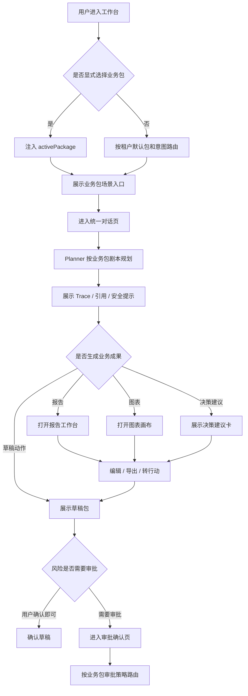
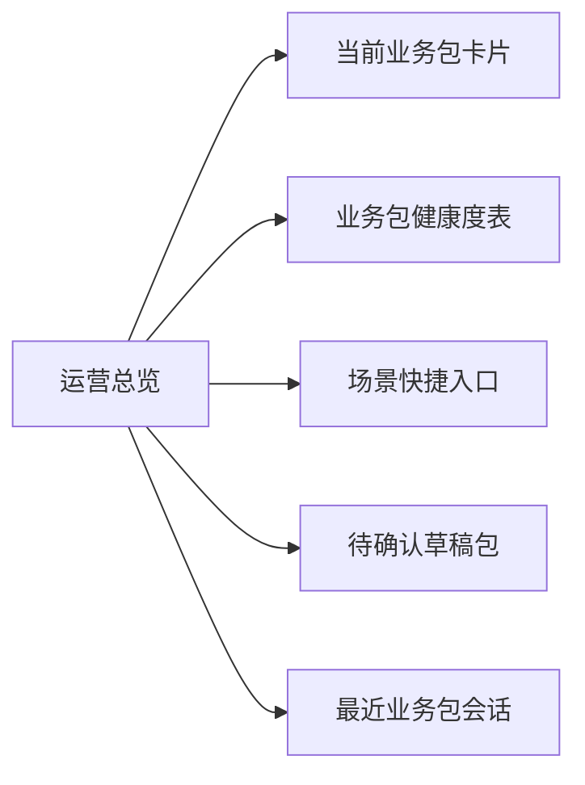
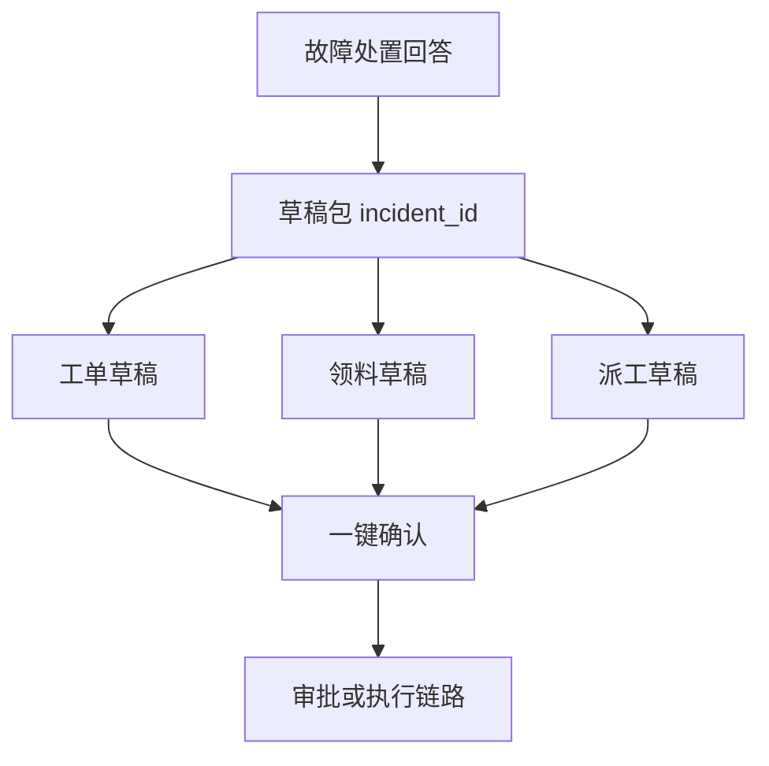
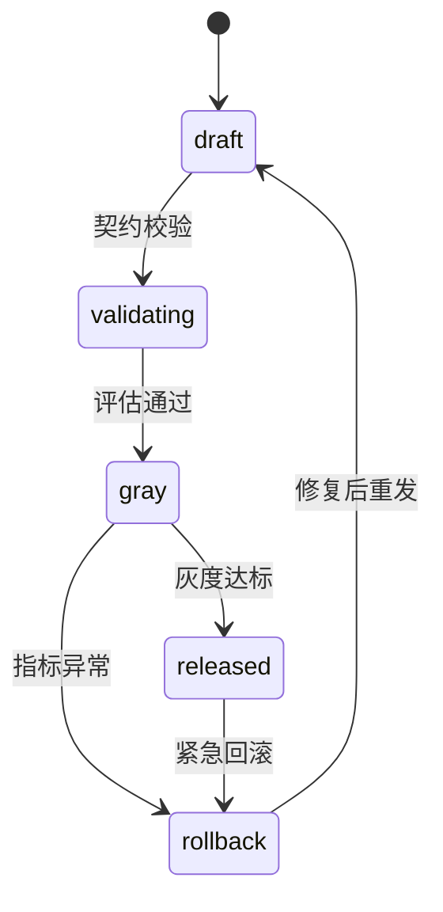

# 业务包界面修改开发方案

**版本**: v1.1  
**日期**: 2026-04-25  
**状态**: 草案  
**适用范围**: Agent Operating Platform 前端工作台  
**关联文档**:
- [行业业务包-通用开发方案.md](行业业务包-通用开发方案.md)
- [制造业设备运维助手-业务包开发文档.md](制造业设备运维助手-业务包开发文档.md)
- [通用包与平台级Skill-Tool开发方案.md](通用包与平台级Skill-Tool开发方案.md)
- [插件开发指南.md](插件开发指南.md)
- [../界面修改开发方案.md](../界面修改开发方案.md)

---

## 1. 文档目标

本文基于业务包相关开发方案与当前系统界面实现，给出一份可落地的界面修改方案，重点解决业务包上线后的前端承载问题：

1. 用户能明确知道当前启用的业务包、可用场景与能力边界。
2. 对话页能承载业务包剧本、知识引用、安全提示与草稿动作。
3. 审批页能展示业务包级阈值、角色路由、草稿包和高风险动作详情。
4. 业务包管理页能从“列表展示”升级为“契约、发布、灰度、插件健康”治理入口。
5. 界面改造保持当前设计系统，不引入新的视觉体系。

本文不直接设计后端核心表变更。涉及新增字段时，遵循本目录文档约束：增加迁移语句或 API 契约，不通过前端逻辑绕开数据模型。

---

## 2. 现有界面与代码现状

### 2.1 当前信息架构

当前工作台由 `Shell` 统一承载，采用固定左侧导航、顶部栏、内容区布局。

| 页面 | 路由 | 主要文件 | 当前能力 | 与业务包的差距 |
|------|------|------|------|------|
| 运营总览 | `/` | `apps/web/src/app/(workspace)/page.tsx` | 指标卡、业务包健康度、待处理事件、最近会话、高频能力入口 | 缺当前业务包上下文、场景入口、草稿待办下钻 |
| 对话演示 | `/chat` | `apps/web/src/components/chat/chat-workbench.tsx` | 消息流、检索模式、Trace、引用依据、单草稿跳转审批 | 缺业务包切换、剧本面板、草稿包、多引用结构化展示 |
| 审批确认 | `/approvals` | `apps/web/src/components/admin/approval-center.tsx` | 草稿列表、风险标签、确认执行 | 缺阈值说明、角色路由、草稿包批量确认、影响范围 |
| 业务包管理 | `/packages` | `apps/web/src/app/(workspace)/packages/page.tsx` | 业务包列表、插件健康度、能力契约页签占位 | 缺业务包详情、capability map、知识绑定、发布编排 |
| 知识库治理 | `/knowledge` | `apps/web/src/components/knowledge/*` | Wiki / 知识库治理 | 缺业务包维度过滤、业务包 attributes 展示 |
| 审计合规 | `/audit` | `apps/web/src/app/(workspace)/audit/page.tsx` | Trace 和事件展示 | 缺按业务包、剧本、草稿包过滤 |
| 安全治理 | `/security` | `apps/web/src/app/(workspace)/security/page.tsx` | 安全事件、审批、规则 | 缺业务包级 OutputGuard 与审批策略展示 |
| 租户与权限 | `/system` | `apps/web/src/app/(workspace)/system/page.tsx` | 租户、角色、LLM 配置 | 缺租户启用业务包与版本状态 |

### 2.2 当前设计语言

当前前端已经形成稳定的控制台风格：

| 设计元素 | 当前类名 / 形态 | 修改原则 |
|------|------|------|
| 页面容器 | `page-section` | 新增业务包页面继续使用同一结构 |
| 页面标题区 | `page-head`, `breadcrumbs`, `page-head-actions` | 所有业务包页面保留面包屑和右侧操作 |
| 指标卡 | `bento-grid`, `stat-card` | 业务包健康、灰度、草稿待办使用同一指标卡 |
| 数据表 | `data-table`, `data-table-row` | capability、审批、发布记录沿用表格结构 |
| 信息面板 | `panel-card`, `panel-header` | 对话右侧上下文、业务包详情使用面板 |
| 列表 | `stack-list`, `stack-item` | 引用、Trace、插件健康沿用栈列表 |
| 标签 | `status-chip`, `risk-level`, `severity-chip` | 风险、状态、side effect 不新增标签体系 |
| 图标 | Material Symbols | 当前项目未使用 lucide，保持 Material Symbols 一致 |

---

## 3. 业务包界面核心原则

### 3.1 用户视角

业务用户不应该理解 `capability-map.yaml`、`approval_policy.yaml` 等内部配置，但界面必须把这些配置翻译成可操作的信息：

| 配置 / 运行时概念 | 前端表达 |
|------|------|
| `package.yaml` | 业务包卡片、版本、负责人、适用行业、发布状态 |
| `entry_intents` | 场景入口，如“故障处置”“备件申领”“SOP 问答” |
| `capability-map.yaml` | 可执行动作、能力白名单、风险级别 |
| `knowledge-bindings.yaml` | 知识源、引用卡片、业务包过滤字段 |
| `approval_policy.yaml` | 审批阈值、角色路由、双签提示 |
| `Trace` | 剧本步骤、插件调用、知识检索、风险拦截过程 |
| `DraftAction` | 草稿动作卡、草稿包、确认与审批入口 |

### 3.2 平台视角

界面不把业务规则写死在 React 组件里。业务包差异通过 API 返回的数据驱动：

- 场景入口来自业务包装配结果，不在前端硬编码制造业场景。
- 审批阈值来自后端策略解释结果，前端只展示。
- 引用字段允许通过 `metadata_json` / `attributes` 扩展，前端做通用渲染。
- 草稿包支持一个用户意图生成多张草稿，前端按 `draft_group_id` 或 `incident_id` 聚合展示。

### 3.3 成果交付视角

业务包不只是“能调用哪些插件”的配置集合，还应该定义某类业务场景最终交付什么结果。对用户来说，业务包的价值经常不是一轮问答，而是可复用、可导出、可审计的业务成果。

| 成果类型 | 用户需要 | 前端承载方式 | 示例 |
|------|------|------|------|
| 报告生成 | 自动汇总事实、引用、结论、行动项 | 报告工作台、章节编辑、导出入口 | 故障复盘报告、月度运维报告、采购分析报告 |
| 图表生成 | 把业务数据转成趋势、排行、分布、对比 | 图表画布、图表配置、数据来源说明 | 设备停机趋势、备件消耗排行、审批耗时分布 |
| 决策建议 | 给出备选方案、依据、风险、推荐动作 | 决策卡片、方案对比、证据链 | 是否停机检修、是否补货、派谁处理 |
| 行动计划 | 把建议转成可执行任务与草稿动作 | 行动清单、草稿包、审批联动 | 工单、领料、派工、通知、复盘待办 |

因此界面需要从“对话 + 审批”扩展为“对话生成成果、成果可编辑、成果可解释、成果可转行动”的工作台。

---

## 4. 总体界面流程



---

## 5. 页面修改方案

### 5.1 Shell：增加业务包上下文入口

**涉及文件**: `apps/web/src/components/shared/shell.tsx`

当前 `Shell` 侧边栏只有导航组，顶部栏有“应用切换”图标但未承载业务包状态。建议增加两个轻量入口：

1. 侧边栏品牌区下方增加“当前业务包”选择器。
2. 顶部栏 `apps` 图标弹出可切换业务包、通用包、平台 Skill 状态。

示例交互：

```text
当前业务包：工业设备运维助手 v0.6.1
状态：灰度中
场景：故障处置 / 备件申领 / SOP 问答 / 故障复盘
```

组件建议：

| 组件 | 文件 | 说明 |
|------|------|------|
| `PackageSwitcher` | `apps/web/src/components/packages/package-switcher.tsx` | 选择当前业务包，写入 URL query 或前端状态 |
| `PackageContextBadge` | `apps/web/src/components/packages/package-context-badge.tsx` | 顶栏展示当前包、版本、环境 |

接口示例：

```typescript
type ActivePackageSummary = {
  package_id: string;
  name: string;
  version: string;
  domain: "industry" | "common" | "platform";
  status: "released" | "gray" | "disabled";
  entry_intents: Array<{
    key: string;
    label: string;
    description: string;
    risk_hint: string;
  }>;
};
```

### 5.2 运营总览：从平台指标补齐业务包入口

**涉及文件**: `apps/web/src/app/(workspace)/page.tsx`

当前运营总览已有业务包健康度、高频能力入口和最近会话。建议保持现有 `bento-grid` 与 `dashboard-grid` 风格，增加业务包工作区信号：

| 区域 | 修改点 | 数据来源 |
|------|------|------|
| 指标卡 | 增加“待确认草稿包”“业务包引用命中率” | `/admin/security`, `/admin/traces` 或新增包维度统计 |
| 业务包运行健康度 | 行点击进入 `/packages/[packageId]` | `/admin/packages` |
| 高频能力入口 | 改为按当前业务包展示 `entry_intents` | package runtime summary |
| 最近会话 | 增加业务包标签和意图标签 | conversation list 扩展字段 |

推荐页面结构：



### 5.3 对话页：升级为业务包统一入口

**涉及文件**: `apps/web/src/components/chat/chat-workbench.tsx`

当前 `ChatWorkbench` 是“两栏布局”：左侧对话演练场，右侧 Trace 执行链路。建议升级为三块信息，但保持现有样式：

```text
┌──────────────────────────────────────────────────────────────┐
│ Shell 顶栏                                                     │
├───────────────┬──────────────────────────────┬───────────────┤
│ 会话 / 场景区  │ 对话主区                       │ 业务包上下文区 │
│ 260-300px      │ flex                          │ 320-360px      │
└───────────────┴──────────────────────────────┴───────────────┘
```

#### 5.3.1 左侧：会话与场景区

新增内容：

- 当前业务包下的 `entry_intents` 场景入口。
- 最近会话按业务包和意图分组。
- 支持“按包筛选”与“固定会话”。

对应制造业业务包示例：

| 场景入口 | 预填提示词 | 对应剧本 |
|------|------|------|
| 故障处置 | `XX 号设备报 E-XXX，帮我处理` | `fault_handling` |
| 备件申领 | `查询并起草 XX 备件领用` | `spare_requisition` |
| SOP 问答 | `XX 型号点检步骤是什么` | `sop_query` |
| 故障复盘 | `生成 INC-xxx 故障复盘` | `incident_review` |

#### 5.3.2 中间：对话主区

保留现有消息渲染、Markdown 表格、流式响应能力，增强三类卡片：

| 卡片 | 说明 | 触发条件 |
|------|------|------|
| `SafetyAlert` | 安全提示强制置顶，展示 SOP / 安全规程引用 | warnings 或 safety chunk 命中 |
| `CitationCard` | 展示 SOP 步骤号、安全标识、历史工单链接 | sources 中包含 locator / metadata |
| `DraftActionGroup` | 一次展示多张草稿，支持批量确认或进入审批 | draft_actions 数量大于 1 |

草稿包展示应避免把“故障工单、备件领用、派工通知”拆散为三个互不相关的按钮。制造业剧本 A 要按同一个 `incident_id` 聚合：



#### 5.3.3 右侧：业务包上下文区

将现有 Trace 面板拆成更清晰的业务包上下文：

| 模块 | 内容 |
|------|------|
| 当前业务包 | 名称、版本、状态、风险上限、自主度上限 |
| 剧本步骤 | 识别意图、检索、插件调用、草稿生成、审批判断 |
| 已用能力 | capability 名称、读写类型、风险等级、耗时 |
| 知识引用 | 来源、章节、SOP 步骤、安全标识、版本 |
| 可执行动作 | 可确认草稿、需审批动作、不可执行原因 |

### 5.4 审批确认页：从草稿列表升级为草稿包审批

**涉及文件**: `apps/web/src/components/admin/approval-center.tsx`

当前审批页是单草稿表格确认。业务包上线后需要展示“为什么需要审批、谁审批、审批影响什么”。

新增信息结构：

| 区域 | 内容 |
|------|------|
| 左侧草稿包列表 | 按 `draft_group_id` / `incident_id` 聚合，展示业务包、意图、风险最高等级 |
| 中间详情 | 动作摘要、参数明细、影响范围、引用依据、Trace 片段 |
| 右侧策略解释 | 命中的审批规则、阈值、角色路由、双签要求 |

审批策略展示示例：

```text
命中策略：erp.spare.purchase.draft
风险等级：high
原因：采购金额 >= 5000 元
路由：车间主任复核 -> 设备经理审批
依据：mfg_equipment_ops/approval_policy.yaml#spare_purchase
```

### 5.5 业务包管理页：补齐详情、契约与发布编排

**涉及文件**: `apps/web/src/app/(workspace)/packages/page.tsx`

当前页面已有三个页签：“业务包 / 能力契约 / 发布编排”，但只有业务包列表和插件健康度。建议按现有页签落地：

#### 5.5.1 业务包列表

增强列：

| 字段 | 说明 |
|------|------|
| 业务包 | 名称、namespace、domain |
| 版本 | 当前发布版本、上一稳定版本 |
| 场景数 | `entry_intents` 数量 |
| 能力数 | capability 白名单数量 |
| 知识源 | 已绑定知识源数量 |
| 发布状态 | released / gray / disabled |

#### 5.5.2 能力契约

展示 `capability-map.yaml` 和插件返回的 capability 契约，不在前端编辑核心逻辑。

| 字段 | 前端展示 |
|------|------|
| capability name | `eam.workorder.draft.create` |
| side effect | read / write_draft / write |
| risk level | low / medium / high |
| required scope | 角色或权限 |
| source plugin | `mfg_eam` |
| schema version | 契约版本 |
| health | 插件可用性和最近错误 |

#### 5.5.3 发布编排

展示业务包上线状态机：



页面操作只允许触发后端已有发布 API，不在前端拼装业务包配置。

### 5.6 知识库治理：增加业务包绑定视角

**涉及文件**: `apps/web/src/components/knowledge/*`

业务包知识绑定要求前端能看到“哪些知识源被哪个业务包使用”。建议增加筛选与字段展示：

- 按业务包过滤知识源。
- 知识源详情展示 `knowledge_base_code`、业务包 attributes schema 命中情况。
- chunk 列表展示扩展字段，例如制造业的 `equipment_model`、`sop_step_no`、`safety_critical`。
- 引用预览展示业务包最终引用样式。

### 5.7 审计与安全：增加业务包过滤和策略解释

**涉及文件**:
- `apps/web/src/app/(workspace)/audit/page.tsx`
- `apps/web/src/app/(workspace)/security/page.tsx`

新增筛选维度：

| 页面 | 新增筛选 |
|------|------|
| 审计合规 | 业务包、意图、capability、draft_group_id、trace_id |
| 安全治理 | 业务包、OutputGuard 规则、审批策略、风险等级 |

### 5.8 新增业务成果工作台：报告、图表、决策建议

**建议新增路由**:
- `/outputs`：业务成果列表
- `/outputs/[outputId]`：成果详情
- `/reports/[reportId]`：报告编辑与导出
- `/charts/[chartId]`：图表配置与数据说明

当前界面缺少承载“报告生成、图表生成、决策建议”的空间。如果继续把这些内容塞进对话气泡，会出现三个问题：

1. 长报告难以阅读、编辑、导出。
2. 图表缺少数据来源、口径、筛选和配置能力。
3. 决策建议缺少方案对比、风险解释和后续行动闭环。

建议新增“业务成果工作台”，把 Agent 输出从聊天消息沉淀为结构化成果。

#### 5.8.1 业务成果列表 `/outputs`

页面定位：所有业务包生成的报告、图表、建议、行动计划统一入口。

| 区域 | 内容 |
|------|------|
| 指标卡 | 今日生成成果数、待确认建议、已导出报告、转行动数量 |
| 筛选栏 | 业务包、成果类型、创建人、状态、时间 |
| 成果表格 | 标题、业务包、意图、类型、状态、更新时间、操作 |
| 右侧预览 | 最近一份成果摘要、引用数量、关联草稿包 |

成果状态建议：

```text
draft -> reviewing -> approved -> exported -> archived
```

#### 5.8.2 报告生成与编辑

报告不是普通 Markdown 消息，应该有章节、数据来源、引用和导出状态。

报告页面建议结构：

```text
┌──────────────────────────────────────────────────────────────┐
│ 报告标题 / 业务包 / 状态 / 导出 PDF / 生成草稿动作             │
├──────────────┬───────────────────────────────┬───────────────┤
│ 章节导航      │ 报告正文编辑区                  │ 证据与行动区   │
│ - 摘要        │ - 可编辑 Markdown / 富文本       │ - 引用依据     │
│ - 数据概览    │ - 表格 / 图表嵌入                │ - 生成口径     │
│ - 原因分析    │ - 风险提示                      │ - 后续动作     │
│ - 建议行动    │                                │ - 审批状态     │
└──────────────┴───────────────────────────────┴───────────────┘
```

制造业示例：`故障复盘报告`

| 章节 | 内容 |
|------|------|
| 事件摘要 | 设备、故障码、发生时间、停机时长 |
| 处置过程 | 工单、派工、领料、通知链路 |
| 根因分析 | 手册引用、历史工单相似案例、插件数据 |
| 影响评估 | 停机损失、备件消耗、人员工时 |
| 改进建议 | 点检调整、备件安全库存、培训动作 |
| 行动清单 | 可转草稿动作的任务列表 |

#### 5.8.3 图表生成与配置

图表生成不能只展示图片，需要展示数据口径和可配置项。

图表页面建议结构：

| 模块 | 内容 |
|------|------|
| 图表画布 | 折线图、柱状图、饼图、表格、漏斗等 |
| 数据口径 | 数据来源、过滤条件、时间范围、聚合方式 |
| 配置面板 | 维度、指标、排序、分组、图表类型 |
| 洞察说明 | Agent 对图表的解释、异常点、趋势判断 |
| 可追溯引用 | 查询 Trace、数据集版本、插件调用记录 |

业务包需要声明自己支持哪些图表模板。例如制造业设备运维助手：

| 图表模板 | 默认维度 | 默认指标 |
|------|------|------|
| 停机趋势 | 日期、产线、设备型号 | 停机分钟数、故障次数 |
| 备件消耗排行 | 备件型号、设备型号 | 消耗数量、金额 |
| 工单处理效率 | 班组、维修工、故障类型 | 响应时长、关闭时长 |
| 审批耗时分布 | 审批角色、风险等级 | 平均耗时、超时数量 |

#### 5.8.4 决策建议卡

决策建议必须比普通回答更结构化，至少包含“建议、依据、风险、备选方案、下一步动作”。

```typescript
type DecisionRecommendation = {
  recommendation_id: string;
  title: string;
  recommended_option: string;
  confidence: "low" | "medium" | "high";
  rationale: string[];
  risks: Array<{ level: string; description: string; mitigation: string }>;
  alternatives: Array<{ option: string; pros: string[]; cons: string[] }>;
  evidence_refs: string[];
  next_actions: DraftActionResponse[];
};
```

前端展示规则：

- 推荐方案必须显著展示，但不能隐藏备选方案。
- 风险和证据链必须与建议同屏展示。
- 能转草稿动作的建议进入草稿包，不能由模型直接执行。
- 低置信度建议需要提示“需要人工复核”，不能包装成确定结论。

---

## 6. Capability / Tool / Skill 在界面上的统一呈现

业务包技术方案把动作单元拆成三层：Capability（插件能力，外部副作用）、Tool（平台原子工具，无业务规则）、Skill（多步编排，可组合 Capability + Tool + 知识检索）。当前界面只承载了 Capability，Tool 和 Skill 在前端不可见，会导致：用户看不到“此次回答用了哪个 Skill”，治理页无法判断 Skill / Tool 的可用范围与版本，灰度也无法做到 Skill 粒度。

### 6.1 BusinessContextPanel 增加“已用 Skill / Tool”分组

**涉及文件**: `apps/web/src/components/chat/business-context-panel.tsx`

右侧上下文面板已规划展示 Capability 与知识引用，本节增加同层分组：

| 分组 | 展示内容 | 可点击行为 |
|------|------|------|
| 已用 Skill | Skill 名称、来源（业务包 / `_platform` / `_common/<pkg>`）、版本、耗时、是否灰度 | 下钻 Skill Trace 子树 |
| 已用 Tool | Tool 名称、调用次数、超时/失败次数、配额剩余 | 下钻每次 Tool 调用入参摘要 |
| 已用 Capability | 现有展示保持不变 | 下钻插件契约 |
| 知识引用 | 现有展示保持不变 | 跳转知识源详情 |

### 6.2 Trace 节点支持 type: capability / tool / skill

**涉及文件**:
- `apps/web/src/components/chat/trace-tree.tsx`
- `apps/web/src/lib/api-client/types.ts`

Trace 节点扩展 `type` 字段，前端按类型选择不同图标和折叠策略。Skill 节点默认折叠，展开后显示其内部子节点（可能再嵌套 Capability / Tool）。

```typescript
export type TraceNodeType = "capability" | "tool" | "skill" | "retrieval" | "guard";

export type TraceNode = {
  node_id: string;
  parent_id?: string;
  type: TraceNodeType;
  ref: string;
  ref_source?: "package" | "_platform" | "_common";
  ref_version?: string;
  duration_ms: number;
  status: "ok" | "error" | "blocked";
  redacted_input?: Record<string, unknown>;
  children?: TraceNode[];
};
```

### 6.3 业务包管理页签扩展

**涉及文件**: `apps/web/src/app/(workspace)/packages/page.tsx`

当前页签为 `[业务包 / 能力契约 / 发布编排]`，扩展为：

```text
[业务包] [能力 Capability] [Tool] [Skill] [知识] [发布编排]
```

| 页签 | 内容 |
|------|------|
| 能力 Capability | 现有 capability 契约表，按业务包白名单展示 |
| Tool | 业务包引用的 Tool 列表（来自 `tools.yaml` 与业务包 yaml）、配额、超时、是否启用 |
| Skill | 业务包私有 Skill + 引用的 `_platform` / `_common` Skill；显示版本、灰度状态、依赖的 Capability 与 Tool |
| 知识 | `knowledge-bindings.yaml` 解析结果与命中统计 |

Skill 详情抽屉至少展示：定义来源（yaml 路径）、输入输出 schema、依赖矩阵（Capability/Tool/知识源）、最近 N 次调用质量信号（成功率、平均耗时、用户反馈）。

---

## 7. 多包叠加与意图路由 UI

技术方案允许租户同时启用一个**主行业包** + 多个**通用包**（`_common/<pkg>`），并由意图路由决定本次会话由哪个包处理。当前 `PackageSwitcher` 是单选，无法表达叠加，也无法解释“为什么这次回答归属 A 包而不是 B 包”。

### 7.1 PackageSwitcher 升级为“主包 + 多通用包”

**涉及文件**: `apps/web/src/components/packages/package-switcher.tsx`

```text
┌─────────────────────────────┐
│ 主行业包  [工业设备运维 ▼]   │
│ 通用包    [✓ 报告生成]       │
│           [✓ 数据问答]       │
│           [  合规问答]       │
└─────────────────────────────┘
```

主包单选、通用包多选；选择结果写入 URL query `?primary=<id>&commons=<id>,<id>`，便于分享与刷新保持。

### 7.2 PackageContextBadge 显示主包 + 叠加数

**涉及文件**: `apps/web/src/components/packages/package-context-badge.tsx`

```text
工业设备运维助手 v0.6.1 · 灰度 · +2 通用包
```

鼠标悬浮显示叠加包列表与各自版本。

### 7.3 意图路由解释

**涉及文件**: `apps/web/src/components/chat/business-context-panel.tsx`

每次会话回答顶部展示一条“路由解释”微卡：

```text
匹配业务包：mfg_equipment_ops（意图：fault_handling，置信度 0.91）
其他候选：_common/report_gen（0.42）
路由依据：意图分类器 + 关键词 [E-1023, 设备]
```

用户可点击切换为其它候选包重发，避免“黑盒路由”。

---

## 8. 业务包配置可视化

技术方案中大量配置以 yaml 存在（`chunk_attributes_schema`、`tools.yaml`、插件 `config_schema`、租户 `tool_overrides`），现有界面没有承载，运营无法在不改 yaml 的情况下治理。本节落地“只读展示 + 受控编辑”能力，不把 yaml 暴露给最终用户。

### 8.1 知识源详情：扩展属性与索引层级

**涉及文件**: `apps/web/src/components/knowledge/knowledge-source-detail.tsx`

知识源详情页新增“扩展属性”区，展示业务包声明的 `chunk_attributes_schema`：

| 字段 | 类型 | 索引层级 | 命中统计 |
|------|------|------|------|
| equipment_model | string | hot（generated column） | 92% chunks 已填充 |
| sop_step_no | string | warm（GIN） | 78% |
| safety_critical | bool | hot | 100% |
| revision_date | date | cold（仅 JSONB） | 64% |

层级用 `status-chip` 颜色区分（hot/warm/cold），并标注是否需要 promotion（冷转热）。

### 8.2 安全治理页：Tool 启用矩阵

**涉及文件**: `apps/web/src/app/(workspace)/security/page.tsx`

新增“Tool 启用矩阵”分区（行 = Tool，列 = 租户/业务包），每格显示：启用 / 禁用 / 配额覆盖。点击单元格弹出抽屉，编辑该租户对该 Tool 的 `tool_overrides`（quota / timeout / disabled），保存时调用后端 API 写入，不在前端持久化 yaml。

### 8.3 安全治理页：OutputGuard 红线规则

**涉及文件**: `apps/web/src/app/(workspace)/security/page.tsx`

新增“OutputGuard 红线”分区，展示业务包声明的 redline 规则：

| 规则 | 触发模式 | 处置 | 来源 |
|------|------|------|------|
| 含 PII 输出拦截 | regex `\d{18}` | block | `_platform/output_guard` |
| 高危操作不得直执 | risk_level=critical | force_approval | `mfg_equipment_ops` |
| 安全关键 SOP 必须引用 | safety_critical=true && citations==0 | warn | `mfg_equipment_ops` |

每条规则可关联到“最近触发次数”和“被绕过申诉记录”，便于审计。

### 8.4 插件 config_schema 动态表单

**涉及文件**: `apps/web/src/components/packages/plugin-config-form.tsx`（新增）

业务包管理页插件详情 → 配置抽屉，按插件 `config_schema`（JSON Schema）自动渲染表单。**密钥字段不接受明文输入**，改为“密钥引用选择器”，从已注册的 `auth_ref` 列表中选择，符合插件开发指南要求。

---

## 9. 业务包依赖与升级影响

业务包依赖 `_platform` Skill、`_common` 通用包、插件版本范围。当某个底层组件升级或回滚时，运营需要立刻看到“哪些业务包会受影响”。当前管理页只展示业务包列表与插件健康度，无法回答这个问题。

### 9.1 业务包依赖图

**涉及文件**: `apps/web/src/components/packages/package-dependency-graph.tsx`（新增）

业务包详情页新增“依赖”页签，以分组列表（不强求关系图引擎）展示：

| 依赖类型 | 名称 | 版本范围 | 当前实际版本 | 状态 |
|------|------|------|------|------|
| 平台 Skill | `kb_grounded_qa@_platform` | `>=1.2 <2.0` | 1.3.1 | ✓ 兼容 |
| 通用包 | `_common/report_gen` | `>=0.5` | 0.5.2 | ✓ 兼容 |
| 插件 | `mfg_eam` | `~0.6.0` | 0.6.3 | ✓ 兼容 |
| 平台 Tool | `http_fetch` | `*` | 1.0.0 | ✓ 兼容 |

不兼容时用 `risk-level=high` 醒目标注，并提供“查看变更日志”入口。

### 9.2 升级影响视图

**涉及文件**: `apps/web/src/app/(workspace)/packages/page.tsx`

发布编排页签新增“升级影响”操作：选中某个 Skill / 插件 / 通用包的目标版本后，前端展示**反向依赖**列表 —— 哪些行业包/租户会被波及，按风险等级排序：

```text
即将升级：mfg_eam 0.6.3 → 0.7.0（破坏性变更：workorder.draft.create 入参重命名）
受影响业务包：
  - mfg_equipment_ops v0.6.1（租户 A、B、C，灰度中）  [需重新评估]
  - mfg_qa_assistant v0.3.0（租户 D）                [兼容]
建议：先在租户 A 灰度验证，再全量发布
```

### 9.3 ReleaseTimeline 单 Skill 灰度

**涉及文件**: `apps/web/src/components/packages/release-timeline.tsx`

发布时间线支持 Skill 粒度的灰度刻度，与业务包整体灰度并存：

```text
业务包灰度：A/B 租户 20%
  ├─ Skill fault_triage v0.6 → v0.7：A 租户 10%（昨日 14:00）
  └─ Skill incident_review v0.4：未启用灰度
```

每个 Skill 灰度行显示开始时间、当前比例、关键指标差异（成功率、用户反馈），并提供“一键回滚到上一稳定版本”。

---

## 10. 前端数据契约建议

当前类型定义位于 `apps/web/src/lib/api-client/types.ts`。建议新增或扩展以下类型。

### 10.1 业务包上下文

```typescript
export type PackageRuntimeSummary = {
  package_id: string;
  name: string;
  version: string;
  domain: "industry" | "common" | "platform";
  status: "released" | "gray" | "disabled";
  autonomy_level: "L1" | "L2" | "L3";
  risk_ceiling: "low" | "medium" | "high" | "critical";
  entry_intents: Array<{
    key: string;
    label: string;
    description: string;
    sample_prompt: string;
  }>;
};
```

### 10.2 草稿包

当前 `ChatCompletionResponse` 只有 `draft_action` 单对象。建议兼容扩展为：

```typescript
export type DraftActionGroup = {
  draft_group_id: string;
  business_key?: string;
  package_id: string;
  intent: string;
  title: string;
  summary: string;
  max_risk_level: string;
  approval_required: boolean;
  approval_hint: string;
  actions: DraftActionResponse[];
};
```

保留 `draft_action` 作为过渡字段，新增 `draft_action_group` 或 `draft_actions`，避免一次性破坏现有页面。

### 10.3 引用扩展

```typescript
export type BusinessCitation = {
  id: string;
  title: string;
  snippet: string;
  source_type: string;
  locator?: string | null;
  source_id?: string | null;
  chunk_id?: string | null;
  metadata?: {
    package_id?: string;
    sop_step_no?: string;
    safety_critical?: boolean;
    equipment_model?: string;
    workorder_id?: string;
    resolved?: boolean;
  };
};
```

### 10.4 业务成果

```typescript
export type BusinessOutputType = "report" | "chart" | "recommendation" | "action_plan";

export type BusinessOutputSummary = {
  output_id: string;
  package_id: string;
  conversation_id?: string;
  trace_id?: string;
  type: BusinessOutputType;
  title: string;
  status: "draft" | "reviewing" | "approved" | "exported" | "archived";
  intent: string;
  created_by: string;
  updated_at: string;
  citation_count: number;
  linked_draft_group_id?: string;
};

export type GeneratedReport = {
  output_id: string;
  title: string;
  package_id: string;
  sections: Array<{
    key: string;
    title: string;
    content_markdown: string;
    citation_ids: string[];
  }>;
  charts: GeneratedChart[];
  recommendations: DecisionRecommendation[];
  export_formats: Array<"pdf" | "docx" | "markdown">;
};

export type GeneratedChart = {
  chart_id: string;
  title: string;
  chart_type: "line" | "bar" | "pie" | "table" | "scatter" | "funnel";
  dataset_id: string;
  dimensions: string[];
  metrics: string[];
  filters: Record<string, unknown>;
  explanation: string;
  trace_id?: string;
};
```

---

## 11. 组件拆分建议

| 组件 | 路径 | 复用页面 | 说明 |
|------|------|------|------|
| `PackageSwitcher` | `components/packages/package-switcher.tsx` | Shell、对话页 | 当前业务包切换 |
| `PackageIntentPanel` | `components/packages/package-intent-panel.tsx` | 首页、对话页 | 场景入口 |
| `PackageContractTable` | `components/packages/package-contract-table.tsx` | 业务包管理 | capability 契约 |
| `ReleaseTimeline` | `components/packages/release-timeline.tsx` | 业务包管理 | 灰度与回滚 |
| `ConversationList` | `components/chat/conversation-list.tsx` | 对话页 | 会话列表 |
| `BusinessContextPanel` | `components/chat/business-context-panel.tsx` | 对话页 | 业务包、Trace、能力、引用 |
| `CitationCard` | `components/chat/citation-card.tsx` | 对话页、审批页 | SOP / 工单引用 |
| `SafetyAlert` | `components/chat/safety-alert.tsx` | 对话页、审批页 | 安全提示 |
| `DraftActionGroupCard` | `components/chat/draft-action-group-card.tsx` | 对话页、审批页 | 草稿包 |
| `ApprovalPolicyExplainer` | `components/admin/approval-policy-explainer.tsx` | 审批页、安全页 | 阈值与角色路由 |
| `OutputList` | `components/outputs/output-list.tsx` | 成果列表 | 报告、图表、建议统一列表 |
| `ReportWorkspace` | `components/outputs/report-workspace.tsx` | 报告详情 | 章节编辑、引用、导出、转行动 |
| `ChartCanvas` | `components/outputs/chart-canvas.tsx` | 图表详情、报告详情 | 图表展示与配置 |
| `DecisionCard` | `components/outputs/decision-card.tsx` | 对话页、成果详情 | 推荐方案、依据、风险、备选方案 |
| `EvidencePanel` | `components/outputs/evidence-panel.tsx` | 报告、图表、建议 | 证据链与 Trace |

拆分原则：

- 不把制造业字段写死到通用组件中。
- 行业字段通过 `metadata` 渲染，未知字段进入“更多属性”折叠区。
- 风险颜色继续使用现有 `risk-level`，避免新增视觉体系。
- 报告、图表、建议都要关联 `trace_id` 或引用 ID，避免形成不可审计的“离线成果”。

---

## 12. 开发里程碑

### M1：业务包上下文可见

目标：用户能看到并切换当前业务包。

任务：

- [ ] 新增 `PackageSwitcher` 与 `PackageContextBadge`
- [ ] 首页高频能力入口改为业务包 `entry_intents`
- [ ] 对话请求携带 `package_id` 或后端可识别的 active package
- [ ] `types.ts` 增加 `PackageRuntimeSummary`

验收：

- 切换业务包后，对话页场景入口和右侧上下文同步变化。
- 未选择业务包时，使用租户默认业务包，不出现空白状态。

### M2：对话页承载业务包剧本

目标：统一对话页展示业务包场景、引用、安全提示、Trace。

任务：

- [ ] 拆分 `ConversationList`
- [ ] 新增 `PackageIntentPanel`
- [ ] 新增 `BusinessContextPanel`
- [ ] 新增 `CitationCard` 与 `SafetyAlert`
- [ ] 对 `ChatCompletionResponse.sources` 增加业务 metadata 渲染

验收：

- 制造业 SOP 引用能展示步骤号与安全标识。
- Trace 能按剧本步骤展示“检索、插件调用、草稿生成、审批判断”。

### M3：草稿包与审批策略解释

目标：支持一次用户意图生成多张草稿，并按业务包审批策略解释。

任务：

- [ ] 扩展 `DraftActionGroup` 类型
- [ ] 新增 `DraftActionGroupCard`
- [ ] 审批页按 `draft_group_id` / `incident_id` 聚合
- [ ] 新增 `ApprovalPolicyExplainer`

验收：

- 制造业故障处置能在同一草稿包展示工单、领料、派工三张草稿。
- 高风险采购能展示“金额阈值、审批角色、双签要求”。

### M4：业务包管理治理闭环

目标：业务包管理页具备契约查看、发布编排、灰度状态展示。

任务：

- [ ] 业务包列表增加场景数、能力数、知识源数
- [ ] 能力契约页签落地 `PackageContractTable`
- [ ] 发布编排页签落地 `ReleaseTimeline`
- [ ] 插件健康度支持按业务包过滤

验收：

- 能从业务包详情下钻到 capability、插件健康、知识绑定。
- 能看清当前版本、灰度状态、上一稳定版本和回滚入口。

### M5：业务成果生成工作台

目标：支持报告生成、图表生成、决策建议与行动计划。

任务：

- [ ] 新增 `/outputs` 成果列表页
- [ ] 新增 `ReportWorkspace`
- [ ] 新增 `ChartCanvas`
- [ ] 新增 `DecisionCard`
- [ ] 对话页支持把回答保存为业务成果
- [ ] 报告和建议支持转草稿包或审批动作

验收：

- 能从一次业务包对话生成报告，并在报告页查看章节、引用、图表和建议。
- 能生成至少一种图表并展示数据来源、过滤条件和 Trace。
- 决策建议能展示推荐方案、备选方案、风险、证据链和下一步动作。

---

## 13. 与现有代码的最小改动路径

优先改造顺序：

1. 先扩展类型与 API client，不动现有页面行为。
2. 在首页和对话页增加只读业务包上下文展示。
3. 再将单草稿 UI 扩展为草稿包 UI，保留 `draft_action` 兼容。
4. 增加业务成果数据结构，让报告、图表、建议先以只读方式落地。
5. 最后补齐业务包管理页的契约、发布编排和成果模板配置。

建议避免：

- 不在前端硬编码制造业审批阈值。
- 不为了展示行业字段新增大量行业专属组件。
- 不把发布状态机只做静态卡片，应由后端发布记录驱动。
- 不把安全提示放在普通引用列表中，安全提示需要强制置顶。
- 不把报告、图表、决策建议只作为聊天文本展示，应沉淀为可追溯的业务成果对象。

---

## 14. 验收标准

| 验收项 | 标准 |
|------|------|
| 当前业务包可见 | Shell、首页、对话页均能展示当前业务包 |
| 场景入口可用 | 至少支持 4 个 `entry_intents` 快捷发起 |
| 引用展示正确 | SOP 步骤号、安全标识、历史工单链接可展示 |
| 草稿包闭环 | 一次任务生成多草稿时，前端聚合展示并能进入审批 |
| 报告生成可用 | 支持从业务包对话生成结构化报告，报告含章节、引用、图表、建议 |
| 图表生成可用 | 图表展示数据口径、过滤条件、Trace，不只展示静态图片 |
| 决策建议清晰 | 建议卡展示推荐方案、依据、风险、备选方案和下一步动作 |
| 审批解释清晰 | 高风险动作展示阈值、角色路由、策略来源 |
| 管理页可治理 | 业务包列表、能力契约、发布编排三个页签均有真实数据承载 |
| 风格一致 | 继续使用现有 `panel-card`、`status-chip`、`risk-level` 等样式体系 |

---

## 15. 风险与取舍

| 风险 | 影响 | 建议 |
|------|------|------|
| 后端仍只返回单个 `draft_action` | 无法完整展示制造业三草稿包 | 先兼容单草稿，后端补 `draft_action_group` 后启用聚合 |
| 引用 metadata 不统一 | 前端难以展示 SOP / 工单差异字段 | 引入通用 `metadata`，只对已知字段做增强展示 |
| 业务包切换只存在前端状态 | 刷新或分享链接丢失上下文 | 使用 URL query 或服务端会话保存 active package |
| 发布编排缺后端状态机 | 页面只能静态展示 | M4 前确认发布 API 与状态字段 |
| 报告和图表只有自然语言结果 | 无法编辑、导出、审计和复用 | 新增 `BusinessOutputSummary` 等结构化成果对象 |
| 决策建议缺少证据链 | 用户难以判断建议可靠性 | 所有建议必须关联 citation、Trace 和风险说明 |

---

## 16. 本方案对应的关键文件

| 类型 | 文件 |
|------|------|
| Shell 布局 | `apps/web/src/components/shared/shell.tsx` |
| 首页 | `apps/web/src/app/(workspace)/page.tsx` |
| 对话页 | `apps/web/src/app/(workspace)/chat/page.tsx` |
| 对话核心组件 | `apps/web/src/components/chat/chat-workbench.tsx` |
| 审批中心 | `apps/web/src/components/admin/approval-center.tsx` |
| 业务包管理 | `apps/web/src/app/(workspace)/packages/page.tsx` |
| 前端类型 | `apps/web/src/lib/api-client/types.ts` |
| API client | `apps/web/src/lib/api-client/index.ts` |
| 样式体系 | `apps/web/src/styles/globals.css` |

---

## 17. 结论

业务包相关界面改造的核心不是新增一批孤立页面，而是把当前工作台升级为“业务包上下文驱动”的操作台。最小可落地路径是：

1. 先让业务包在 Shell、首页、对话页可见。
2. 再让对话页承载剧本、引用、安全提示和草稿包。
3. 最后补齐审批策略解释与业务包管理治理闭环。

这样既能支撑制造业设备运维助手作为首个样板包，也能让金融、政务、医疗、法务等后续行业包复用同一套界面结构。
