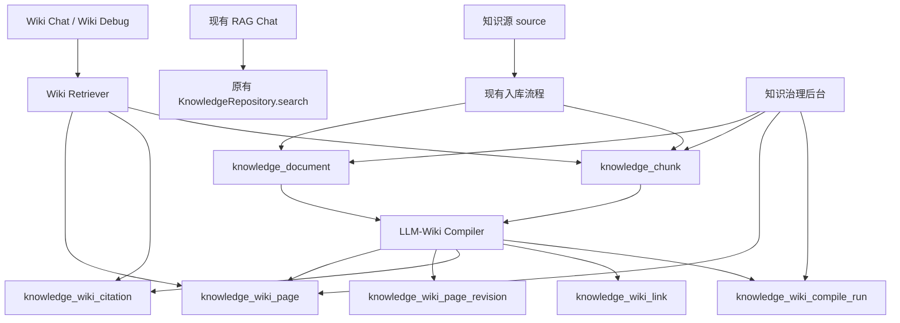
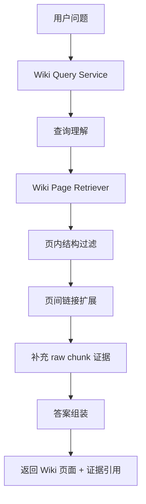

# LLM-Wiki 独立模块化改造技术方案

**版本**: v1.0  
**日期**: 2026-04-23  
**状态**: 方案草案  
**适用范围**: Agent Operating Platform 的知识库治理、LLM-Wiki 知识编译、Wiki 检索问答与治理后台  
**关联文档**:

- `docs/可扩展Agent架构-技术开发文档.md`
- `docs/技术文档知识库-混合检索优化方案.md`
- `docs/知识库行业插件化索引与混合检索-功能技术方案.md`

---

## 目录

1. [背景与目标](#1-背景与目标)
2. [核心约束与非目标](#2-核心约束与非目标)
3. [当前系统现状](#3-当前系统现状)
4. [为什么采用独立模块方案](#4-为什么采用独立模块方案)
5. [总体架构](#5-总体架构)
6. [模块边界设计](#6-模块边界设计)
7. [数据模型设计](#7-数据模型设计)
8. [Wiki 页面 Schema 设计](#8-wiki-页面-schema-设计)
9. [知识编译流程设计](#9-知识编译流程设计)
10. [在线查询与回答流程](#10-在线查询与回答流程)
11. [API 设计](#11-api-设计)
12. [前端治理页面设计](#12-前端治理页面设计)
13. [权限、安全与审计](#13-权限安全与审计)
14. [评测与质量闭环](#14-评测与质量闭环)
15. [与现有 RAG 的兼容策略](#15-与现有-rag-的兼容策略)
16. [实施计划](#16-实施计划)
17. [风险与取舍](#17-风险与取舍)
18. [落地建议总结](#18-落地建议总结)

---

## 1. 背景与目标

当前平台已经具备基础知识库能力：

- 管理端可提交 Markdown / 纯文本知识源。
- 后端已支持文档切片、简版 embedding、关键词 + 向量融合检索。
- 聊天链路可通过知识检索返回 `SourceReference` 引用。

当前知识链路更接近传统 RAG：

```text
原始文档
 -> chunk
 -> 检索
 -> 把命中的 snippet 拼给 LLM
 -> 生成回答
```

这种模式的优点是实现快、路径短，但长期会遇到以下问题：

- 每次问答都依赖原始 chunk 临时拼装，知识无法持续沉淀。
- 同一主题会分散在多个 chunk 中，模型每次都要重新归纳。
- 不同文档版本、不同表述、局部冲突难以收敛成稳定知识页。
- 前端治理对象主要还是 source / chunk，而不是可运营的知识页面。

本方案的目标是新增一套独立的 `LLM-Wiki` 模块，把知识链路演进为：

```text
原始知识源
 -> 文档切片
 -> Wiki 编译
 -> Wiki 页面 / 引用 / 链接
 -> 基于 Wiki 检索与回答
```

本方案强调：

- **LLM-Wiki 是新增模块，不替换当前 RAG 模块。**
- **现有 RAG 继续可用，Wiki 能力以独立入口、独立表、独立服务出现。**
- **Wiki 只消费当前知识库已有 source / chunk，不反向侵入当前 RAG 主链。**

---

## 2. 核心约束与非目标

### 2.1 核心约束

本方案必须满足以下硬约束：

1. 不修改当前 RAG 主流程的既有行为。
2. 不重命名、不移除当前 `knowledge_document`、`knowledge_chunk` 的现有职责。
3. 不将 Wiki 检索逻辑直接混入当前 `PostgresKnowledgeRepository.search`。
4. 不通过“兼容分支”把 Wiki 逻辑塞进现有 `knowledge.search` 能力内部。
5. Wiki 相关数据库结构通过**新增迁移**实现，不直接改老表语义。
6. 默认不开启回答后自动回写，避免在知识尚未稳定前引入隐式写操作。

### 2.2 非目标

本期不作为首批落地目标的内容：

- 替换当前 RAG 的在线问答主入口。
- 重写现有知识入库流程。
- 构建复杂多人协作式 Wiki 编辑器。
- 构建完整图谱画布。
- 构建多模态图片 Wiki。
- 在首期引入自动无审核发布。

---

## 3. 当前系统现状

结合仓库现有实现，当前知识能力的关键落点如下：

- `apps/api/src/agent_platform/infrastructure/repositories.py`
  - `PostgresKnowledgeRepository.ingest_text`
  - `PostgresKnowledgeRepository.search`
- `apps/api/src/agent_platform/runtime/chat_service.py`
  - `_run_knowledge_search`
  - `_generate_rag_llm_answer`
- `apps/api/src/agent_platform/retrieval/text.py`
  - `chunk_text`
  - `embed_text`
  - `cosine_similarity`
- `apps/api/src/agent_platform/plugins/knowledge.py`
  - `knowledge.search`

当前知识链路的特点：

- 已支持租户过滤。
- 已有 `knowledge_document`、`knowledge_chunk` 基础结构。
- 已有简版向量表示与 RRF 融合。
- 已有聊天接入与引用展示。

当前知识链路的局限：

- 最终可被治理和复用的对象仍是 `chunk`，不是 `page`。
- 检索结果偏“证据片段”，缺少稳定的知识主题组织。
- 缺少“知识页版本”“页间链接”“页内证据引用”“编译任务”等治理结构。

---

## 4. 为什么采用独立模块方案

如果直接在现有 RAG 代码上做 Wiki 改造，会有几个明显问题：

- 现有 `search()` 方法职责会被污染，既做原始 chunk 检索，又做 wiki 页检索。
- 当前 `knowledge.search` 已被聊天链路和插件链路复用，直接改会增加回归风险。
- source / chunk 与 wiki page 的生命周期不同，混在一起会让状态机变复杂。
- Wiki 编译是“离线或准实时知识构建”，而不是“在线临时检索”，工程边界应分离。

因此更合适的方式是：

```text
保留现有 RAG
 + 新增独立 Wiki 模块
 + 新增独立表结构
 + 新增独立服务与 API
 + 新增独立前端治理页签
```

这种拆法的优点：

- 风险小，便于灰度。
- 易于回滚。
- 便于单独评测 Wiki 价值。
- 不会破坏现有知识问答、测试和前端展示。

---

## 5. 总体架构



总体原则：

- 原始知识源继续走当前知识库入库流程。
- Wiki 模块只把 `knowledge_document` / `knowledge_chunk` 当输入。
- Wiki 页面、引用、链接、编译记录完全独立持久化。
- 在线回答时，Wiki 模块优先基于 `wiki_page` 组织答案，必要时补充 raw chunk 证据。

---

## 6. 模块边界设计

### 6.1 推荐目录结构

建议新增独立模块目录：

```text
apps/api/src/agent_platform/wiki/
  __init__.py
  models.py                  # Wiki 领域模型
  repository.py              # Wiki 持久化接口
  service.py                 # Wiki 业务服务
  compiler.py                # Wiki 编译器
  retriever.py               # Wiki 检索器
  prompts.py                 # 编译 / 摘要 / 合并 prompt
  schemas.py                 # API schema
  orchestrator.py            # 编译任务编排
  quality.py                 # 质量评估与冲突检查
```

### 6.2 与现有模块的关系

| 模块 | 角色 | 是否修改现有职责 |
|------|------|------------------|
| `infrastructure.repositories.PostgresKnowledgeRepository` | 原始 source / chunk 的读写 | 否 |
| `runtime.chat_service.ChatService` | 当前 RAG 聊天主链 | 否 |
| `plugins.knowledge.KnowledgePlugin` | 现有能力插件 | 否 |
| 新增 `wiki.repository` | Wiki 表读写 | 是，新增 |
| 新增 `wiki.compiler` | Wiki 编译 | 是，新增 |
| 新增 `wiki.retriever` | Wiki 页面检索 | 是，新增 |
| 新增 `wiki.service` | 管理 API / 调试 API / Wiki chat 接口 | 是，新增 |

### 6.3 模块职责边界

`knowledge_*` 模块负责：

- source 接收
- chunk 切分
- embedding
- 传统混合检索

`wiki.*` 模块负责：

- source / chunk 消费
- 页面生成与更新
- 页面版本管理
- 页间链接
- 证据引用
- 页面检索
- Wiki 治理

---

## 7. 数据模型设计

### 7.1 新增表概览

建议新增以下表：

1. `knowledge_wiki_page`
2. `knowledge_wiki_page_revision`
3. `knowledge_wiki_citation`
4. `knowledge_wiki_link`
5. `knowledge_wiki_compile_run`
6. `knowledge_wiki_feedback`

说明：

- 所有新增表均通过新的 Alembic migration 创建。
- 不直接修改现有 `knowledge_document` 和 `knowledge_chunk` 的核心语义。
- 如需建立关联，使用外键或引用字段，不反向要求老表增加强耦合字段。

### 7.2 knowledge_wiki_page

用于表示当前对外可检索、可引用的 Wiki 页面主记录。

建议字段：

| 字段 | 类型 | 说明 |
|------|------|------|
| `page_id` | varchar(64) PK | 页面 ID |
| `tenant_id` | varchar(64) | 租户 ID |
| `space_code` | varchar(64) | Wiki 空间，如 `platform`、`hr`、`finance` |
| `page_type` | varchar(32) | 页面类型 |
| `title` | varchar(255) | 页面标题 |
| `slug` | varchar(255) | 页面唯一别名 |
| `summary` | text | 页面摘要 |
| `content_markdown` | text | 当前发布正文 |
| `status` | varchar(32) | `draft` / `published` / `archived` |
| `confidence` | varchar(16) | `low` / `medium` / `high` |
| `freshness_score` | numeric | 新鲜度分 |
| `source_count` | integer | 关联 source 数 |
| `citation_count` | integer | 证据引用数 |
| `revision_no` | integer | 当前发布版本号 |
| `created_by` | varchar(64) | 创建者 |
| `updated_by` | varchar(64) | 更新者 |
| `created_at` | timestamptz | 创建时间 |
| `updated_at` | timestamptz | 更新时间 |

索引建议：

- `(tenant_id, status, page_type)`
- `(tenant_id, slug)`
- `(tenant_id, updated_at desc)`
- 页面标题全文索引

### 7.3 knowledge_wiki_page_revision

用于保存页面历史版本，保证可回溯。

建议字段：

| 字段 | 类型 | 说明 |
|------|------|------|
| `revision_id` | varchar(64) PK | 修订 ID |
| `page_id` | varchar(64) | 页面 ID |
| `tenant_id` | varchar(64) | 租户 ID |
| `revision_no` | integer | 版本号 |
| `compile_run_id` | varchar(64) | 来源编译任务 |
| `change_type` | varchar(32) | `create` / `update` / `merge` / `refresh` |
| `content_markdown` | text | 该版本正文 |
| `summary` | text | 该版本摘要 |
| `change_summary` | text | 本次变更说明 |
| `quality_score` | numeric | 质量评分 |
| `created_at` | timestamptz | 创建时间 |
| `created_by` | varchar(64) | 创建者或系统 |

### 7.4 knowledge_wiki_citation

用于保存页面正文中的关键结论对应哪些原始证据。

建议字段：

| 字段 | 类型 | 说明 |
|------|------|------|
| `citation_id` | varchar(64) PK | 引用 ID |
| `tenant_id` | varchar(64) | 租户 ID |
| `page_id` | varchar(64) | 页面 ID |
| `revision_id` | varchar(64) | 页面版本 ID |
| `section_key` | varchar(128) | 页面 section 标识 |
| `claim_text` | text | 被支撑的结论 |
| `source_id` | varchar(64) | 原始 source |
| `chunk_id` | varchar(64) | 原始 chunk |
| `evidence_snippet` | text | 证据摘录 |
| `support_type` | varchar(16) | `direct` / `derived` |
| `created_at` | timestamptz | 创建时间 |

### 7.5 knowledge_wiki_link

用于保存页间关系。

建议字段：

| 字段 | 类型 | 说明 |
|------|------|------|
| `link_id` | varchar(64) PK | 链接 ID |
| `tenant_id` | varchar(64) | 租户 ID |
| `from_page_id` | varchar(64) | 起点页 |
| `to_page_id` | varchar(64) | 目标页 |
| `link_type` | varchar(32) | `related` / `depends_on` / `conflicts_with` / `see_also` |
| `weight` | numeric | 关联强度 |
| `created_at` | timestamptz | 创建时间 |

### 7.6 knowledge_wiki_compile_run

用于保存每次 Wiki 编译任务。

建议字段：

| 字段 | 类型 | 说明 |
|------|------|------|
| `compile_run_id` | varchar(64) PK | 编译任务 ID |
| `tenant_id` | varchar(64) | 租户 ID |
| `trigger_type` | varchar(32) | `manual` / `source_publish` / `refresh` / `feedback` |
| `status` | varchar(32) | `pending` / `running` / `completed` / `failed` |
| `scope_type` | varchar(32) | `source` / `page` / `space` |
| `scope_value` | varchar(64) | 作用范围 |
| `input_source_ids` | json | 输入 source 列表 |
| `input_chunk_ids` | json | 输入 chunk 列表 |
| `affected_page_ids` | json | 影响页面列表 |
| `summary` | text | 编译总结 |
| `error_message` | text | 失败信息 |
| `token_usage` | integer | 大致 token 使用量 |
| `started_at` | timestamptz | 开始时间 |
| `finished_at` | timestamptz | 完成时间 |
| `created_by` | varchar(64) | 创建者 |

### 7.7 knowledge_wiki_feedback

用于保存查询反馈与后续质量分析。

建议字段：

| 字段 | 类型 | 说明 |
|------|------|------|
| `feedback_id` | varchar(64) PK | 反馈 ID |
| `tenant_id` | varchar(64) | 租户 ID |
| `query` | text | 用户问题 |
| `page_ids` | json | 命中的 Wiki 页面 |
| `result_status` | varchar(32) | `helpful` / `unhelpful` / `partial` |
| `feedback_note` | text | 反馈说明 |
| `created_at` | timestamptz | 创建时间 |

---

## 8. Wiki 页面 Schema 设计

Wiki 页面不能完全自由生成，否则后续治理和检索会失控。建议采用固定 schema。

### 8.1 页面类型

建议首批支持以下类型：

- `overview`：主题总览
- `entity`：术语、系统、模块、角色说明
- `process`：流程说明
- `policy`：制度、规则、口径
- `faq`：高频问答
- `decision`：架构决策、取舍结论
- `comparison`：差异对比与冲突页

### 8.2 页面内容骨架

建议页面统一使用结构化 Markdown：

```md
---
page_type: process
title: 知识库入库流程
space_code: platform
confidence: high
---

## 摘要

## 关键结论

## 详细说明

## 适用范围

## 相关页面

## 证据来源

## 冲突与未决问题
```

### 8.3 结构化字段建议

页面模型中建议抽取以下结构化字段：

- `keywords`
- `aliases`
- `entities`
- `source_ids`
- `heading_paths`
- `applicable_roles`
- `applicable_systems`
- `version_scope`
- `confidence`
- `freshness_score`

这样既便于检索，也便于后台过滤和调试。

---

## 9. 知识编译流程设计

Wiki 编译不是简单摘要，而是把多个 source / chunk 编译成稳定知识页。

### 9.1 触发方式

建议支持以下触发方式：

1. 手动编译  
   管理员在后台选择某个 source 或 space 手动触发。

2. 新知识源发布后编译  
   原始 source 入库完成后，异步触发对应 space 的 Wiki 编译。

3. 定时新鲜度重编译  
   对长期未更新但高访问页面做周期刷新。

4. 反馈驱动编译  
   当某类问题反复反馈无帮助时，触发 FAQ / comparison 页重建。

### 9.2 编译阶段

推荐编译流程：

```text
读取 source / chunk
 -> 候选主题发现
 -> 页面定位
 -> 页面生成或更新
 -> 引用对齐
 -> 冲突检查
 -> 质量评分
 -> 发布或转人工审核
```

### 9.3 候选主题发现

输入是一批 source / chunk，输出是一组候选 page topic。

可采用的策略：

- 按标题、术语、实体名聚类。
- 按 chunk metadata 中的文档名、heading path 聚类。
- 对历史已有 page 的标题、别名做匹配，判断是更新还是新增。

输出示例：

```json
[
  {
    "topic": "知识库入库流程",
    "page_type": "process",
    "source_ids": ["ks-1"],
    "chunk_ids": ["kc-1", "kc-2", "kc-3"]
  }
]
```

### 9.4 页面定位策略

对于每个候选 topic，需要判断：

- 是否已有同主题页面。
- 是否应更新已有页面。
- 是否应新建页面。
- 是否应新建 comparison / decision 页面，而不是覆盖原页面。

建议定位规则：

1. `slug` 精确匹配优先。
2. 标题 / alias 高相似匹配次之。
3. 若内容与已有页面冲突且不能自动合并，则生成 `comparison` 或标记待审核。

### 9.5 页面生成策略

页面生成需要遵守几个原则：

- 不直接复制原文整段内容。
- 以“主题页”方式重新组织知识。
- 每个关键结论尽量能对应至少一条 citation。
- 对不确定结论显式打低置信度。
- 对版本差异和冲突信息不静默吞并。

### 9.6 引用对齐

页面生成后，需要把关键结论拆成 claim 并回绑证据：

```text
页面结论
 -> claim
 -> 对应 source_id / chunk_id
 -> 保存 evidence_snippet
```

若某关键结论无法绑定证据：

- 不进入 `high confidence`
- 可允许进入 `draft`
- 后台页面应显示“证据不足”

### 9.7 冲突检查

以下情况视为冲突：

- 同一主题在不同 source 中给出不同规则。
- 同一流程在不同版本中顺序不一致。
- 相同术语定义不一致。

冲突处理建议：

- 不直接覆盖旧页面。
- 生成 `comparison` 页或在当前页“冲突与未决问题”中记录。
- 必要时要求人工审核后发布。

### 9.8 发布策略

建议首期采用：

- 低风险页面可自动生成 `draft`
- 经过质量检查且证据完整时可自动发布 `published`
- 冲突页、证据不足页、低质量页需人工审核

---

## 10. 在线查询与回答流程

Wiki 模块的在线查询流程与当前 RAG 分离，建议独立暴露。

### 10.1 检索流程



### 10.2 检索原则

Wiki 查询优先检索：

- 页面标题
- 页面摘要
- 页面关键词
- 页面类型
- 页面别名

必要时再检索：

- 页面正文全文
- 页面关联 citation 中的 evidence
- 原始 chunk

### 10.3 排序因子

Wiki 页面排序建议综合以下因素：

- 标题匹配度
- 关键词匹配度
- 页面类型适配度
- citation 完整度
- freshness_score
- 最近反馈质量
- page 与 query 的主题相似度

### 10.4 回答生成

回答生成建议遵循：

1. 优先基于 Wiki 页面做摘要回答。
2. 页面证据不足时，补充 raw chunk 证据。
3. 输出时同时附 `wiki page source` 和原始 citation。
4. 若存在冲突页，明确说明“当前知识源存在版本差异或规则冲突”。

### 10.5 与当前聊天入口的关系

首期不替换当前聊天主入口，推荐新增两种接入方式：

- 新增后台“Wiki 检索调试”接口
- 新增单独的 `wiki.chat.answer` 能力或独立 API

待评测结果稳定后，再考虑是否把部分问答流量切到 Wiki。

---

## 11. API 设计

### 11.1 管理接口

建议新增管理接口：

| 方法 | 路径 | 说明 |
|------|------|------|
| `GET` | `/admin/wiki/pages` | 查询 Wiki 页面列表 |
| `GET` | `/admin/wiki/pages/{page_id}` | 查询页面详情 |
| `GET` | `/admin/wiki/pages/{page_id}/revisions` | 查询页面历史 |
| `POST` | `/admin/wiki/compile` | 触发编译 |
| `GET` | `/admin/wiki/compile-runs` | 查询编译任务 |
| `GET` | `/admin/wiki/compile-runs/{id}` | 查询编译详情 |
| `POST` | `/admin/wiki/retrieval-debug` | 运行 Wiki 检索调试 |
| `POST` | `/admin/wiki/pages/{page_id}/publish` | 发布页面 |
| `POST` | `/admin/wiki/pages/{page_id}/archive` | 归档页面 |

### 11.2 运行时接口

建议新增运行时接口：

| 方法 | 路径 | 说明 |
|------|------|------|
| `POST` | `/wiki/query` | 返回 Wiki 检索结果 |
| `POST` | `/wiki/answer` | 基于 Wiki 生成回答 |
| `POST` | `/wiki/feedback` | 提交结果反馈 |

### 11.3 返回结构建议

`/wiki/query` 返回示例：

```json
{
  "query": "知识库入库流程是什么",
  "matches": [
    {
      "page_id": "wp-001",
      "title": "知识库入库流程",
      "page_type": "process",
      "summary": "描述知识源提交、切片、编译和发布的流程。",
      "confidence": "high",
      "freshness_score": 0.92,
      "citations": 4
    }
  ],
  "debug": {
    "filters": {
      "tenant_id": "tenant-a"
    },
    "expanded_pages": ["wp-002"],
    "raw_chunk_support_count": 2
  }
}
```

---

## 12. 前端治理页面设计

Wiki 治理页面建议作为知识库治理页的新增页签出现，而不是替换当前页面。

### 12.1 页面结构

建议新增以下页签：

1. `Wiki 页面`
2. `编译任务`
3. `Wiki 检索调试`
4. `质量与反馈`

### 12.2 Wiki 页面列表

列表维度建议包括：

- 页面标题
- 页面类型
- 当前状态
- 置信度
- 新鲜度
- 最近更新时间
- 引用数量
- 关联 source 数量

### 12.3 编译任务页

展示维度建议包括：

- 任务触发类型
- 输入 source
- 影响页面
- 成功 / 失败状态
- 错误信息
- token 使用量
- 编译耗时

### 12.4 检索调试页

展示内容建议包括：

- query 理解结果
- 命中的 Wiki 页面
- 页间扩展路径
- 补充的 raw chunk
- 最终回答引用的 claim 与 citation

这样能够把“为什么命中这个页面、为什么引用这条证据”完整展示出来。

---

## 13. 权限、安全与审计

### 13.1 权限

建议新增 scope：

- `wiki:read`
- `wiki:compile`
- `wiki:publish`
- `wiki:debug`
- `wiki:feedback`

### 13.2 安全边界

必须保证：

- Wiki 页面按租户隔离。
- 编译时只消费当前租户可见 source / chunk。
- 不把跨租户页面做聚合。
- 敏感页可按 page_type 或 metadata 做额外可见性控制。

### 13.3 审计要求

以下操作应入审计：

- 触发编译
- 自动生成页面
- 人工发布页面
- 页面归档
- 回答反馈
- 冲突页处理

---

## 14. 评测与质量闭环

Wiki 模块必须独立评测，不能只复用当前 RAG 指标。

### 14.1 核心指标

建议指标：

- Wiki 页覆盖率
- 页面 citation 完整率
- 页面新鲜度达标率
- 查询命中正确页面的 recall@k
- 基于 Wiki 的答案正确率
- 冲突识别率
- 用户 helpful 反馈率

### 14.2 对照实验

建议做三组对照：

1. 仅当前 RAG
2. 仅 Wiki
3. Wiki + raw chunk 补强

这样可以判断：

- Wiki 是否真的减少了“重复归纳”
- Wiki 是否提升了多跳主题组织能力
- Wiki 是否在某些问题上反而损失了原始细节

### 14.3 质量门禁

页面自动发布建议满足：

- citation 数量达到下限
- 无高置信冲突未处理
- 质量评分达到阈值
- 新内容不是简单重复旧版本

---

## 15. 与现有 RAG 的兼容策略

这一部分是本方案的核心约束，必须明确。

### 15.1 代码层兼容

不直接修改以下现有职责：

- `PostgresKnowledgeRepository.search`
- `ChatService._run_knowledge_search`
- `ChatService._generate_rag_llm_answer`
- `KnowledgePlugin.invoke`

如需未来接入，也应通过新增适配层或新能力名完成，而不是重写原能力。

### 15.2 存储层兼容

不删除、不重定义：

- `knowledge_document`
- `knowledge_chunk`

Wiki 只把它们作为输入源。

### 15.3 运行时兼容

首期推荐运行方式：

- 当前 RAG 继续作为默认问答路径。
- Wiki 模块通过独立 API 或独立能力入口提供。
- 管理端先提供 Wiki 治理与调试。
- 评测稳定后，再考虑灰度切流。

### 15.4 迁移原则

数据库变更必须通过新增迁移完成，例如：

```text
migrations/versions/20260423_0003_add_knowledge_wiki_tables.py
```

如果后续需要给现有表补充外键或索引，也必须新增迁移，不直接靠代码隐式兼容。

---

## 16. 实施计划

### 16.1 P0：独立 Wiki 存储与编译框架

目标：先把“独立模块”和“独立治理对象”建起来。

范围：

- 新增 Wiki 表结构
- 新增 `wiki` 模块目录
- 新增页面 / 修订 / citation / compile run repository
- 新增手动触发编译接口
- 新增最小可用的页面生成流程

交付结果：

- 平台能从已有 source / chunk 生成第一批 Wiki 页面
- 不影响现有 RAG

### 16.2 P1：Wiki 检索与后台治理

目标：让 Wiki 可查、可看、可调试。

范围：

- 新增 Wiki retriever
- 新增 `/admin/wiki/retrieval-debug`
- 前端新增 Wiki 页面和编译任务页签
- 支持页面详情、版本详情、证据查看

交付结果：

- 可以独立评估 Wiki 质量和命中效果

### 16.3 P2：Wiki 回答与反馈闭环

目标：让 Wiki 具备独立回答能力。

范围：

- 新增 `/wiki/answer`
- 支持 helpful / unhelpful 反馈
- 支持 freshness 重编译
- 支持冲突页治理

交付结果：

- Wiki 成为独立的问答能力模块

### 16.4 P3：灰度接入聊天主链

目标：只在数据证明有效后，再考虑接入主链。

范围：

- 对特定问答场景做流量灰度
- 保留回退到现有 RAG 的开关
- 对比主链效果

---

## 17. 风险与取舍

| 风险 | 说明 | 应对策略 |
|------|------|----------|
| 页面幻觉固化 | LLM 可能把未经证据支撑的推断写成页面内容 | claim 必须绑定 citation；无证据内容降为 draft |
| 页面漂移 | 多次编译后页面结构不稳定 | 使用固定 schema，保留 revision 历史 |
| 主题误合并 | 两个相近主题被误并为一个页面 | slug / alias / page_type 联合判定；高风险场景转人工审核 |
| 与现有 RAG 职责混淆 | 如果把 Wiki 逻辑塞进原有 search，会导致复杂度失控 | 采用独立模块、独立 API、独立表 |
| 编译成本偏高 | source 多时编译成本明显上升 | 增量编译，只处理受影响页面 |
| 用户误以为 Wiki 已替代原知识库 | 造成产品认知偏差 | 页面和接口命名上明确“Wiki 为独立模块” |

---

## 18. 落地建议总结

本方案建议把 `LLM-Wiki` 定义为一个独立于当前 RAG 的知识编译模块，而不是对现有检索链路做侵入式改造。

推荐落地方向如下：

1. 保留当前 `knowledge_document` / `knowledge_chunk` 与 RAG 主链不变。
2. 新增 `apps/api/src/agent_platform/wiki/` 独立模块。
3. 新增 Wiki 页面、修订、引用、链接、编译任务等独立表。
4. 先做后台治理与独立调试，再评估是否需要接入主链。
5. 用“页面质量、citation 完整度、对照实验效果”决定后续灰度范围。

一句话总结：

```text
当前 RAG 负责“从原始知识中找到证据”，
LLM-Wiki 负责“把知识编译成稳定页面并可持续演化”，
两者并行存在，先解耦，再评估是否融合。
```
