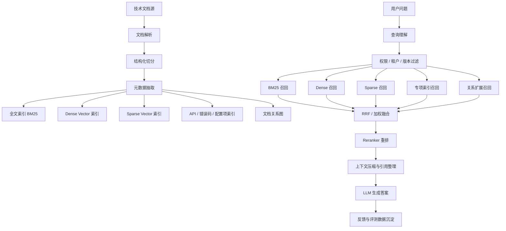
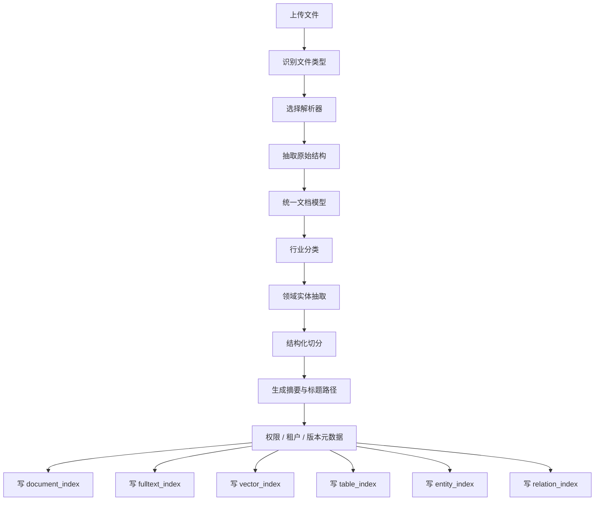
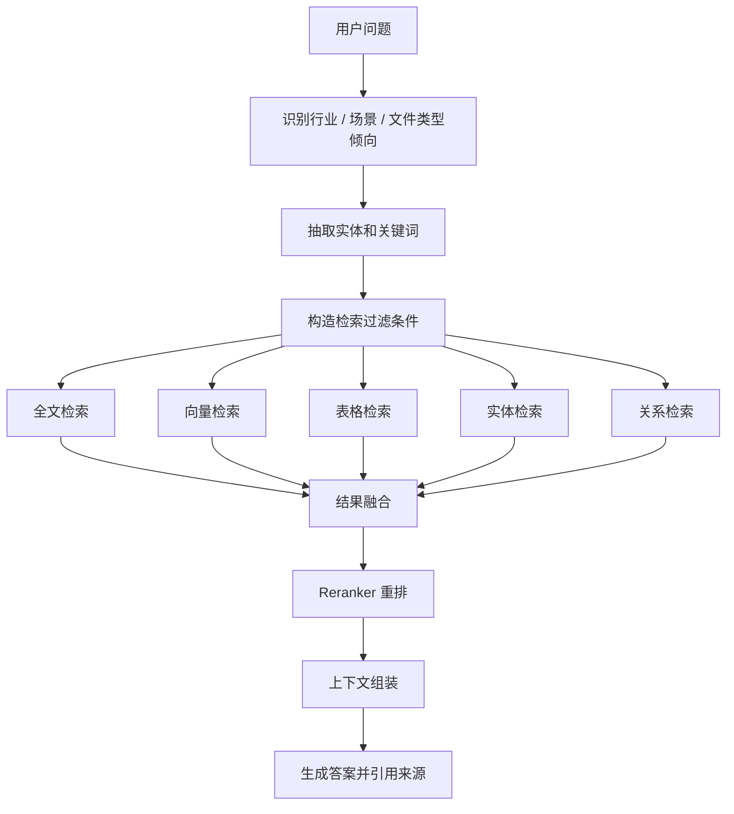
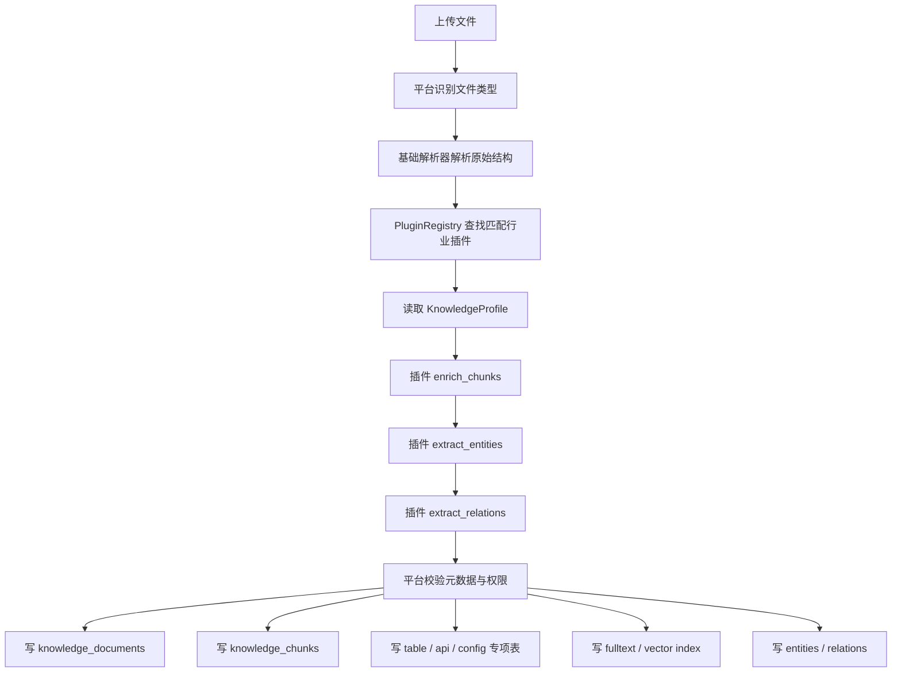
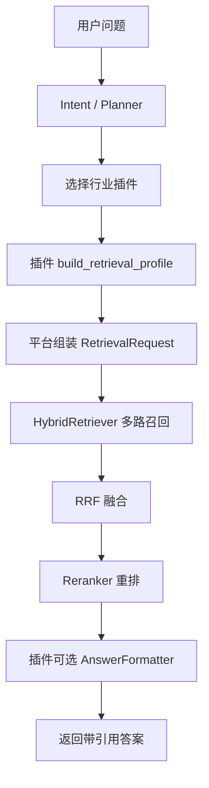

# 技术文档知识库 - 混合检索优化方案

**版本**: v1.0  
**日期**: 2026-04-22  
**状态**: 方案草案  
**适用范围**: Agent Operating Platform 的知识库、技术文档检索、RAG 问答与企业内部文档治理

---

## 目录

1. [方案目标](#1-方案目标)
2. [核心结论](#2-核心结论)
3. [整体架构](#3-整体架构)
4. [文档入库优化](#4-文档入库优化)
5. [查询理解优化](#5-查询理解优化)
6. [多路召回设计](#6-多路召回设计)
7. [融合与重排](#7-融合与重排)
8. [技术文档专项优化](#8-技术文档专项优化)
9. [权限、版本与时效治理](#9-权限版本与时效治理)
10. [评测与反馈闭环](#10-评测与反馈闭环)
11. [跨行业与多格式索引设计](#11-跨行业与多格式索引设计)
12. [索引落库与召回链路](#12-索引落库与召回链路)
13. [行业索引能力的插件化注入](#13-行业索引能力的插件化注入)
14. [在当前平台中的落地建议](#14-在当前平台中的落地建议)
15. [实施优先级](#15-实施优先级)
16. [风险与取舍](#16-风险与取舍)
17. [总结](#17-总结)

---

## 1. 方案目标

本文档用于整理技术文档 / 知识库场景下，除向量数据库之外的混合检索优化技术，并给出适合 Agent Operating Platform 的工程落地路径。

目标包括：

- 提升技术文档问答的召回准确率。
- 降低相似但版本不匹配、权限不匹配、上下文不完整带来的误答风险。
- 支持错误码、API、配置项、日志、代码片段等技术内容的精确检索。
- 为后续 Retriever 能力模块、知识库管理页面、RAG 评测体系提供设计依据。

---

## 2. 核心结论

混合检索不应只理解为“向量检索 + 关键词检索”。在技术文档知识库中，稳定的检索系统通常由以下能力共同组成：

- 文档结构化切分
- 元数据过滤
- BM25 / 全文检索
- 稀疏向量检索
- Dense Vector 语义检索
- API / 错误码 / 配置项专项索引
- 多路召回
- RRF 等结果融合
- Cross-Encoder / Reranker 重排
- 权限、租户、版本、时效治理
- 离线评测与线上反馈闭环

向量数据库只是召回链路中的一个组件，不应承担全部检索责任。

---

## 3. 整体架构

### 3.1 推荐检索链路



### 3.2 设计原则

1. 召回阶段优先保证“不漏掉关键文档”。
2. 重排阶段负责判断“哪个文档真正能回答问题”。
3. 技术专有名词、错误码、API 名称、配置项必须保留精确匹配能力。
4. 版本、权限、租户过滤应尽量前置，避免无权或过期内容进入生成上下文。
5. 最终答案必须基于真实文档引用，不能把查询扩展或 HyDE 生成内容当事实来源。

---

## 4. 文档入库优化

### 4.1 结构化切分

技术文档不适合简单按固定长度切分。更推荐按文档结构切分：

- 按标题层级切分。
- 表格保持完整。
- 代码块不要切断。
- API 描述与参数表尽量放在同一个 chunk。
- 故障现象、原因、解决方案尽量放在同一个 chunk。
- 每个 chunk 附带标题路径。

示例 chunk：

```text
Agent Operating Platform > 知识库 > 文档入库 > AOP_DATABASE_URL

AOP_DATABASE_URL 用于配置 PostgreSQL 连接地址。
部署时需要确保数据库可连接，并在执行 alembic upgrade head 前完成环境变量配置。
```

### 4.2 元数据抽取

每个文档和 chunk 都应尽量带上可过滤字段：

```json
{
  "title": "Agent Runtime 部署说明",
  "doc_type": "deployment",
  "product": "Agent Operating Platform",
  "module": "runtime",
  "version": "v1.3",
  "environment": "kubernetes",
  "language": "zh-CN",
  "status": "published",
  "updated_at": "2026-04-22",
  "heading_path": ["部署", "环境变量", "数据库迁移"]
}
```

这些字段可以用于：

- 检索前过滤。
- 排序加权。
- 权限隔离。
- 答案引用展示。
- 文档治理与过期提醒。

---

## 5. 查询理解优化

查询理解用于把用户输入转成更适合检索的结构化查询。

推荐能力：

- 意图识别：安装、排错、API 使用、概念解释、版本差异。
- 实体识别：模块名、版本号、错误码、环境、框架、语言。
- 关键词抽取：保留技术词、配置项、接口路径。
- 拼写纠错：处理 API、配置项、模型名拼写错误。
- 缩写展开：如 AOP、RAG、MCP、SSE。
- 多查询扩展：生成多个等价查询并行召回。

示例：

```text
用户问题：
流式接口没输出

扩展查询：
- stream response no output
- SSE stream not returning data
- /agents/react/chat/stream
- curl -N
- text/event-stream
```

注意：技术场景中不要过度改写。错误码、接口路径、函数名、配置项、日志片段必须原样保留。

---

## 6. 多路召回设计

### 6.1 BM25 / 全文检索

BM25 对以下内容非常有效：

- 错误码
- API 名称
- 类名、函数名
- 配置项
- 日志片段
- 命令行参数
- 精确产品术语

优化方式：

- 标题字段权重大于正文。
- 错误码字段权重大于普通段落。
- 代码块、配置项、日志样例单独建字段。
- 支持精确短语匹配。
- 对下划线、连字符、大小写做归一化。

可选技术：

- Elasticsearch / OpenSearch
- PostgreSQL Full Text Search
- SQLite FTS5
- Meilisearch / Typesense
- Lucene

### 6.2 Dense Vector 语义召回

Dense Vector 适合处理语义相近但字面不同的问题，例如：

```text
“agent 没记住上下文”
```

可召回：

- session_id 未传递
- conversation state 丢失
- memory 未持久化
- 多轮对话上下文配置

### 6.3 Sparse Vector 召回

Sparse Vector 可以理解为语义增强版关键词检索。它比纯 BM25 更具语义扩展能力，又比 Dense Vector 更容易保留关键词精确性。

常见方法：

- SPLADE
- uniCOIL
- DeepImpact
- learned sparse retrieval

适用场景：

- 专业术语较多。
- 查询中包含长尾词。
- 需要兼顾语义扩展与关键词命中。

### 6.4 专项索引召回

技术知识库建议单独维护以下索引：

| 索引 | 适用内容 |
|------|----------|
| `docs_index` | 普通文档段落 |
| `api_index` | OpenAPI、接口路径、请求响应 schema |
| `error_code_index` | 错误码、异常名称、排查建议 |
| `config_index` | 环境变量、配置项、默认值、示例 |
| `code_snippet_index` | 代码片段、命令、SDK 用法 |
| `log_pattern_index` | 日志模式、报错文本、排查路径 |
| `faq_index` | 常见问答与人工沉淀经验 |

例如用户查询：

```text
422 tools calling
```

不应只依赖语义召回，而应同时查：

- HTTP 422 错误码索引
- tool calling 文档
- 请求 schema
- 相关接口路径
- 历史 FAQ / 工单经验

---

## 7. 融合与重排

### 7.1 RRF 融合

RRF（Reciprocal Rank Fusion）适合多路召回结果合并。它不要求 BM25、向量检索、专项索引的分数尺度一致，只依赖每个召回器内部的排名。

简化公式：

```text
score(doc) = sum(1 / (k + rank_i(doc)))
```

适合场景：

- BM25 分数和向量分数不好直接比较。
- 不同检索器召回结果尺度不同。
- 需要快速建立稳定 baseline。

### 7.2 加权融合

当系统有足够评测数据后，可以引入加权融合：

```text
final_score =
  0.45 * rerank_score
+ 0.20 * bm25_score
+ 0.15 * dense_score
+ 0.10 * version_match
+ 0.05 * freshness
+ 0.05 * source_authority
```

权重不应固定拍脑袋决定，应通过真实查询日志和离线评测集调优。

### 7.3 Reranker 重排

召回阶段可以取更多候选：

```text
BM25 top 50
Dense top 50
Sparse top 50
专项索引 top 30
融合后取 top 100
```

然后使用 Reranker 判断 query 与 chunk 是否真的相关：

```text
(query, chunk) -> relevance_score
```

可选方案：

- bge-reranker
- Cohere Rerank
- Jina Reranker
- monoT5
- ColBERT 类 late interaction 模型

---

## 8. 技术文档专项优化

### 8.1 表格处理

参数表、错误码表、配置项表应保持结构，不建议拆成孤立文本。

建议保留：

- 表名
- 所属模块
- 字段名
- 类型
- 默认值
- 是否必填
- 示例值
- 说明

### 8.2 代码块处理

代码块应记录语言类型，并与前后说明绑定：

```json
{
  "kind": "code",
  "language": "bash",
  "module": "deployment",
  "content": "uv run alembic upgrade head",
  "description": "执行数据库迁移"
}
```

### 8.3 错误码处理

错误码适合结构化建模：

```json
{
  "error_code": "422",
  "service": "agent-runtime",
  "endpoint": "/agents/react/chat/stream",
  "cause": "请求体参数不符合 schema",
  "fix": "检查 input、session_id、工具调用参数结构"
}
```

### 8.4 术语表与同义词

建议维护平台领域词典：

```json
{
  "tool calling": ["function calling", "工具调用", "tools"],
  "stream": ["SSE", "流式响应", "text/event-stream"],
  "session": ["conversation", "上下文", "会话"],
  "retriever": ["检索器", "知识库检索", "RAG retrieval"]
}
```

术语表可用于：

- 查询扩展
- 索引增强
- 搜索建议
- 拼写纠错

核心术语建议人工维护，避免自动扩展带来噪声。

---

## 9. 权限、版本与时效治理

### 9.1 权限过滤

企业知识库必须先判断“能不能看”，再判断“相关不相关”。

建议过滤条件：

```sql
WHERE visibility = 'published'
  AND tenant_id = :current_tenant
  AND status != 'deprecated'
  AND access_level <= :user_access_level
```

### 9.2 版本过滤

技术文档经常存在版本差异。检索时应尽量使用当前运行版本和兼容版本。

示例：

```sql
WHERE product = 'Agent Operating Platform'
  AND module = 'runtime'
  AND version <= :current_version
  AND status != 'deprecated'
```

### 9.3 时效排序

排序时可以加入：

- 文档更新时间。
- 与当前版本的匹配程度。
- 是否 deprecated。
- 是否来自官方主文档。
- 是否被近期工单引用。
- 是否有成功解决记录。

---

## 10. 评测与反馈闭环

### 10.1 离线评测集

建议建立检索评测集：

```json
{
  "query": "流式接口没有输出怎么排查",
  "expected_docs": [
    "runtime-streaming-troubleshooting",
    "api-chat-stream"
  ],
  "must_contain_answer": ["curl -N", "text/event-stream", "session_id"],
  "forbidden_docs": ["deprecated-stream-api"],
  "intent": "troubleshooting",
  "version": "v1.3",
  "difficulty": "medium"
}
```

### 10.2 指标

推荐指标：

- Recall@k
- Precision@k
- MRR
- nDCG
- answer groundedness
- citation accuracy
- no-answer accuracy

### 10.3 线上反馈

可收集：

- 用户查询
- 点击文档
- 继续追问次数
- 用户是否点“有帮助”
- 工单最终解决方案
- 无结果查询
- 被人工采纳的答案

这些数据可用于：

- 调整字段权重。
- 补充术语表。
- 发现缺失文档。
- 训练 Reranker。
- 构建 query-doc relevance 数据集。

---

## 11. 跨行业与多格式索引设计

### 11.1 设计目标

跨行业、多格式知识库不能只做“统一文本切块 + 向量化”。更稳的方式是：

```text
文件解析层
 -> 行业语义抽取层
 -> 统一文档模型层
 -> 多粒度 chunk 层
 -> 多索引写入层
 -> 行业检索策略层
```

其中，文件格式决定“怎么解析”，行业语义决定“怎么抽取实体、怎么建索引、怎么召回”。

### 11.2 统一文档模型

不管来源是 PDF、Word、Excel、Markdown、HTML、PPT、图片 OCR，入库后都应先转换为统一中间模型。

```json
{
  "document_id": "doc_001",
  "tenant_id": "tenant_a",
  "industry": "finance",
  "business_domain": "risk_control",
  "file_type": "xlsx",
  "title": "企业授信审批规则",
  "source_uri": "s3://kb/finance/risk/credit_rule.xlsx",
  "version": "2026-04",
  "language": "zh-CN",
  "status": "published",
  "security_level": 3,
  "sections": [],
  "tables": [],
  "figures": [],
  "code_blocks": [],
  "entities": [],
  "relations": []
}
```

关键原则：

- 不要一开始把所有内容压成纯文本。
- 保留标题层级、段落、表格、图片说明、OCR 文本、公式、代码块。
- 保留页码、sheet、slide、section、row、column、原始坐标等定位信息。
- 保留行业、业务域、文档类型、版本、权限等治理字段。

### 11.3 不同格式文件的索引策略

| 文件类型 | 解析重点 | 推荐索引方式 |
|----------|----------|--------------|
| Markdown / HTML | 标题层级、链接、代码块 | 段落索引 + 标题路径 + 代码块索引 |
| Word / PDF | 标题、段落、表格、页码 | 段落索引 + 表格索引 + 页码引用 |
| Excel / CSV | sheet、表头、行列、公式 | 表格结构索引 + 行级索引 + 字段索引 |
| PPT | slide、标题、图文关系 | slide 级索引 + 文本块索引 + 图片 OCR |
| 图片 / 扫描件 | OCR、版面区域、图表说明 | OCR 索引 + 图片向量索引 + 版面坐标 |
| JSON / YAML | key path、schema、字段值 | path 索引 + 字段索引 + 文档索引 |
| 代码 / 日志 | 函数、类、错误栈、时间线 | 符号索引 + 日志模式索引 + 全文索引 |
| API 文档 | path、method、schema、错误码 | API 专项索引 + 错误码索引 |

例如 Excel 不应只切成普通段落，而应保留行级结构：

```json
{
  "sheet": "授信规则",
  "row": 18,
  "columns": {
    "客户类型": "小微企业",
    "授信额度上限": "500万",
    "审批级别": "二级审批",
    "风险等级": "B"
  }
}
```

这样用户问“小微企业授信额度上限是多少”时，可以直接命中结构化字段，而不是只依赖语义相似。

### 11.4 行业元数据设计

跨行业知识库的核心差异不只是文件格式，而是行业语义。相同词汇在不同行业可能含义不同。

例如“额度”：

- 金融：授信额度、贷款额度。
- 人力资源：假期额度、福利额度。
- 客服：工单配额。
- 云平台：资源 quota。

因此每个文档和 chunk 都应带行业标签：

```json
{
  "industry": "finance",
  "business_domain": "credit_approval",
  "scenario": "loan_risk_control",
  "doc_type": "policy",
  "entity_types": ["customer_type", "credit_limit", "risk_level", "approval_level"]
}
```

常见行业字段示例：

| 行业 | 业务域 | 典型实体 |
|------|--------|----------|
| 金融 | 授信、风控、合规 | 客户类型、授信额度、风险等级、审批规则、监管条款 |
| 医疗 | 临床指南、用药、检查 | 疾病、症状、药物、剂量、禁忌症、诊疗流程 |
| 法务 | 合同、法规、争议处理 | 合同主体、义务、责任、条款、管辖地、生效日期 |
| 制造 | 质量、工艺、设备维护 | 零件号、工序、缺陷类型、检验标准、公差、批次 |
| 客服 | 工单、FAQ、服务流程 | 问题类型、服务等级、处理动作、话术、升级路径 |
| 政务 | 政策、审批、办事指南 | 事项、材料、条件、流程、部门、办理时限 |

### 11.5 多粒度索引

跨行业、多格式文件建议至少建立三层粒度：

```text
文档级索引
section / sheet / slide 级索引
chunk / row / block 级索引
```

文档级索引用于发现文档：

```json
{
  "document_id": "doc_001",
  "title": "差旅报销制度",
  "industry": "enterprise",
  "doc_type": "policy",
  "summary": "说明员工出差审批、住宿标准、交通报销规则"
}
```

章节级索引用于定位主题：

```json
{
  "section_id": "sec_001",
  "document_id": "doc_001",
  "heading_path": ["差旅报销制度", "住宿标准"],
  "content": "一线城市住宿标准为每晚不超过 600 元..."
}
```

原子块索引用于回答事实：

```json
{
  "chunk_id": "chunk_001",
  "document_id": "doc_001",
  "section_id": "sec_001",
  "content": "一线城市住宿标准为每晚不超过 600 元。",
  "facts": {
    "city_level": "一线城市",
    "hotel_limit": "600元/晚"
  }
}
```

对于 Excel，可以是 row 级索引；对于 PPT，可以是 slide 级索引；对于 API 文档，可以是 endpoint 级索引。

### 11.6 行业实体与关系抽取

跨行业知识库要做稳定检索，需要抽取领域实体与关系。

示例：

```text
金融：
客户类型 -> 小微企业
授信额度上限 -> 500万
审批级别 -> 二级审批
风险等级 -> B

医疗：
疾病 -> 高血压
药物 -> 硝苯地平
剂量 -> 10mg
禁忌症 -> 妊娠期慎用

法务：
合同主体 -> 甲方 / 乙方
义务 -> 按期交付
违约责任 -> 每延迟一日支付合同金额 0.1%
管辖法院 -> 北京市朝阳区人民法院

制造：
零件号 -> PN-8831
缺陷类型 -> 表面划痕
公差 -> ±0.02mm
检验标准 -> GB/T xxxx
```

实体和关系可以写入：

```text
knowledge_entities
knowledge_relations
graph_store
```

轻量阶段可以先用 PostgreSQL 关系表：

```text
entity_a = 小微企业
relation = has_credit_limit
entity_b = 500万
source_chunk_id = chunk_001
```

### 11.7 多索引并存

跨行业、多格式知识库不应只使用一个索引。推荐组合：

| 索引 | 作用 |
|------|------|
| `document_index` | 文档级检索、导航、摘要 |
| `chunk_index` | 普通段落语义检索 |
| `fulltext_index` | 关键词、术语、错误码、编号 |
| `table_index` | Excel、CSV、PDF 表格 |
| `entity_index` | 行业实体，如药品、条款、零件号 |
| `relation_index` | 实体关系，如药品-禁忌症、条款-责任方 |
| `api_index` | API path、method、schema |
| `code_index` | 函数、类、配置项、日志模式 |
| `image_ocr_index` | 图片 OCR 文本 |
| `multimodal_index` | 图片、图表、扫描件语义检索 |
| `audit_index` | 权限、来源、版本、过期状态 |

例如用户问“小微企业授信额度上限是多少”，推荐召回：

```text
industry = finance
business_domain = credit_approval
file_type in ["xlsx", "csv", "docx", "pdf"]

优先：
1. table_index
2. entity_index
3. fulltext_index
4. chunk_index
```

### 11.8 跨行业入库流程



### 11.9 跨行业查询流程



### 11.10 行业索引 Profile

不同行业应通过 Profile 配置召回策略，避免把行业规则写死在核心检索逻辑中。

```yaml
finance:
  preferred_indexes:
    - table_index
    - entity_index
    - fulltext_index
    - vector_index
  entity_types:
    - customer_type
    - credit_limit
    - risk_level
    - approval_rule
  rerank_weights:
    table_match: 0.30
    entity_match: 0.25
    bm25: 0.20
    vector: 0.15
    freshness: 0.10

legal:
  preferred_indexes:
    - fulltext_index
    - entity_index
    - relation_index
    - vector_index
  entity_types:
    - clause
    - party
    - obligation
    - liability
  rerank_weights:
    clause_match: 0.30
    exact_term: 0.25
    vector: 0.20
    authority: 0.15
    freshness: 0.10
```

新增行业时，优先新增 Profile、实体抽取规则、字段映射和评测样本，不要直接改核心 Retriever 编排逻辑。

---

## 12. 索引落库与召回链路

### 12.1 推荐落库分层

知识库入库时不要只写一个向量库。推荐将原始文件、结构化元数据、全文索引、向量索引、专项索引分开存储，并用统一的 `document_id`、`chunk_id` 关联。

| 内容类型 | 推荐落库位置 | 说明 |
|----------|--------------|------|
| 原始文件 | Object Storage / 本地文件存储 | 保存 PDF、Word、Excel、图片等原文件，供下载、审计、重新解析使用 |
| 文档元数据 | PostgreSQL `knowledge_documents` | 租户、行业、文档类型、文件类型、版本、状态、权限、来源等 |
| 文档 chunk | PostgreSQL `knowledge_chunks` | 标题路径、正文、页码、sheet、slide、row 范围、chunk 类型等 |
| 全文检索 | PostgreSQL FTS / Elasticsearch / OpenSearch | BM25、短语匹配、错误码、配置项、接口路径、日志片段 |
| Dense 向量 | pgvector / Milvus / Qdrant / Weaviate | 语义召回，保存 chunk embedding |
| Sparse 向量 | Elasticsearch / OpenSearch / 专用 sparse index | SPLADE、learned sparse retrieval 等稀疏召回 |
| 表格行数据 | PostgreSQL JSONB / Elasticsearch | Excel、CSV、PDF 表格的行级结构化检索 |
| API / 错误码 / 配置项 | PostgreSQL 结构表 + 全文索引 | 用于精确过滤与专项召回 |
| 实体与关系 | PostgreSQL 关系表 / Neo4j | 行业实体、文档关系、API 与错误码关系、配置项依赖关系 |
| 检索日志与反馈 | PostgreSQL / ClickHouse / 日志平台 | query、召回结果、点击、反馈、最终答案、人工采纳结果 |

如果当前阶段希望控制复杂度，建议优先采用：

```text
PostgreSQL
  -> 文档元数据
  -> chunk 正文
  -> 表格行 JSONB
  -> API / 错误码 / 配置项结构表
  -> 反馈日志

pgvector
  -> chunk dense embedding

PostgreSQL FTS 或 OpenSearch
  -> BM25 / 全文检索

Object Storage
  -> 原始文件
```

这样既能支撑 P0/P1 的混合检索，也不会过早引入过多基础设施。

### 12.2 入库写入映射

不同解析结果应写入不同存储，而不是全部塞进同一个 chunk 表。

| 解析结果 | 写入目标 | 召回用途 |
|----------|----------|----------|
| 文件基础信息 | `knowledge_documents` | 权限、租户、行业、版本、状态过滤 |
| 普通段落 | `knowledge_chunks` + 全文索引 + 向量索引 | 普通问答、语义召回、关键词召回 |
| 标题路径 | `knowledge_chunks.heading_path` | 提升上下文相关性与引用可读性 |
| PDF 页码 / Word 小节 | `knowledge_chunks.metadata` | 答案引用与原文定位 |
| Excel / CSV 行 | `knowledge_table_rows` + 全文索引 | 表格问答、精确字段查询 |
| API endpoint | `knowledge_api_endpoints` | 接口路径、method、schema 查询 |
| 错误码 | `knowledge_error_codes` | 错误排查、异常原因定位 |
| 配置项 | `knowledge_config_items` | 环境变量、默认值、依赖关系查询 |
| 代码块 / 命令 | `knowledge_code_snippets` | SDK、CLI、部署命令检索 |
| 图片 OCR 文本 | `knowledge_chunks`，`chunk_type = 'ocr'` | 扫描件、截图、图表文字检索 |
| 行业实体 | `knowledge_entities` | 金融、医疗、法务、制造等领域实体召回 |
| 实体关系 | `knowledge_relations` | 关系扩展、GraphRAG、上下游依赖定位 |

示例：一份 Excel 授信规则文件入库时，不只生成向量，还应写入：

```text
knowledge_documents
  -> 文件标题、行业 finance、业务域 credit_approval、版本、权限

knowledge_chunks
  -> sheet 摘要、表格说明、关键规则说明

knowledge_table_rows
  -> 每一行授信规则，row_data 保存客户类型、额度、风险等级、审批级别

knowledge_entities
  -> 小微企业、500万、B级风险、二级审批

knowledge_relations
  -> 小微企业 has_credit_limit 500万
  -> 小微企业 requires_approval_level 二级审批

vector_index
  -> sheet 摘要和关键规则 chunk 的 embedding

fulltext_index
  -> 文件标题、sheet 名、表头、行文本、实体名
```

### 12.3 最小表结构建议

P0 阶段至少需要以下核心表：

```sql
CREATE TABLE knowledge_documents (
    id UUID PRIMARY KEY,
    tenant_id UUID NOT NULL,
    industry VARCHAR(64),
    business_domain VARCHAR(128),
    doc_type VARCHAR(64),
    file_type VARCHAR(32),
    title TEXT NOT NULL,
    source_uri TEXT NOT NULL,
    version VARCHAR(64),
    language VARCHAR(32),
    status VARCHAR(32) NOT NULL,
    security_level INTEGER DEFAULT 0,
    created_at TIMESTAMP NOT NULL,
    updated_at TIMESTAMP NOT NULL
);

CREATE TABLE knowledge_chunks (
    id UUID PRIMARY KEY,
    document_id UUID NOT NULL REFERENCES knowledge_documents(id),
    tenant_id UUID NOT NULL,
    heading_path JSONB,
    chunk_type VARCHAR(32),
    content TEXT NOT NULL,
    summary TEXT,
    page_number INTEGER,
    sheet_name TEXT,
    slide_number INTEGER,
    row_range TEXT,
    metadata JSONB,
    embedding vector,
    created_at TIMESTAMP NOT NULL
);

CREATE TABLE knowledge_table_rows (
    id UUID PRIMARY KEY,
    document_id UUID NOT NULL REFERENCES knowledge_documents(id),
    chunk_id UUID REFERENCES knowledge_chunks(id),
    tenant_id UUID NOT NULL,
    sheet_name TEXT,
    table_name TEXT,
    row_number INTEGER,
    row_data JSONB NOT NULL,
    normalized_text TEXT,
    created_at TIMESTAMP NOT NULL
);
```

如果使用 PostgreSQL FTS，可以给 chunk 与表格行增加全文索引：

```sql
ALTER TABLE knowledge_chunks
ADD COLUMN search_vector tsvector
GENERATED ALWAYS AS (
    to_tsvector('simple', coalesce(content, '') || ' ' || coalesce(summary, ''))
) STORED;

CREATE INDEX idx_knowledge_chunks_search
ON knowledge_chunks USING GIN (search_vector);

ALTER TABLE knowledge_table_rows
ADD COLUMN search_vector tsvector
GENERATED ALWAYS AS (
    to_tsvector('simple', coalesce(normalized_text, ''))
) STORED;

CREATE INDEX idx_knowledge_table_rows_search
ON knowledge_table_rows USING GIN (search_vector);
```

如果使用 pgvector，可以给 `embedding` 建向量索引：

```sql
CREATE INDEX idx_knowledge_chunks_embedding
ON knowledge_chunks
USING ivfflat (embedding vector_cosine_ops);
```

### 12.4 召回编排

查询时先做查询理解，再按行业、文件类型、实体类型选择召回通道。

示例：用户问：

```text
小微企业授信额度上限是多少？
```

查询理解结果：

```json
{
  "industry": "finance",
  "business_domain": "credit_approval",
  "entities": ["小微企业"],
  "intent": "fact_lookup",
  "preferred_indexes": ["table", "entity", "fulltext", "vector"]
}
```

召回顺序：

1. 用租户、行业、权限、版本过滤 `knowledge_documents`。
2. 查 `knowledge_table_rows`，优先匹配 `row_data` 和 `normalized_text` 中的“小微企业”。
3. 查 `knowledge_entities`，定位“小微企业”及其关系。
4. 查全文索引，匹配“授信额度”“额度上限”“小微企业”。
5. 查向量索引，召回语义相近的授信规则 chunk。
6. 用 RRF 融合多路结果。
7. 用 Reranker 重排 top 50。
8. 组装原始行、来源文件、sheet、行号或页码，生成带引用答案。

### 12.5 召回 SQL 示例

表格精确召回：

```sql
SELECT r.*
FROM knowledge_table_rows r
JOIN knowledge_documents d ON d.id = r.document_id
WHERE d.tenant_id = :tenant_id
  AND d.industry = 'finance'
  AND d.business_domain = 'credit_approval'
  AND d.status = 'published'
  AND r.normalized_text ILIKE '%小微企业%'
ORDER BY r.row_number
LIMIT 20;
```

全文召回：

```sql
SELECT c.*
FROM knowledge_chunks c
JOIN knowledge_documents d ON d.id = c.document_id
WHERE d.tenant_id = :tenant_id
  AND d.status = 'published'
  AND c.search_vector @@ plainto_tsquery('simple', :query)
ORDER BY ts_rank(c.search_vector, plainto_tsquery('simple', :query)) DESC
LIMIT 50;
```

向量召回：

```sql
SELECT c.*, 1 - (c.embedding <=> :query_embedding) AS score
FROM knowledge_chunks c
JOIN knowledge_documents d ON d.id = c.document_id
WHERE d.tenant_id = :tenant_id
  AND d.status = 'published'
  AND d.industry = :industry
ORDER BY c.embedding <=> :query_embedding
LIMIT 50;
```

多路召回后，统一转换为候选结果：

```python
@dataclass(frozen=True)
class RetrievalCandidate:
    source: str
    document_id: str
    chunk_id: str | None
    content: str
    score: float
    rank: int
    metadata: dict
```

所有候选进入同一个融合层，避免每个索引直接决定最终答案。

### 12.6 不同行业的召回 Profile

可以为每个行业配置默认召回策略：

```yaml
finance:
  filters:
    industry: finance
  recall_order:
    - table_rows
    - entities
    - fulltext
    - vector
  weights:
    table_rows: 0.35
    entities: 0.25
    fulltext: 0.20
    vector: 0.20

legal:
  filters:
    industry: legal
  recall_order:
    - fulltext
    - entities
    - relations
    - vector
  weights:
    fulltext: 0.30
    entities: 0.25
    relations: 0.20
    vector: 0.25

manufacturing:
  filters:
    industry: manufacturing
  recall_order:
    - entities
    - table_rows
    - fulltext
    - vector
  weights:
    entities: 0.30
    table_rows: 0.25
    fulltext: 0.25
    vector: 0.20
```

新增行业时优先新增 Profile、实体类型和抽取规则，不要改核心 Retriever 编排逻辑。

---

## 13. 行业索引能力的插件化注入

### 13.1 与通用能力模块化方案的关系

根据 [可扩展Agent架构-通用能力模块化方案.md](/Users/shenwei/github/Agent-Operating-Platform/docs/可扩展Agent架构-通用能力模块化方案.md) 的分层原则：

- Retriever、Storage、Monitor 属于底层通用能力。
- HRPlugin、LegalPlugin、FinancePlugin 等属于上层行业 / 场景插件。
- Plugin Protocol Layer 负责把行业插件能力标准化暴露给 Agent 编排层。
- 上层插件不应直接触碰核心索引实现，也不应直接持有全量数据库访问权限。

因此，检索和索引阶段的行业定制不应通过“每个插件自己建一套检索系统”实现，而应通过插件向平台注入以下内容：

```text
行业插件注入：
  -> 行业元数据 schema
  -> 文件类型处理规则
  -> chunk 增强规则
  -> 实体抽取规则
  -> 关系抽取规则
  -> 专项索引路由
  -> 查询改写规则
  -> 召回 Profile
  -> Reranker 权重

平台通用能力负责：
  -> 文件入库任务编排
  -> 原始文件存储
  -> PostgreSQL / pgvector / 全文索引写入
  -> 权限、租户、版本过滤
  -> 多路召回
  -> RRF 融合
  -> 监控、审计、评测
```

这样可以保证“行业逻辑在插件层，基础设施在平台层”，符合通用能力模块化方案中的层级隔离原则。

### 13.2 插件注入点

建议在插件协议中增加知识库索引扩展契约。行业插件不直接操作数据库，而是声明自己如何参与索引和召回。

| 注入点 | 插件负责 | 平台负责 |
|--------|----------|----------|
| `KnowledgeProfile` | 声明行业、业务域、实体类型、默认索引策略 | 注册、校验、版本管理 |
| `DocumentClassifier` | 判断文档是否属于该行业或业务域 | 调用分类器并写入元数据 |
| `ChunkEnricher` | 给 chunk 补充行业字段、业务标签、事实字段 | 控制 chunk 生成与落库 |
| `EntityExtractor` | 抽取行业实体 | 写入 `knowledge_entities` |
| `RelationExtractor` | 抽取实体关系 | 写入 `knowledge_relations` |
| `IndexRoutingPolicy` | 决定哪些内容写入表格、全文、向量、专项索引 | 执行实际写入 |
| `QueryRewriter` | 行业查询扩展、术语归一化 | 保留原始 query 并执行多路召回 |
| `RetrievalProfile` | 声明召回通道、权重、过滤条件 | 调用 Retriever、融合、重排 |
| `AnswerFormatter` | 行业答案格式、引用展示规则 | 生成前后统一安全与审计 |

### 13.3 插件侧契约示例

```python
from dataclasses import dataclass, field
from typing import Any, Protocol


@dataclass(frozen=True)
class IndustryKnowledgeProfile:
    plugin_name: str
    industry: str
    business_domains: list[str]
    supported_file_types: list[str]
    supported_doc_types: list[str]
    entity_types: list[str]
    relation_types: list[str]
    preferred_indexes: list[str]
    rerank_weights: dict[str, float]
    required_metadata: list[str] = field(default_factory=list)


@dataclass(frozen=True)
class ParsedDocument:
    document_id: str
    file_type: str
    title: str
    text_blocks: list[dict[str, Any]]
    tables: list[dict[str, Any]]
    metadata: dict[str, Any]


@dataclass(frozen=True)
class EnrichedChunk:
    content: str
    chunk_type: str
    metadata: dict[str, Any]
    facts: dict[str, Any] = field(default_factory=dict)


@dataclass(frozen=True)
class ExtractedEntity:
    entity_type: str
    entity_name: str
    normalized_name: str
    attributes: dict[str, Any]
    evidence_chunk_id: str | None = None


@dataclass(frozen=True)
class ExtractedRelation:
    source_entity: str
    relation_type: str
    target_entity: str
    evidence_chunk_id: str | None = None
    confidence: float = 1.0


class IKnowledgeIndexPlugin(Protocol):
    def get_knowledge_profile(self) -> IndustryKnowledgeProfile:
        """声明插件支持的行业知识库索引能力。"""
        ...

    async def enrich_chunks(
        self,
        document: ParsedDocument,
        chunks: list[EnrichedChunk],
    ) -> list[EnrichedChunk]:
        """补充行业元数据、事实字段、索引标签。"""
        ...

    async def extract_entities(
        self,
        chunks: list[EnrichedChunk],
    ) -> list[ExtractedEntity]:
        """抽取行业实体。"""
        ...

    async def extract_relations(
        self,
        entities: list[ExtractedEntity],
        chunks: list[EnrichedChunk],
    ) -> list[ExtractedRelation]:
        """抽取行业实体关系。"""
        ...

    async def build_retrieval_profile(
        self,
        query: str,
        context: dict[str, Any],
    ) -> dict[str, Any]:
        """生成行业召回策略，包括 filters、preferred_indexes、weights。"""
        ...
```

### 13.4 金融插件示例

金融插件不需要知道底层是 PostgreSQL、pgvector 还是 OpenSearch，只需要声明金融行业的知识结构和召回策略。

```python
class FinanceKnowledgePlugin:
    def get_knowledge_profile(self) -> IndustryKnowledgeProfile:
        return IndustryKnowledgeProfile(
            plugin_name="FinancePlugin",
            industry="finance",
            business_domains=["credit_approval", "risk_control", "compliance"],
            supported_file_types=["xlsx", "csv", "pdf", "docx"],
            supported_doc_types=["policy", "rule_table", "regulation", "faq"],
            entity_types=[
                "customer_type",
                "credit_limit",
                "risk_level",
                "approval_rule",
                "regulatory_clause",
            ],
            relation_types=[
                "has_credit_limit",
                "requires_approval_level",
                "belongs_to_risk_level",
                "constrained_by_clause",
            ],
            preferred_indexes=[
                "table_index",
                "entity_index",
                "fulltext_index",
                "vector_index",
            ],
            rerank_weights={
                "table_match": 0.30,
                "entity_match": 0.25,
                "bm25": 0.20,
                "vector": 0.15,
                "freshness": 0.10,
            },
            required_metadata=[
                "tenant_id",
                "industry",
                "business_domain",
                "doc_type",
                "version",
                "security_level",
            ],
        )

    async def enrich_chunks(self, document, chunks):
        enriched = []
        for chunk in chunks:
            metadata = {
                **chunk.metadata,
                "industry": "finance",
                "business_domain": document.metadata.get("business_domain"),
                "index_profile": "finance_credit",
            }

            if chunk.chunk_type == "table_row":
                metadata["preferred_index"] = "table_index"

            enriched.append(
                EnrichedChunk(
                    content=chunk.content,
                    chunk_type=chunk.chunk_type,
                    metadata=metadata,
                    facts=chunk.facts,
                )
            )
        return enriched

    async def build_retrieval_profile(self, query, context):
        return {
            "filters": {
                "tenant_id": context["tenant_id"],
                "industry": "finance",
                "business_domain": context.get("business_domain"),
                "status": "published",
            },
            "preferred_indexes": [
                "table_rows",
                "entities",
                "fulltext",
                "vector",
            ],
            "weights": {
                "table_rows": 0.35,
                "entities": 0.25,
                "fulltext": 0.20,
                "vector": 0.20,
            },
        }
```

### 13.5 入库阶段如何调用插件

平台入库服务负责调度，插件只返回行业增强结果。



入库阶段的责任边界：

| 阶段 | 行业插件 | 平台 |
|------|----------|------|
| 文件解析 | 可声明特定格式规则，如金融 Excel 表头识别 | 执行基础解析，管理解析任务 |
| chunk 增强 | 补充行业标签、事实字段、索引偏好 | 生成 chunk、控制大小和结构 |
| 实体抽取 | 抽取客户类型、额度、条款、药品等行业实体 | 统一落库、去重、审计 |
| 关系抽取 | 抽取额度关系、条款约束、禁忌关系等 | 写入关系表或图存储 |
| 索引路由 | 声明 chunk 应进入哪些索引 | 执行 PostgreSQL、pgvector、全文索引写入 |

### 13.6 召回阶段如何调用插件

召回阶段由 Agent 编排层先识别意图，再通过插件生成行业召回策略，最后交给通用 Retriever 执行。



召回请求可以统一成：

```python
@dataclass(frozen=True)
class RetrievalRequest:
    query: str
    tenant_id: str
    user_id: str
    filters: dict[str, Any]
    preferred_indexes: list[str]
    weights: dict[str, float]
    top_k: int = 10
    rerank: bool = True
```

通用 Retriever 根据 `preferred_indexes` 调度不同索引：

```python
class PluginAwareHybridRetriever:
    async def retrieve_with_plugin(
        self,
        query: str,
        context: dict[str, Any],
        plugin: IKnowledgeIndexPlugin,
    ) -> list[dict[str, Any]]:
        profile = await plugin.build_retrieval_profile(query, context)

        request = RetrievalRequest(
            query=query,
            tenant_id=context["tenant_id"],
            user_id=context["user_id"],
            filters=profile["filters"],
            preferred_indexes=profile["preferred_indexes"],
            weights=profile["weights"],
            top_k=context.get("top_k", 10),
        )

        candidates = await self.index_router.search(request)
        fused = self.fusion.merge(candidates, weights=request.weights)
        reranked = await self.reranker.rerank(query, fused)
        return reranked[: request.top_k]
```

### 13.7 插件注册方式

可以在现有 `PluginRegistry` 基础上增加知识库 Profile 注册，不需要改变插件执行主流程。

```python
class PluginRegistry:
    def register_plugin(self, plugin_class, config):
        plugin = plugin_class(**self._resolve_dependencies(plugin_class))
        self._plugins[plugin.metadata.name] = plugin

        if hasattr(plugin, "get_knowledge_profile"):
            profile = plugin.get_knowledge_profile()
            self._knowledge_profiles[profile.industry] = profile
            self._knowledge_plugins[profile.industry] = plugin
```

行业匹配逻辑：

```text
显式 industry 参数
 -> 使用对应行业插件

没有 industry 参数
 -> 根据文档分类 / 用户组织 / 业务线 / query 实体识别推断

无法判断
 -> 使用 default knowledge profile
```

### 13.8 安全边界

行业插件只能注入规则，不能绕开平台治理。

必须遵守：

- 插件不能直接访问全量知识库表。
- 插件不能自行绕过 `tenant_id`、`security_level`、`status`、`version` 过滤。
- 插件返回的 filters 必须经过平台策略二次校验。
- 插件抽取的实体和关系必须带来源 chunk，便于审计和回溯。
- 插件升级需要跑行业检索评测集，避免召回策略漂移。

推荐执行顺序：

```text
plugin filters
  -> platform policy merge
  -> tenant / authz enforcement
  -> retrieval execution
```

其中平台策略优先级高于插件策略。

### 13.9 开发一个行业知识插件的最小清单

新增行业插件时，至少需要提供：

1. `IndustryKnowledgeProfile`：行业、业务域、文件类型、实体类型、索引偏好。
2. `required_metadata`：必须入库的治理字段。
3. `enrich_chunks`：chunk 行业增强逻辑。
4. `extract_entities`：实体抽取逻辑。
5. `build_retrieval_profile`：召回通道和权重。
6. 行业评测集：典型 query、期望文档、禁止命中文档。

非 P0 必需但建议后续补齐：

- `extract_relations`
- `QueryRewriter`
- `AnswerFormatter`
- 行业术语表
- 行业同义词表
- 行业专项 Reranker 权重

---

## 14. 在当前平台中的落地建议

Agent Operating Platform 已将 Retriever 作为通用能力模块之一，知识库能力可以按照“检索能力抽象 + 多实现适配 + 治理前置”的方式建设。

### 14.1 推荐模块边界

```text
apps/api/src/agent_platform/retrieval/
  interfaces.py          # Retriever 抽象协议
  query_parser.py        # 查询理解与实体抽取
  chunking.py            # 文档结构化切分
  fusion.py              # RRF / 加权融合
  rerank.py              # Reranker 适配
  metadata.py            # 元数据过滤与版本规则
  indexes/
    bm25.py              # 全文检索适配
    dense.py             # 向量检索适配
    sparse.py            # 稀疏向量适配
    api.py               # API / 错误码 / 配置项专项索引
```

可以在插件层增加行业知识扩展模块：

```text
apps/api/src/agent_platform/plugins/
  finance/
    knowledge.py         # FinanceKnowledgePlugin
    profile.yaml         # 行业索引 Profile
    entities.py          # 金融实体抽取
    relations.py         # 金融关系抽取
  legal/
    knowledge.py         # LegalKnowledgePlugin
    profile.yaml
    entities.py
    relations.py
```

平台 Retriever 只依赖统一协议，不直接依赖具体行业插件。

### 14.2 Retriever 调用示例

```python
from dataclasses import dataclass
from typing import Sequence


@dataclass(frozen=True)
class RetrievalContext:
    tenant_id: str
    user_id: str
    product: str
    version: str | None = None
    access_level: int = 0


@dataclass(frozen=True)
class RetrievedChunk:
    chunk_id: str
    title: str
    content: str
    source_uri: str
    score: float


class HybridRetriever:
    def retrieve(self, query: str, context: RetrievalContext) -> Sequence[RetrievedChunk]:
        parsed_query = self.query_parser.parse(query)
        filters = self.metadata_policy.build_filters(parsed_query, context)

        candidates = []
        candidates.extend(self.bm25_index.search(parsed_query.keyword_query, filters=filters))
        candidates.extend(self.dense_index.search(parsed_query.semantic_query, filters=filters))
        candidates.extend(self.sparse_index.search(parsed_query.keyword_query, filters=filters))
        candidates.extend(self.specialized_indexes.search(parsed_query, filters=filters))

        fused = self.fusion.merge(candidates)
        reranked = self.reranker.rerank(query, fused)
        return reranked[: self.top_k]
```

该示例表达的是模块职责，不要求一次性实现所有索引。实际落地时可以先实现 BM25 + Dense + RRF，再逐步接入专项索引和 Reranker。

---

## 15. 实施优先级

### P0：建立稳定 baseline

- 文档按标题层级结构化切分。
- chunk 写入标题路径、模块、版本、状态、更新时间等元数据。
- 建立统一文档模型，保留文件类型、行业、业务域、文档类型等基础字段。
- 定义 `IndustryKnowledgeProfile` 和插件注册机制。
- 明确原始文件、文档元数据、chunk、表格行、向量、全文索引分别写入的位置。
- 建立 BM25 / 全文检索。
- 继续保留 Dense Vector 召回。
- 使用 RRF 融合 BM25 与 Dense 结果。

### P1：提升技术文档准确率

- 引入 Reranker。
- 增加 Excel / CSV 行级索引、PDF / Word 表格索引、PPT slide 级索引。
- 单独索引错误码、API、配置项、代码块、日志样例。
- 增加行业实体抽取与行业召回 Profile。
- 接入插件的 `enrich_chunks`、`extract_entities`、`build_retrieval_profile`。
- 建立领域术语表与同义词表。
- 增加版本、权限、状态过滤。

### P2：形成长期优化闭环

- 建立离线检索评测集。
- 收集线上点击、反馈、工单解决记录。
- 通过评测数据调优融合权重。
- 引入 Sparse Vector 或学习排序。
- 建立文档关系图，支持 GraphRAG 类扩展召回。
- 按行业维护评测集和召回权重。
- 插件升级时执行行业检索回归测试。

---

## 16. 风险与取舍

| 风险 | 说明 | 建议 |
|------|------|------|
| 过度依赖向量召回 | 对错误码、配置项、API 名称不稳定 | 保留 BM25 和专项索引 |
| 多格式全部平铺为文本 | Excel、PPT、扫描件、API schema 会丢失结构 | 先转统一文档模型，再按类型写专项索引 |
| 行业语义混淆 | 同一词在不同行业含义不同 | 文档和 chunk 必须带行业、业务域、场景字段 |
| 插件直接访问底层知识库 | 容易绕过租户、权限、版本治理 | 插件只返回 Profile 和规则，平台统一执行检索 |
| 插件召回策略漂移 | 插件升级可能导致命中结果变化 | 每个行业插件维护专项评测集和回归门禁 |
| 查询改写过度 | 技术关键词被改坏，导致召回偏移 | 错误码、接口、配置项必须原样保留 |
| 元数据缺失 | 无法按租户、版本、状态过滤 | 入库阶段强制校验关键元数据 |
| Reranker 成本较高 | 候选过多会增加延迟 | 先融合截断，再重排 top 50-100 |
| 评测缺失 | 优化效果不可判断 | P0 阶段同步积累 query-doc 测试集 |

---

## 17. 总结

技术文档知识库的混合检索优化，应从单一向量召回升级为“结构化文档治理 + 多路召回 + 融合重排 + 权限版本过滤 + 评测反馈闭环”的完整体系。

对当前平台而言，推荐优先落地：

1. 文档结构化切分与元数据治理。
2. BM25 + Dense Vector + RRF 融合。
3. Reranker 重排。
4. 错误码、API、配置项、代码块专项索引。
5. 检索评测集与线上反馈闭环。

这条路径改造成本可控，也更符合 Agent Operating Platform 中 Retriever 通用能力模块的演进方向。
