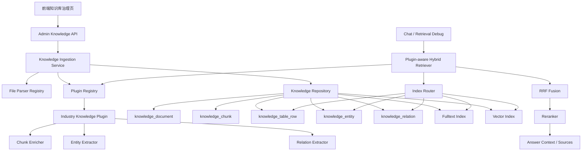
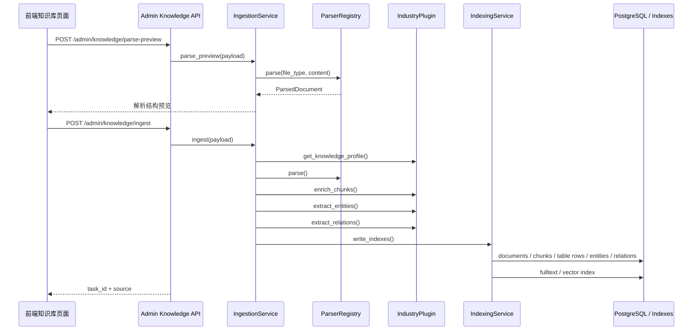
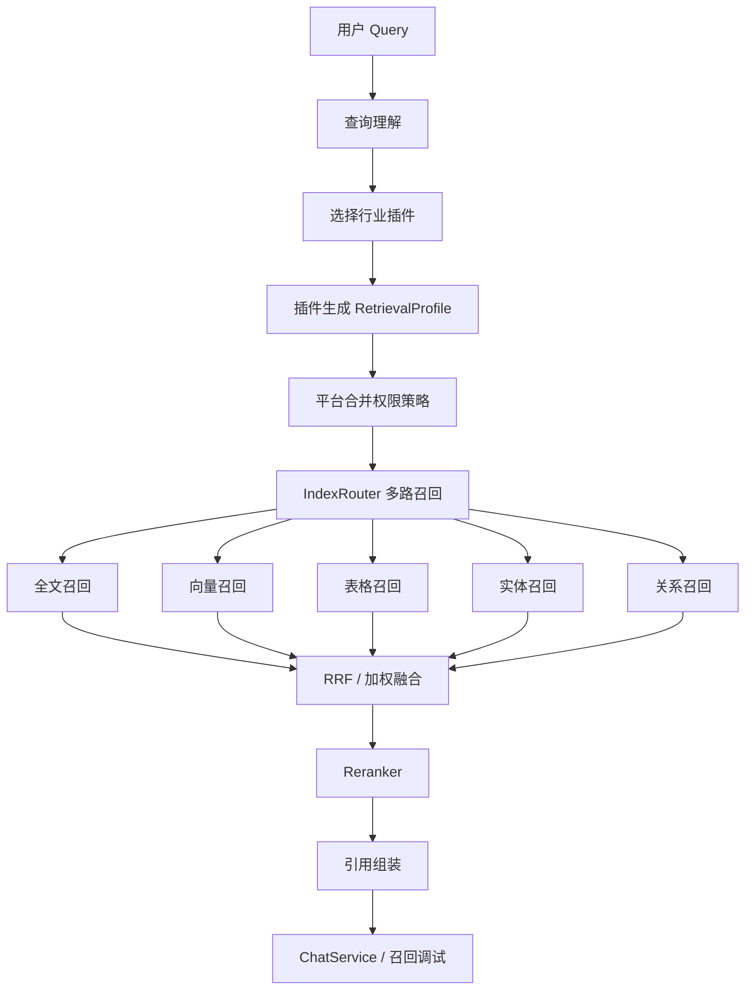

# 知识库行业插件化索引与混合检索 - 功能技术方案

**版本**: v1.0  
**日期**: 2026-04-22  
**状态**: 方案草案  
**适用范围**: Agent Operating Platform 知识库治理、行业插件化索引、多格式文档入库、混合检索与前端治理页面  
**关联文档**:

- [技术文档知识库-混合检索优化方案.md](/Users/shenwei/github/Agent-Operating-Platform/docs/技术文档知识库-混合检索优化方案.md)
- [知识库治理前端交互逻辑方案.md](/Users/shenwei/github/Agent-Operating-Platform/docs/知识库治理前端交互逻辑方案.md)
- [可扩展Agent架构-通用能力模块化方案.md](/Users/shenwei/github/Agent-Operating-Platform/docs/可扩展Agent架构-通用能力模块化方案.md)

---

## 目录

1. [背景与目标](#1-背景与目标)
2. [当前系统现状](#2-当前系统现状)
3. [建设范围](#3-建设范围)
4. [总体架构](#4-总体架构)
5. [核心设计原则](#5-核心设计原则)
6. [后端模块设计](#6-后端模块设计)
7. [行业插件化设计](#7-行业插件化设计)
8. [数据模型设计](#8-数据模型设计)
9. [入库流程设计](#9-入库流程设计)
10. [召回流程设计](#10-召回流程设计)
11. [前端交互设计](#11-前端交互设计)
12. [API 设计](#12-api-设计)
13. [权限、安全与审计](#13-权限安全与审计)
14. [评测与质量闭环](#14-评测与质量闭环)
15. [迁移与兼容策略](#15-迁移与兼容策略)
16. [实施计划](#16-实施计划)
17. [风险与取舍](#17-风险与取舍)

---

## 1. 背景与目标

当前平台已具备基础知识库能力：管理员可通过知识库页面提交 Markdown / 纯文本，后端完成切片、embedding 写入和简版混合检索，聊天链路可通过 `knowledge.search` 召回知识片段。

后续知识库需要支持：

- 不同行业：金融、法务、HR、制造、客服、政务等。
- 不同格式：Markdown、PDF、Word、Excel、CSV、PPT、HTML、JSON、图片 OCR、API 文档、日志等。
- 不同索引：全文、向量、表格行、实体、关系、API、错误码、配置项、代码块。
- 不同插件：行业插件注入行业实体、索引 Profile、召回策略、答案格式。
- 前端治理：入库配置、插件 Profile、流水线状态、召回调试、质量评测、新鲜度重建。

本功能的目标是把当前“文本知识入库 + 简版检索”升级为：

```text
多格式解析
 + 行业插件增强
 + 多索引落库
 + 混合召回
 + 融合重排
 + 前端可观测治理
```

---

## 2. 当前系统现状

### 2.1 后端现状

当前知识库核心路径：

| 能力 | 当前实现 |
|------|----------|
| 管理接口 | `GET /admin/knowledge`、`POST /admin/knowledge/ingest` |
| 入库请求 | `KnowledgeIngestRequest` 支持 `name`、`content`、`source_type`、`owner` |
| 文档表 | `knowledge_document` |
| chunk 表 | `knowledge_chunk` |
| Repository | `PostgresKnowledgeRepository` |
| 入库方法 | `ingest_text` |
| 检索方法 | `search` |
| embedding | 当前存储为 JSON list |
| 混合检索 | keyword score + vector cosine + RRF |
| 聊天接入 | `ChatService._run_knowledge_search` |
| 插件接入 | `KnowledgePlugin` / `knowledge.search` |

当前数据模型：

```text
knowledge_document
  -> source_id
  -> tenant_id
  -> name
  -> source_type
  -> owner
  -> chunk_count
  -> status

knowledge_chunk
  -> chunk_id
  -> source_id
  -> tenant_id
  -> chunk_index
  -> title
  -> content
  -> content_hash
  -> embedding
  -> metadata_json
  -> token_count
  -> status
```

当前能力优点：

- 已有租户级过滤。
- 已有文档与 chunk 基础表。
- 已有入库接口和前端入库面板。
- 已有 RRF 融合雏形。
- 已有聊天链路对接。

当前不足：

- 只支持 Markdown / 纯文本。
- 行业、业务域、文档类型、文件类型等元数据缺失。
- 表格、API、错误码、配置项、实体关系未结构化。
- 检索 Profile 不能按行业插件定制。
- 前端无法观测具体索引通道、召回路径和评测结果。

### 2.2 前端现状

当前页面：

```text
apps/web/src/app/(workspace)/knowledge/page.tsx
apps/web/src/components/knowledge/knowledge-ingest-panel.tsx
```

当前页面结构：

- 顶部指标卡片：检索质量指数、总切片规模、平均新鲜度。
- 知识入库表单：名称、负责人、文档内容。
- 处理流水线状态。
- 数据源列表。
- tabs：流水线、质量实验室、新鲜度。

当前前端适合作为治理页面骨架继续扩展。

---

## 3. 建设范围

### 3.1 本期建设范围

本功能包含：

- 扩展知识入库模型，支持行业、业务域、文档类型、文件类型、权限等级、插件 Profile。
- 建立行业知识插件契约。
- 建立多格式解析与统一文档模型。
- 增加表格行、实体、关系、索引任务、评测样例等数据结构。
- 扩展混合检索为插件感知的多路召回。
- 扩展知识库前端页面，支持入库配置、行业配置、召回调试和质量观测。

### 3.2 暂不纳入本期

暂不纳入本期指：当前阶段不作为 P0 / P1 的交付范围，避免在核心入库和检索链路尚未稳定前引入过重的平台能力。这些能力不是不做，而是建议放到 P2 / P3 或单独立项。

| 能力 | 暂不纳入原因 | 本期替代方案 |
|------|--------------|--------------|
| 完整在线协同标注系统 | 会涉及多人标注、审核流、冲突处理、任务分发、标注权限等完整平台能力，建设成本较高 | P0 / P1 只做轻量评测集，支持 query、expected_docs、forbidden_docs、must_contain_answer 等字段 |
| 大规模知识图谱可视化编辑器 | 图谱画布、节点拖拽、关系编辑、版本合并、冲突处理都属于独立复杂产品 | 本期只建设 `knowledge_entity`、`knowledge_relation` 及关系召回，不做复杂图谱 UI |
| 复杂多模态图片向量检索 | 图片 embedding、图表理解、图文混合召回、版面结构理解需要额外模型与评测体系 | 本期图片和扫描件先走 OCR 文本入库，按 `chunk_type = ocr` 进入全文 / 向量检索 |
| 自训练 reranker 平台 | 需要样本采集、训练任务、模型评估、模型发布、A/B、回滚等完整模型平台能力 | 本期只预留 Reranker 接口，可接入现成 reranker 或外部 rerank 服务 |
| 开放式插件市场 | 第三方插件涉及供应链、安全审查、沙箱、权限声明、签名、版本审核和租户隔离风险 | 本期仅支持企业内部插件注册和 Profile 管理，不开放第三方在线安装 |

本期重点是：

```text
多格式入库
+ 行业插件 Profile
+ 多索引落库
+ 混合召回
+ 前端治理页面
+ 基础评测闭环
```

暂不纳入本期的是：

```text
标注平台
+ 图谱编辑器
+ 多模态图片检索
+ 自训练 Reranker
+ 开放插件市场
```

---

## 4. 总体架构



架构分层：

| 层级 | 责任 |
|------|------|
| 前端治理层 | 入库配置、插件 Profile 展示、流水线观测、召回调试、质量实验室 |
| Admin API 层 | 知识库管理接口、权限校验、请求参数规范化 |
| 入库服务层 | 文件解析、chunk 生成、插件增强、索引任务编排 |
| 插件层 | 行业 Profile、实体抽取、关系抽取、召回策略 |
| 检索层 | 多路召回、RRF 融合、Reranker、引用组装 |
| 存储层 | PostgreSQL、全文索引、pgvector / JSON embedding、对象存储 |
| 治理层 | 租户、权限、版本、审计、评测、回滚 |

---

## 5. 核心设计原则

1. 平台负责基础设施，行业插件负责行业语义。
2. 插件只注入规则和 Profile，不直接访问全量底层知识库。
3. 文档入库先转统一文档模型，再写多种索引。
4. 检索先做权限、租户、版本过滤，再做多路召回。
5. 多格式内容不能全部平铺成文本，表格、API、错误码、实体关系需要专项索引。
6. 前端展示业务可理解的索引通道，不展示底层数据库复杂度。
7. 所有 Profile 变更和索引重建必须可评测、可回滚、可审计。

---

## 6. 后端模块设计

### 6.1 推荐模块结构

```text
apps/api/src/agent_platform/knowledge/
  models.py                  # 统一文档模型、入库任务、索引产物 DTO
  ingestion_service.py       # 入库编排
  parser_registry.py         # 文件解析器注册
  chunking.py                # 结构化切分
  profile_registry.py        # 行业 KnowledgeProfile 注册
  indexing_service.py        # 多索引写入编排
  evaluation_service.py      # 检索评测
  debug_service.py           # 召回调试

apps/api/src/agent_platform/knowledge/parsers/
  markdown.py
  text.py
  pdf.py
  docx.py
  spreadsheet.py
  html.py
  json_schema.py

apps/api/src/agent_platform/retrieval/
  interfaces.py
  query_parser.py
  index_router.py
  fusion.py
  rerank.py
  hybrid_retriever.py
  indexes/
    fulltext.py
    vector.py
    table.py
    entity.py
    relation.py
    api.py

apps/api/src/agent_platform/plugins/
  finance/
    knowledge.py
    profile.yaml
    entities.py
    relations.py
  legal/
    knowledge.py
    profile.yaml
```

### 6.2 与现有模块的关系

现有 `PostgresKnowledgeRepository` 不直接删除，建议演进为：

```text
PostgresKnowledgeRepository
  -> 保留 list_recent / 基础 CRUD
  -> search 逐步迁移到 PluginAwareHybridRetriever
  -> ingest_text 兼容旧接口

KnowledgeIngestionService
  -> 新增统一入库编排
  -> 内部可复用 chunk_text / embed_text
```

这样可以避免一次性替换当前聊天链路。

---

## 7. 行业插件化设计

### 7.1 插件契约

行业插件通过 `IKnowledgeIndexPlugin` 注入行业能力。

```python
@dataclass(frozen=True)
class IndustryKnowledgeProfile:
    plugin_name: str
    industry: str
    business_domains: list[str]
    supported_file_types: list[str]
    supported_doc_types: list[str]
    entity_types: list[str]
    relation_types: list[str]
    preferred_indexes: list[str]
    rerank_weights: dict[str, float]
    required_metadata: list[str]


class IKnowledgeIndexPlugin(Protocol):
    def get_knowledge_profile(self) -> IndustryKnowledgeProfile:
        ...

    async def enrich_chunks(self, document, chunks):
        ...

    async def extract_entities(self, chunks):
        ...

    async def extract_relations(self, entities, chunks):
        ...

    async def build_retrieval_profile(self, query: str, context: dict):
        ...
```

### 7.2 插件注入点

| 阶段 | 插件输出 | 平台动作 |
|------|----------|----------|
| 入库前 | `IndustryKnowledgeProfile` | 校验行业、文件类型、必填元数据 |
| 解析后 | enhanced chunks | 写入 chunk 表和索引通道 |
| 实体抽取 | entities | 写入 `knowledge_entity` |
| 关系抽取 | relations | 写入 `knowledge_relation` |
| 召回前 | retrieval profile | 生成 filters、preferred_indexes、weights |
| 生成前 | answer format 可选 | 控制行业答案结构 |

### 7.3 安全边界

插件不能：

- 直接访问全量知识库表。
- 绕过 `tenant_id`、`security_level`、`status`、`version`。
- 自行发布或删除索引。
- 修改平台级权限策略。

插件只能：

- 声明 Profile。
- 返回 chunk 增强结果。
- 返回实体和关系。
- 返回召回策略建议。

最终落库和检索执行由平台统一完成。

---

## 8. 数据模型设计

### 8.1 现有表扩展

#### `knowledge_document`

建议新增字段：

| 字段 | 类型 | 说明 |
|------|------|------|
| `industry` | varchar | 行业，如 finance、legal、hr |
| `business_domain` | varchar | 业务域 |
| `doc_type` | varchar | 文档类型 |
| `file_type` | varchar | 文件类型 |
| `source_uri` | text | 原始文件地址 |
| `version` | varchar | 文档版本 |
| `language` | varchar | 语言 |
| `security_level` | integer | 权限等级 |
| `profile_name` | varchar | 插件 Profile |
| `profile_version` | varchar | Profile 版本 |
| `metadata_json` | json | 扩展元数据 |
| `updated_at` | timestamp | 更新时间 |

#### `knowledge_chunk`

建议新增字段：

| 字段 | 类型 | 说明 |
|------|------|------|
| `chunk_type` | varchar | paragraph、table_row、code、ocr、api |
| `heading_path` | json | 标题路径 |
| `page_number` | integer | PDF / Word 页码 |
| `sheet_name` | varchar | Excel sheet |
| `slide_number` | integer | PPT 页码 |
| `row_range` | varchar | 表格行范围 |
| `facts_json` | json | 事实字段 |
| `index_channels` | json | 写入哪些索引 |

注意：如果使用 PostgreSQL 原生 `vector` 类型，应新增迁移，不要只修改代码逻辑。当前 `embedding` 是 JSON，可 P0 保持兼容，P1 再迁移 pgvector。

### 8.2 新增表

#### `knowledge_table_row`

```sql
CREATE TABLE knowledge_table_row (
    row_id VARCHAR(64) PRIMARY KEY,
    source_id VARCHAR(64) NOT NULL REFERENCES knowledge_document(source_id),
    chunk_id VARCHAR(64) REFERENCES knowledge_chunk(chunk_id),
    tenant_id VARCHAR(64) NOT NULL,
    sheet_name VARCHAR(255),
    table_name VARCHAR(255),
    row_number INTEGER,
    row_data JSON NOT NULL,
    normalized_text TEXT NOT NULL,
    metadata_json JSON NOT NULL,
    created_at TIMESTAMP WITH TIME ZONE DEFAULT now() NOT NULL
);
```

#### `knowledge_entity`

```sql
CREATE TABLE knowledge_entity (
    entity_id VARCHAR(64) PRIMARY KEY,
    source_id VARCHAR(64) NOT NULL REFERENCES knowledge_document(source_id),
    chunk_id VARCHAR(64) REFERENCES knowledge_chunk(chunk_id),
    tenant_id VARCHAR(64) NOT NULL,
    industry VARCHAR(64),
    entity_type VARCHAR(64) NOT NULL,
    entity_name TEXT NOT NULL,
    normalized_name TEXT NOT NULL,
    attributes_json JSON NOT NULL,
    created_at TIMESTAMP WITH TIME ZONE DEFAULT now() NOT NULL
);
```

#### `knowledge_relation`

```sql
CREATE TABLE knowledge_relation (
    relation_id VARCHAR(64) PRIMARY KEY,
    tenant_id VARCHAR(64) NOT NULL,
    source_entity_id VARCHAR(64) NOT NULL REFERENCES knowledge_entity(entity_id),
    relation_type VARCHAR(64) NOT NULL,
    target_entity_id VARCHAR(64) NOT NULL REFERENCES knowledge_entity(entity_id),
    evidence_chunk_id VARCHAR(64) REFERENCES knowledge_chunk(chunk_id),
    confidence FLOAT,
    created_at TIMESTAMP WITH TIME ZONE DEFAULT now() NOT NULL
);
```

#### `knowledge_ingest_task`

```sql
CREATE TABLE knowledge_ingest_task (
    task_id VARCHAR(64) PRIMARY KEY,
    tenant_id VARCHAR(64) NOT NULL,
    source_id VARCHAR(64),
    status VARCHAR(64) NOT NULL,
    current_stage VARCHAR(64) NOT NULL,
    stage_stats JSON NOT NULL,
    error_message TEXT,
    created_at TIMESTAMP WITH TIME ZONE DEFAULT now() NOT NULL,
    updated_at TIMESTAMP WITH TIME ZONE DEFAULT now() NOT NULL
);
```

#### `knowledge_eval_case`

```sql
CREATE TABLE knowledge_eval_case (
    case_id VARCHAR(64) PRIMARY KEY,
    tenant_id VARCHAR(64) NOT NULL,
    industry VARCHAR(64),
    business_domain VARCHAR(128),
    query TEXT NOT NULL,
    expected_docs JSON NOT NULL,
    forbidden_docs JSON NOT NULL,
    metadata_json JSON NOT NULL,
    created_at TIMESTAMP WITH TIME ZONE DEFAULT now() NOT NULL
);
```

---

## 9. 入库流程设计

### 9.1 流程图



### 9.2 入库阶段

| 阶段 | 说明 | 失败处理 |
|------|------|----------|
| 文件接收 | 获取上传文件、文本、URL 或连接器来源 | 返回校验错误 |
| 文件识别 | 推断 file_type、大小、页数、sheet 数 | 不支持时进入通用文本解析 |
| 解析预览 | 生成 heading、table、sheet、slide 预览 | 用户修正或取消 |
| Profile 匹配 | 根据 industry / business_domain 找插件 | fallback 到 general profile |
| chunk 生成 | 按文档结构切分 | 记录失败 chunk |
| 插件增强 | 增加行业元数据、事实字段 | 插件失败时可终止或降级，默认终止 |
| 实体关系抽取 | 写入实体和关系候选 | 可部分成功 |
| 多索引写入 | 写 document、chunk、table、entity、relation、全文、向量 | 使用 task 状态记录 |
| 质量校验 | 检查 chunk 数、索引通道、必填元数据 | 失败不发布 |
| 发布 | 状态切换为 published / 运行中 | 保留旧索引直到新索引可用 |

---

## 10. 召回流程设计

### 10.1 流程图



### 10.2 RetrievalRequest

```python
@dataclass(frozen=True)
class RetrievalRequest:
    query: str
    tenant_id: str
    user_id: str
    filters: dict[str, Any]
    preferred_indexes: list[str]
    weights: dict[str, float]
    top_k: int = 10
    rerank: bool = True
    debug: bool = False
```

### 10.3 多路召回通道

| 通道 | 数据来源 | 适用问题 |
|------|----------|----------|
| fulltext | `knowledge_chunk` FTS / OpenSearch | 错误码、API、术语、日志 |
| vector | `knowledge_chunk.embedding` / pgvector | 语义问答 |
| table_rows | `knowledge_table_row` | Excel / CSV 表格事实 |
| entities | `knowledge_entity` | 行业实体 |
| relations | `knowledge_relation` | 实体关系、依赖、规则 |
| api | API / 错误码专项表 | 接口、schema、状态码 |

### 10.4 与聊天链路集成

当前 `ChatService._run_knowledge_search` 调用 `KnowledgeRepository.search`。演进后：

```text
ChatService._run_knowledge_search
  -> PluginAwareHybridRetriever.retrieve()
  -> 返回 SourceReference + retrieval debug summary
```

P0 可保持原 `search` 不变；P1 将 `KnowledgeRepository.search` 内部委托给新的 Retriever。

---

## 11. 前端交互设计

### 11.1 页面扩展

当前页面保留，tabs 扩展为：

```text
流水线
行业配置
召回调试
质量实验室
新鲜度
```

### 11.2 入库面板

`KnowledgeIngestPanel` 从单一表单升级为分步表单：

1. 选择数据源：文件、文本、URL、连接器。
2. 选择行业与插件：industry、business_domain、doc_type、plugin_profile。
3. 解析预览：heading、sheet、table、slide、OCR。
4. 索引策略确认：fulltext、vector、table、entity、relation。
5. 提交入库：展示 task 状态和流水线进度。

### 11.3 行业配置

展示：

- 已安装知识插件。
- Profile 版本。
- 支持文件类型。
- 实体类型。
- 关系类型。
- 默认召回通道和权重。

操作：

- 查看 Profile。
- 运行评测。
- 灰度启用。
- 回滚版本。

### 11.4 召回调试

输入 query 后展示：

- 查询理解结果。
- 命中的行业插件。
- filters。
- preferred indexes。
- 各索引召回结果。
- RRF 融合结果。
- Reranker 结果。
- 最终引用。

### 11.5 数据源详情

数据源列表新增字段：

- 行业
- 业务域
- 文件类型
- 插件 Profile
- 索引通道
- 最近重建
- 质量状态

详情抽屉展示：

- 解析结构。
- chunk 统计。
- table rows。
- entities。
- relations。
- 评测结果。
- 重建 / 下线 / 调试入口。

---

## 12. API 设计

### 12.1 扩展现有接口

#### `GET /admin/knowledge`

返回新增字段：

```json
{
  "sources": [
    {
      "source_id": "ks_xxx",
      "tenant_id": "default",
      "name": "企业授信审批规则",
      "source_type": "file",
      "file_type": "xlsx",
      "industry": "finance",
      "business_domain": "credit_approval",
      "doc_type": "rule_table",
      "owner": "风控平台组",
      "chunk_count": 328,
      "index_channels": ["fulltext", "vector", "table", "entity"],
      "profile_name": "FinancePlugin",
      "profile_version": "1.0.0",
      "status": "运行中"
    }
  ]
}
```

#### `POST /admin/knowledge/ingest`

兼容当前 payload，并扩展字段：

```json
{
  "name": "企业授信审批规则",
  "owner": "风控平台组",
  "source_type": "file",
  "file_type": "xlsx",
  "industry": "finance",
  "business_domain": "credit_approval",
  "doc_type": "rule_table",
  "plugin_profile": "FinancePlugin@1.0.0",
  "security_level": 3,
  "content": "...",
  "ingest_options": {
    "extract_tables": true,
    "extract_entities": true,
    "extract_relations": true,
    "build_fulltext_index": true,
    "build_vector_index": true
  }
}
```

### 12.2 新增接口

| 方法 | 路径 | 说明 |
|------|------|------|
| `GET` | `/admin/knowledge/profiles` | 查询可用行业 Profile |
| `GET` | `/admin/knowledge/profiles/{industry}` | 查询行业 Profile 详情 |
| `POST` | `/admin/knowledge/parse-preview` | 解析预览 |
| `GET` | `/admin/knowledge/tasks/{task_id}` | 查询入库任务状态 |
| `GET` | `/admin/knowledge/sources/{source_id}` | 数据源详情 |
| `POST` | `/admin/knowledge/sources/{source_id}/reindex` | 重建单个数据源 |
| `POST` | `/admin/knowledge/retrieval-debug` | 召回调试 |
| `GET` | `/admin/knowledge/evaluations` | 查询评测集 |
| `POST` | `/admin/knowledge/evaluations/run` | 运行评测 |

---

## 13. 权限、安全与审计

### 13.1 权限

| 动作 | Scope |
|------|-------|
| 查看知识源 | `knowledge:read` |
| 上传知识源 | `knowledge:write` |
| 修改 Profile | `knowledge:profile:write` |
| 运行召回调试 | `knowledge:debug` |
| 重建索引 | `knowledge:reindex` |
| 查看评测 | `knowledge:evaluation:read` |
| 运行评测 | `knowledge:evaluation:run` |

### 13.2 审计事件

需要记录：

- 数据源上传。
- 解析预览。
- 入库任务开始 / 结束 / 失败。
- Profile 发布 / 回滚。
- 召回调试查询。
- 全量或局部重建。
- 数据源下线。
- 权限等级变更。

### 13.3 策略合并

召回过滤条件必须按以下顺序合并：

```text
plugin filters
  -> request filters
  -> tenant policy
  -> authz policy
  -> platform safety policy
```

平台策略优先级最高。

---

## 14. 评测与质量闭环

### 14.1 评测指标

- Recall@k
- Precision@k
- MRR
- nDCG
- citation accuracy
- no-answer accuracy
- plugin regression pass rate

### 14.2 失败样例分类

- 文档缺失。
- chunk 切分错误。
- 行业 Profile 过滤过严。
- 全文索引未命中。
- 向量召回偏移。
- 表格索引缺失。
- 实体抽取错误。
- 权限过滤导致不可见。
- Reranker 排序错误。

### 14.3 插件回归

每次行业插件升级必须运行：

- 插件契约测试。
- 行业评测集。
- 关键 query 固定回归。
- Profile 权重变更对比。

---

## 15. 迁移与兼容策略

### 15.1 数据兼容

当前已有 `knowledge_document` 和 `knowledge_chunk` 数据继续可用。

迁移策略：

1. 对旧文档补默认字段：
   - `industry = general`
   - `business_domain = general`
   - `doc_type = knowledge`
   - `file_type = source_type`
   - `profile_name = GeneralKnowledgeProfile`
2. 旧 chunk 的 `metadata_json` 保留。
3. 旧 embedding JSON 保留，P1 再决定是否迁移 pgvector。
4. 新增表不影响旧 search。

### 15.2 接口兼容

`POST /admin/knowledge/ingest` 继续接受旧 payload：

```json
{
  "name": "产品实施手册",
  "owner": "知识平台组",
  "source_type": "Markdown",
  "content": "..."
}
```

服务端自动补：

```json
{
  "industry": "general",
  "business_domain": "general",
  "doc_type": "knowledge",
  "plugin_profile": "GeneralKnowledgeProfile@1.0.0"
}
```

---

## 16. 实施计划

### P0：基础模型与前端最小增强

目标：不破坏现有链路，补齐行业和索引元数据。

- 扩展 `KnowledgeIngestRequest`。
- 扩展 `knowledge_document` 和 `knowledge_chunk` 字段。
- 增加 `GeneralKnowledgeProfile`。
- 前端入库面板增加行业、业务域、文档类型、文件类型字段。
- 数据源列表展示行业、Profile、索引通道。
- `GET /admin/knowledge/profiles` 返回静态 Profile。

### P1：插件化入库与多路召回

目标：支持行业插件注入和多索引召回。

- 新增 `IKnowledgeIndexPlugin`。
- 新增 `KnowledgeIngestionService`。
- 新增 `knowledge_table_row`、`knowledge_entity`、`knowledge_relation`。
- 支持 Excel / CSV 行级解析。
- 接入 `PluginAwareHybridRetriever`。
- 新增 `/admin/knowledge/retrieval-debug`。
- 前端新增“行业配置”和“召回调试”页签。

### P2：质量实验室、新鲜度与回归

目标：形成治理闭环。

- 新增 `knowledge_eval_case`。
- 支持评测集管理和运行。
- 支持 Profile 灰度、回滚、影响范围预检。
- 新鲜度页签支持按数据源、行业、Profile 重建。
- 高风险操作接入审批和审计。

---

## 17. 风险与取舍

| 风险 | 说明 | 处理建议 |
|------|------|----------|
| 一次性改造过大 | 多格式、插件、评测同时做会拉长周期 | 按 P0/P1/P2 分阶段 |
| 插件绕过平台权限 | 插件直接查库会破坏治理 | 插件只返回 Profile 和规则，平台统一执行 |
| 多格式解析质量不稳定 | PDF、Excel、PPT 结构差异大 | P1 优先 Excel / CSV 和 Markdown，PDF 表格后置 |
| embedding 存储迁移风险 | 当前是 JSON embedding，迁移 pgvector 需数据库变更 | P0 保持兼容，P1 单独迁移 |
| 行业 Profile 配置错误 | 可能导致召回丢失 | Profile 发布前必须跑评测 |
| 前端复杂度升高 | 过多高级配置影响业务用户 | 默认折叠高级项，普通用户使用插件默认值 |

---

## 18. 总结

该功能的核心是把知识库从“单一文本入库”升级为“行业插件驱动的知识治理系统”。

落地时应坚持三条边界：

1. **行业语义在插件层**：实体、关系、Profile、召回权重由插件声明。
2. **索引执行在平台层**：落库、权限、索引、召回、融合、审计由平台统一执行。
3. **治理体验在前端层**：业务用户看到的是入库、索引、质量、调试和重建，而不是底层数据库细节。

这样既能复用当前已有知识库基础能力，又能支撑后续跨行业、多格式、可评测、可回滚的企业级知识库演进。
