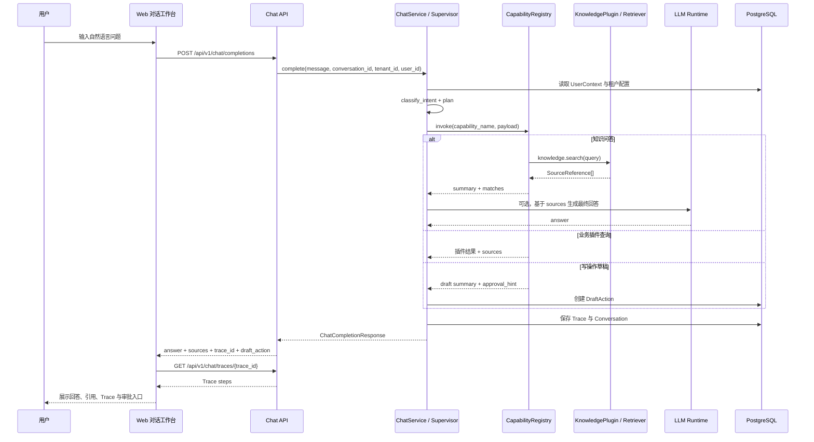

# 可扩展Agent架构 - 技术开发文档

**版本**: v1.2  
**日期**: 2026-04-19  
**状态**: 正式版  
**关联文档**: [可扩展Agent平台-通用PRD-v1.0.md](/Users/shenwei/简历/可扩展Agent平台-通用PRD-v1.0.md)

**英文系统名称**: `Agent Operating Platform`

---

## 目录

1. [文档目标与范围](#1-文档目标与范围)
2. [架构设计原则](#2-架构设计原则)
3. [总体技术架构](#3-总体技术架构)
4. [技术栈与选型](#4-技术栈与选型)
5. [项目结构与模块边界](#5-项目结构与模块边界)
6. [核心运行链路](#6-核心运行链路)
7. [核心模块设计](#7-核心模块设计)
8. [能力契约与插件体系](#8-能力契约与插件体系)
9. [多模型路由与任务编排设计](#9-多模型路由与任务编排设计)
10. [记忆与知识治理设计](#10-记忆与知识治理设计)
11. [安全、权限与租户隔离](#11-安全权限与租户隔离)
12. [数据模型与存储设计](#12-数据模型与存储设计)
13. [开发流程与工程规范](#13-开发流程与工程规范)
14. [测试、评估与验收](#14-测试评估与验收)
15. [部署、灰度与运维](#15-部署灰度与运维)
16. [里程碑映射与实施建议](#16-里程碑映射与实施建议)
17. [附录：接口与配置示例](#17-附录接口与配置示例)

---

## 1. 文档目标与范围

### 1.1 文档目标

本文档用于把 PRD 中的产品能力转化为可开发、可测试、可部署的工程方案。该项目为一个完整的全栈平台，覆盖 Web 工作台、管理控制台、平台后端、异步任务、插件运行时与治理能力，具体包括：

- 平台级通用能力如何落地
- 业务包 / 插件如何接入
- 多租户、安全、审计、评估、灰度如何统一治理
- P0 / P1 / P2 各阶段的推荐实施顺序

### 1.2 适用对象

| 角色 | 关注点 |
|------|------|
| 平台后端开发 | 模块边界、接口契约、运行时治理 |
| 前端 / 工作台开发 | 对话入口、管理台、审计台的 API 与状态流 |
| 插件开发者 | capability schema、调试流程、测试要求 |
| 平台管理员 / SRE | 部署形态、可观测性、灰度回滚、配额策略 |
| 安全 / 审计人员 | 权限边界、日志留痕、数据隔离与合规流程 |

### 1.3 与 PRD 的对应关系

本文重点承接 PRD 中以下新增要求：

- Agent 自主度递进模型（L1-L4）
- 记忆治理与被遗忘权
- 安全与内容治理
- 多模型路由与主备降级
- 配额、限流、熔断
- 多租户隔离等级
- 风险分级与审批
- 反馈闭环、灰度发布、自动回滚
- 开发者工具链与插件生态

---

## 2. 架构设计原则

### 2.1 核心原则

1. 平台负责编排与治理，行业逻辑下沉到业务包 / 插件。
2. 所有可调能力必须显式声明契约，禁止隐式工具调用。
3. 默认最小权限、默认可审计、默认可回滚。
4. 高风险写操作必须走草稿、确认或审批链路。
5. 跨租户隔离优先级高于功能便利性。
6. 新能力上线必须经过离线评估、影子验证或灰度验证。
7. 模型、检索、插件都视为可替换依赖，不把业务逻辑绑死在单一供应商上。

### 2.2 平台能力分层

```text
接入层
 -> API Gateway / SSO / 流量治理 / Web工作台
编排层
 -> Intent / Planner / Executor / Response Composer
能力层
 -> Retriever / Memory / Plugin Runtime / Model Router
治理层
 -> AuthZ / Risk Engine / Approval / Quota / Audit / Safety Guard
平台层
 -> Tenant / Config / Registry / Release / Evaluation / Observability
基础设施层
 -> PostgreSQL(pgvector) / Redis / Object Storage / MQ / Metrics / Trace
```

### 2.3 自主度落地原则

| 自主度级别 | 技术要求 |
|------|------|
| L1 建议型 | 可只读检索与分析，不得触发写接口 |
| L2 草稿型 | 允许生成结构化草稿，但必须由用户显式确认 |
| L3 审批型 | 写操作前必须通过审批引擎，审计与幂等必选 |
| L4 受控自动化 | 必须具备配额、熔断、补偿、回滚、异常告警 |

工程上，能力能否运行到哪一级，不由提示词决定，而由 `capability.risk_level + tenant_policy + approval_policy + runtime_guard` 联合决定。

---

## 3. 总体技术架构

### 3.1 逻辑架构图

```text
+----------------------+        +-----------------------+
| Web / Admin Console  |        | External Clients      |
+----------+-----------+        +-----------+-----------+
           |                                    |
           +----------------+-------------------+
                            |
                    +-------v--------+
                    | API Gateway    |
                    | Auth / Rate    |
                    +-------+--------+
                            |
          +-----------------+-----------------+
          |                                   |
+---------v----------+             +----------v----------+
| Conversation API   |             | Admin / Ops API     |
+---------+----------+             +----------+----------+
          |                                   |
          +-----------------+-----------------+
                            |
                    +-------v--------+
                    | Agent Runtime   |
                    | Supervisor      |
                    +---+----+---+----+
                        |    |   |
        +---------------+    |   +----------------+
        |                    |                    |
+-------v------+    +--------v-------+    +-------v-------+
| Planner      |    | Model Router   |    | Response Hub  |
+-------+------+    +--------+-------+    +-------+-------+
        |                    |                    |
 +------v------+    +--------v-------+    +-------v-------+
 | Retriever   |    | Plugin Runtime |    | Safety Guard  |
 +------+------+    +--------+-------+    +-------+-------+
        |                    |                    |
 +------v-------------------------------------------------v------+
 | Governance: Risk / Approval / Quota / Audit / Evaluation      |
 +--------------------+-------------------+----------------------+
                      |                   |
          +-----------v---+     +---------v-----------+
          | Data Plane    |     | Control Plane       |
          | PG+pgvector   |     | Registry/Policy     |
          +---------------+     +---------------------+
```

### 3.2 物理部署视图

推荐拆分为三类服务：

| 服务 | 职责 | 是否必须独立部署 |
|------|------|------|
| `agent-api` | 对话、管理台 API、流式响应 | 是 |
| `agent-worker` | 异步任务、审批后执行、知识入库、评估作业 | 是 |
| `agent-control-plane` | 插件注册、策略配置、租户配置、发布治理 | P1 起建议独立 |

基础依赖：

- PostgreSQL：主事务库、审计、配置、元数据、pgvector 向量检索
- Redis：缓存、会话态、限流计数、任务短状态
- MQ / Stream：异步事件、评估、回写、告警
- Object Storage：原始文档、评估报告、审计归档附件

### 3.3 控制面与数据面分离

控制面负责：

- capability 注册
- 租户配置
- 模型路由策略
- 审批策略
- 灰度发布

数据面负责：

- 单次请求编排
- 插件执行
- 检索、记忆、模型调用
- 实时审计与监控

这样做的好处是：平台配置变更不影响请求执行路径，且后续更容易演进到多集群或多地域部署。

---

## 4. 技术栈与选型

### 4.1 全栈项目定位

本项目不是单纯的 Agent 后端服务，而是一个完整的全栈系统，至少包含以下工程构成：

- 前端 Web 工作台：承载对话页、审批页、管理台、评估看板、插件配置页。
- 平台 API：承载对话编排、权限校验、租户隔离、管理接口与流式输出。
- 异步 Worker：承载知识入库、审批后执行、评估任务、审计归档等后台作业。
- Control Plane：承载 capability 注册、租户策略、模型路由、灰度发布等控制面能力。

因此技术选型与目录设计需要同时服务前端工程效率、后端模块边界、前后端契约协作与统一部署治理。

### 4.2 后端核心技术栈

| 类别 | 选型 | 说明 |
|------|------|------|
| 语言 | Python 3.11+ | AI 生态成熟，异步与类型支持较好 |
| Web 框架 | FastAPI | OpenAPI、异步原生、依赖注入清晰 |
| ORM / DB | SQLAlchemy 2.x + asyncpg | 适合 PG 异步访问 |
| 配置 | Pydantic Settings | 类型校验与多环境配置 |
| 缓存 / 限流 | Redis | Session、Quota、熔断状态 |
| 向量库 | pgvector | 统一基于 PostgreSQL 承载向量检索，减少基础设施复杂度并便于事务数据协同 |
| 消息队列 | Redis Stream 或 Kafka | P0 可轻量，P1 后建议 Kafka |
| 工作流 / 任务 | RQ / Arq / Celery | 用于异步执行、回填、评估 |
| LLM 抽象 | LiteLLM + 自定义 Router | 强调多模型路由与统一错误码 |
| 检索编排 | 自研 Retriever Pipeline | 避免把核心策略强绑到框架 |
| 可观测 | OpenTelemetry + Prometheus + Loki/ELK | 日志、指标、Trace 三件套 |
| 安全扫描 | 内容安全服务 + 规则引擎 | 输入、输出、数据分级控制 |

### 4.3 前端技术栈选型

| 类别 | 选型 | 说明 |
|------|------|------|
| 前端框架 | Next.js 15 + React 19 + TypeScript | 适合工作台、管理台、SSR/CSR 混合渲染与类型约束 |
| UI 组件 | Ant Design 5 | 适合企业级后台、表格、表单、抽屉、审批流等复杂交互 |
| 状态管理 | Zustand + TanStack Query | 本地交互状态与服务端状态分离，降低全局状态复杂度 |
| 样式方案 | Tailwind CSS + 设计令牌（Design Tokens） | 统一主题、间距、颜色体系，兼顾页面搭建效率与风格约束 |
| 表单能力 | React Hook Form + Zod | 复杂配置表单、审批表单和 schema 校验一致性更好 |
| 实时通信 | SSE 优先，必要时 WebSocket | 适配大模型流式输出、长任务状态刷新、审批进度回推 |
| 图表可视化 | ECharts | 适合监控、评估、调用量、成功率等运营看板场景 |
| 测试 | Vitest + Testing Library + Playwright | 分别覆盖单元/组件测试与关键业务链路 E2E |
| 契约共享 | OpenAPI Generator 或共享 TypeScript SDK | 减少前后端字段漂移，提升联调效率 |

前端页面建议至少拆分为三类应用域：

- 用户工作台：对话、引用、草稿确认、历史会话、知识上传。
- 管理控制台：租户、插件、模型路由、审批策略、配额与灰度配置。
- 运营与审计台：Trace、风险事件、评估结果、告警与审计检索。

### 4.4 选型原则说明

- 对话编排与治理逻辑建议自研，不把平台核心行为绑定在单一 Agent 框架上。
- 可以局部复用 LangChain / LlamaIndex 等生态，但应限制在可替换的适配层内。
- 模型路由、capability 契约、审批与审计必须是平台原生能力。
- 前端避免把页面逻辑直接耦合到后端内部实现，应围绕 OpenAPI / BFF / shared schema 构建稳定契约。
- 对于工作台类页面，优先保证信息密度、状态可追踪和流式体验，而不是追求营销型站点的展示效果。

### 4.5 推荐依赖分层

```text
platform-core
 -> 不依赖具体模型厂商和具体业务插件
platform-adapters
 -> openai / anthropic / local-llm / vectordb / storage adapters
platform-runtime
 -> planner / executor / safety / policy / audit
platform-plugins
 -> hr / legal / finance / knowledge 等业务插件
platform-console
 -> admin web / operator web / developer playground
```

---

## 5. 项目结构与模块边界

### 5.1 推荐目录结构

```text
agent-platform/
├── apps/
│   ├── api/
│   │   ├── src/agent_platform/
│   │   │   ├── main.py
│   │   │   ├── bootstrap/
│   │   │   ├── api/
│   │   │   │   ├── routes/
│   │   │   │   ├── middleware/
│   │   │   │   └── schemas/
│   │   │   ├── domain/
│   │   │   ├── application/
│   │   │   ├── infrastructure/
│   │   │   ├── runtime/
│   │   │   ├── plugins/
│   │   │   └── policies/
│   │   └── tests/
│   ├── worker/
│   │   ├── src/agent_worker/
│   │   └── tests/
│   ├── control-plane/
│   │   ├── src/agent_control_plane/
│   │   └── tests/
│   └── web/
│       ├── src/
│       │   ├── app/
│       │   │   ├── (workspace)/
│       │   │   ├── admin/
│       │   │   ├── audit/
│       │   │   └── api/
│       │   ├── components/
│       │   │   ├── chat/
│       │   │   ├── admin/
│       │   │   ├── audit/
│       │   │   └── shared/
│       │   ├── features/
│       │   │   ├── conversation/
│       │   │   ├── approvals/
│       │   │   ├── plugins/
│       │   │   ├── evaluation/
│       │   │   └── tenancy/
│       │   ├── hooks/
│       │   ├── lib/
│       │   │   ├── api-client/
│       │   │   ├── auth/
│       │   │   ├── streaming/
│       │   │   └── utils/
│       │   ├── stores/
│       │   ├── styles/
│       │   └── types/
│       ├── public/
│       └── tests/
│           ├── unit/
│           ├── component/
│           └── e2e/
├── packages/
│   ├── shared-contracts/
│   │   ├── openapi/
│   │   ├── typescript-sdk/
│   │   └── python-client/
│   ├── design-system/
│   ├── eslint-config/
│   └── tooling/
├── migrations/
├── tests/
│   ├── unit/
│   ├── integration/
│   ├── contract/
│   ├── e2e/
│   └── eval/
├── scripts/
├── configs/
├── docker/
└── docs/
```

推荐采用 monorepo 结构，原因如下：

- 前后端共享接口契约、类型定义、设计令牌与脚本工具更容易统一。
- 便于在同一版本下管理 API、Web、Worker、Control Plane 的协同变更。
- 更适合 CI 中做 contract test、前端 E2E、后端集成测试与统一发布。

### 5.2 前端工程目录建议

`apps/web` 建议遵循“路由层薄、业务特性聚合、共享能力下沉”的组织方式：

| 目录 | 职责 |
|------|------|
| `app/` | Next.js 路由入口、布局、页面级加载与权限边界 |
| `features/` | 按业务域组织页面逻辑，如对话、审批、插件管理、评估 |
| `components/` | 复用 UI 组件，避免与具体页面强耦合 |
| `lib/api-client/` | HTTP / SSE / 鉴权封装、请求拦截与错误映射 |
| `stores/` | 会话状态、草稿状态、筛选条件等前端本地状态 |
| `types/` | 前端专属类型与共享契约映射类型 |
| `tests/` | 单元、组件、E2E 测试 |

推荐规则：

- 页面只负责组装，不承载复杂业务逻辑。
- 跨页面复用的 Agent 响应渲染、引用卡片、审批抽屉等组件应沉到 `components/` 或 `features/`。
- 与后端字段完全一致的 DTO 优先从 `packages/shared-contracts` 生成，避免手写重复类型。

### 5.3 模块边界约束

| 模块 | 可以依赖 | 不应依赖 |
|------|------|------|
| `domain` | 纯 Python / 标准库 | FastAPI、ORM、具体 SDK |
| `application` | `domain` | HTTP 层细节 |
| `runtime` | `domain` + `application` | 前端页面逻辑 |
| `infrastructure` | 外部 SDK、数据库、缓存 | 业务插件内部逻辑 |
| `plugins` | SDK、domain 契约 | 平台私有数据库表实现细节 |
| `apps/web` | shared-contracts、design-system、BFF/HTTP API | 直接依赖后端内部 Python 模块 |
| `packages/shared-contracts` | OpenAPI、schema、生成脚本 | 页面状态逻辑、后端业务实现 |

### 5.4 关键边界规则

- 业务插件只能通过 SDK 与平台交互，不允许直接操作平台内部服务对象。
- 审计、权限、审批、配额必须在平台 Runtime 层统一处理，插件不可绕过。
- 所有跨模块调用优先使用 command / query service 或显式接口。
- 前端访问后端时优先通过稳定 API 契约或 BFF 层，不直接依赖数据库视图或临时拼装字段。
- 对话流式输出、审批动作、Trace 查询等关键链路要在前后端统一定义事件模型、错误码与空态/异常态。

---

## 6. 核心运行链路

### 6.1 标准查询链路

```text
1. API 接收请求
2. 解析身份、租户、角色、业务包上下文
3. 创建 Trace / RequestContext
4. 输入安全检查与敏感信息识别
5. 意图识别与任务分类
6. 读取短期记忆 + 长期记忆摘要
7. 候选 capability 筛选
8. Planner 生成执行计划
9. 风险引擎判断自主度上限
10. 权限与配额校验
11. 执行检索 / 插件 / 模型调用
12. 响应聚合、引用补齐、结构化输出
13. 输出脱敏与内容审查
14. 返回用户
15. 审计、指标、反馈、评估样本异步回写
```

### 6.2 Agent + RAG 对话主链路

统一对话入口不是单独的“LLM 问答接口”，而是由 Agent Runtime 负责把用户请求、租户上下文、权限、知识检索、插件能力、模型生成、Trace 与引用依据串成一条可治理链路。P0 阶段先实现单 Supervisor + capability registry 的轻量编排，后续再把 Planner、Retriever Pipeline、Risk Engine、Memory 与异步评估拆成独立模块。

当前代码中的主链路对应关系：

| 链路节点 | 当前实现 | 职责 |
|------|------|------|
| 前端对话工作台 | `apps/web/src/components/chat/chat-workbench.tsx` | 提交用户输入，展示助手回复、引用来源、Trace 步骤与草稿动作 |
| Chat API | `apps/api/src/agent_platform/api/routes/chat.py` | 暴露 `/api/v1/chat/completions`、Trace 查询、草稿创建与确认接口 |
| Supervisor / Runtime | `apps/api/src/agent_platform/runtime/chat_service.py` | 解析用户上下文、识别意图、选择策略、规划 capability、记录 Trace、组装响应 |
| Capability Registry | `apps/api/src/agent_platform/runtime/registry.py` | 注册并调用 `knowledge.search`、`hr.leave.balance.query`、`workflow.procurement.request.create` |
| Knowledge Plugin | `apps/api/src/agent_platform/plugins/knowledge.py` | P0 以项目 `docs/*.md` 为知识源做关键词召回，返回 `SourceReference` |
| LLM Runtime | `apps/api/src/agent_platform/infrastructure/llm_client.py` | 在启用 OpenAI-compatible 配置时，把用户问题与检索片段组成上下文后生成最终回答 |
| Trace / Conversation Store | `apps/api/src/agent_platform/infrastructure/repositories.py` | 持久化会话消息、Trace、草稿动作、知识源与租户数据 |

整体时序如下：



对于知识问答，RAG 子链路在 P0 先保持可解释、可替换：

```text
用户问题
 -> intent = knowledge_query
 -> plan = knowledge.search
 -> 基于租户 / scope 校验 knowledge:read
 -> 从已装载知识源召回 SourceReference
 -> 组装 summary + 引用片段
 -> 如果 LLM Runtime 启用：把问题与引用片段拼入上下文生成最终回答
 -> 保存 Trace.sources
 -> 前端展示 answer + sources
```

P0 当前实现边界：

- 已实现：`knowledge.search` 能从本项目 `docs/*.md` 召回引用；对话响应会返回 `sources`；Trace 会记录 `received`、`classified`、`planned`、`executed`、`model`、`completed` 等步骤；前端会展示引用与 Trace。
- 已实现：当租户配置启用 LLM 且 API Key 可用时，知识问答会走 OpenAI-compatible `/chat/completions` 生成最终回答；未启用时返回基于检索结果拼装的可解释回答。
- 未实现：真正的文档解析、切片、Embedding、pgvector 向量检索、BM25、重排、知识版本发布与引用新鲜度校验；这些能力按 6.4 与 10.4 演进。
- 未实现：独立 Risk Engine、Memory、Quota、Safety Guard 的完整链式门禁；P0 先以 scope 校验、capability 风险字段和草稿动作表达治理边界。

后续 P1/P2 的目标链路如下：

```text
Chat API
 -> RequestContext
 -> InputGuard
 -> Intent + Business Package Router
 -> Memory Recall
 -> Planner
 -> Governance.evaluate
 -> Retriever Pipeline / Plugin Runtime / Model Router
 -> Response Composer
 -> OutputGuard
 -> Trace + Audit + Feedback
```

### 6.3 受控写操作链路

```text
用户请求
 -> capability 识别为 write / irreversible
 -> 风险引擎计算 risk_level + autonomy ceiling
 -> 生成草稿 DraftAction
 -> 用户确认或发起审批
 -> 审批通过后进入异步执行队列
 -> 调用外部系统
 -> 记录幂等键、结果快照、审计日志
 -> 如失败则补偿或人工介入
```

### 6.4 知识入库链路

```text
采集
 -> 文档解析
 -> 切分
 -> 元数据标注
 -> 嵌入
 -> 索引入库
 -> 质量校验
 -> 发布到指定租户 / 业务包
```

### 6.5 插件发布链路

```text
开发者提交插件包
 -> 契约校验
 -> 单测 / 合约测试 / 安全扫描
 -> 沙箱租户验证
 -> 管理员审核
 -> 灰度发布
 -> 全量启用
 -> 回归监控
```

---

## 7. 核心模块设计

### 7.1 API 接入层

职责：

- 鉴权、SSO、租户识别
- 请求参数校验
- SSE / WebSocket / HTTP 流式输出
- 请求级限流与熔断前置拦截

关键接口：

- `POST /api/v1/chat/completions`
- `POST /api/v1/chat/actions/draft`
- `POST /api/v1/chat/actions/{draft_id}/confirm`
- `POST /api/v1/admin/plugins/{plugin_id}/release`
- `GET /api/v1/admin/traces/{trace_id}`
- `GET /api/v1/memory/me`

### 7.2 Supervisor 调度中心

Supervisor 是请求生命周期总协调器，负责：

- 创建 `RequestContext`
- 串联意图、记忆、Planner、Executor、Response
- 管理步骤状态机
- 触发审计与观测事件

推荐状态机：

| 状态 | 说明 |
|------|------|
| `received` | 请求已接收 |
| `classified` | 已完成意图与风险识别 |
| `planned` | 已生成可执行计划 |
| `awaiting_confirmation` | 等待用户确认 |
| `awaiting_approval` | 等待审批 |
| `executing` | 执行中 |
| `completed` | 已完成 |
| `failed` | 执行失败 |
| `cancelled` | 用户取消或熔断 |

### 7.3 Planner 规划模块

Planner 不是单一算法，而是策略路由层：

| 策略 | 使用条件 |
|------|------|
| `direct_answer` | FAQ、单轮、只需检索或简单生成 |
| `plan_execute` | 多步骤但路径稳定 |
| `react` | 中间结果会影响后续动作 |
| `reflection` | 高风险、高准确率要求场景 |

Planner 输出结构：

```json
{
  "plan_id": "pln_xxx",
  "strategy": "plan_execute",
  "goal": "查询并总结某员工剩余年假",
  "steps": [
    {
      "step_id": "s1",
      "type": "capability_call",
      "capability": "hr.leave.balance.query",
      "input": {"employee_id": "E123"},
      "requires_approval": false,
      "risk_level": "low"
    }
  ],
  "knowns": ["用户身份已解析"],
  "unknowns": [],
  "max_steps": 4
}
```

### 7.4 Executor 执行模块

职责：

- 根据计划分发步骤
- 执行前做 schema、权限、配额、风险校验
- 统一处理超时、重试、补偿、熔断

执行器不应直接相信 Planner 输出，必须二次校验：

1. capability 是否注册且启用
2. 当前租户是否允许调用
3. 用户是否具备 scope
4. 风险等级是否超过自主度上限
5. 当前 quota 是否充足
6. 输入输出是否满足 schema

### 7.5 Retriever 检索模块

检索流水线建议分六步：

1. Query Rewrite
2. 权限过滤条件构造
3. 稀疏检索（BM25 / 关键词）
4. 稠密检索（Embedding / Vector）
5. 混合召回与重排
6. 引用格式化

每次检索结果必须返回：

- `source_id`
- `title`
- `snippet`
- `version`
- `updated_at`
- `tenant_id`
- `classification`
- `score`

### 7.6 Memory 记忆模块

Memory 服务负责四类记忆：

| 类型 | 存储 | 典型 TTL |
|------|------|------|
| 短期会话记忆 | Redis | 30 分钟 - 24 小时 |
| 长期用户记忆 | PostgreSQL + pgvector | 30 / 90 / 180 天 |
| 语义知识记忆 | PostgreSQL(pgvector) | 跟随知识发布版本 |
| 业务状态记忆 | PG / Redis | 按业务对象生命周期 |

写入策略：

- 自动写入仅限短期会话记忆
- 长期记忆需要可信来源或用户确认
- 敏感字段需先经过分类与脱敏判定

### 7.7 Safety Guard 安全治理模块

分三层：

| 层级 | 典型规则 |
|------|------|
| 输入侧 | Prompt Injection、PII、越权意图检测 |
| 数据侧 | 密级过滤、出域限制、跨租户隔离 |
| 输出侧 | 脱敏、内容审查、无依据事实提示 |

推荐设计为规则链：

```text
InputGuard -> PolicyGuard -> ToolGuard -> OutputGuard
```

每个 Guard 返回：

- `allow`
- `rewrite`
- `block`
- `require_human_review`

### 7.8 Governance 治理模块

治理模块拆分为：

- `RiskEngine`
- `ApprovalService`
- `QuotaService`
- `CircuitBreaker`
- `AuditService`
- `PolicyDecisionPoint`

建议统一暴露成请求前置检查接口：

```python
decision = governance.evaluate(
    tenant_id=ctx.tenant_id,
    user_id=ctx.user_id,
    capability=capability,
    action_input=payload,
)
```

返回结果至少包含：

- 是否允许执行
- 是否需要确认
- 是否需要审批
- 允许的最高自主度
- 当前命中的配额策略
- 审计标签

### 7.9 Audit 审计模块

审计粒度不能只到“请求成功 / 失败”，至少应记录：

| 字段 | 说明 |
|------|------|
| `trace_id` | 全链路追踪 ID |
| `request_id` | 单次请求 ID |
| `tenant_id` | 租户 |
| `user_id` | 发起人 |
| `autonomy_level` | 本次执行实际自主度 |
| `plan_snapshot` | 执行计划摘要 |
| `tool_calls` | capability 调用列表 |
| `approval_id` | 审批单号 |
| `risk_level` | 风险等级 |
| `result_summary` | 结果摘要 |
| `cost` | token / 外部调用成本 |
| `security_events` | 安全拦截记录 |

高风险动作建议同时写入不可篡改审计存储或追加签名摘要。

---

## 8. 能力契约与插件体系

### 8.1 Capability 设计目标

Capability 是平台调度的最小单位，所有插件能力必须显式声明。

### 8.2 Capability Schema

```json
{
  "name": "hr.leave.balance.query",
  "version": "1.2.0",
  "description": "查询员工年假余额",
  "input_schema": {
    "type": "object",
    "properties": {
      "employee_id": {"type": "string"}
    },
    "required": ["employee_id"]
  },
  "output_schema": {
    "type": "object",
    "properties": {
      "remaining_days": {"type": "number"},
      "source": {"type": "string"}
    },
    "required": ["remaining_days", "source"]
  },
  "side_effect": "read",
  "idempotent": true,
  "risk_level": "low",
  "required_scopes": ["hr.leave.read"],
  "timeout_ms": 3000,
  "cost_hint": "low",
  "tenant_scope": "tenant",
  "autonomy_ceiling": "L2"
}
```

### 8.3 插件包结构

```text
plugins/hr_leave/
├── plugin.yaml
├── capabilities/
│   ├── leave_balance_query.json
│   └── leave_request_draft.json
├── src/
│   ├── handlers.py
│   ├── clients.py
│   └── mapping.py
├── tests/
│   ├── contract/
│   └── integration/
└── README.md
```

### 8.4 插件生命周期

| 阶段 | 平台动作 |
|------|------|
| `draft` | 本地开发 / 沙箱验证 |
| `validated` | 契约、测试、安全扫描通过 |
| `approved` | 管理员审核通过 |
| `released` | 已进入灰度或生产 |
| `disabled` | 熔断或手动下线 |
| `archived` | 停止维护 |

### 8.5 插件运行隔离

按风险与租户敏感度分三级：

| 等级 | 方式 | 适用场景 |
|------|------|------|
| 共享进程 | 同进程内调用 | 低风险、只读插件 |
| 独立服务 | HTTP / gRPC 调用 | 大多数业务插件 |
| 独立沙箱实例 | 单租户 / 单插件容器 | 高敏感、高风险插件 |

### 8.6 与 MCP 的兼容

平台 capability 与 MCP Tool 做双向映射：

- 导入：外部 MCP Server 可以注册为平台插件
- 导出：平台插件可以生成 MCP 元数据给外部 Agent 使用

映射规则建议：

- `capability.name` -> `tool.name`
- `input_schema` -> `tool.inputSchema`
- `description` -> `tool.description`
- `risk_level` / `required_scopes` 作为平台扩展字段保留

### 8.7 业务包配置与装配模型

业务包不是单个插件，而是面向某一业务域的能力集合编排单元。一个业务包通常包含：

- 业务包元数据
- 一组插件与 capability
- 关联知识源
- 默认提示词与规划策略
- 权限范围与审批策略
- 租户启用配置

推荐关系：

```text
business_package
 -> package_plugin_binding
 -> capability_binding
 -> package_knowledge_binding
 -> package_policy_binding
 -> tenant_package_release
```

建议新增的核心配置实体：

| 实体 | 说明 |
|------|------|
| `business_package` | 业务包定义，如 HR、法务、财务 |
| `business_package_version` | 业务包版本，支持灰度与回滚 |
| `package_plugin_binding` | 业务包与插件绑定关系 |
| `package_capability_policy` | capability 在该业务包下的启用、默认风险策略 |
| `package_knowledge_binding` | 业务包可访问的知识源、知识空间 |
| `tenant_package_release` | 某租户启用了哪个业务包版本 |

推荐最小配置文件示例：

```yaml
package:
  name: hr_assistant
  display_name: HR Assistant
  version: 1.0.0
  domain: hr
  entry_intents:
    - leave_balance
    - leave_request
    - policy_question
plugins:
  - name: hr_core_plugin
    version: 1.2.0
  - name: knowledge_plugin
    version: 1.0.0
capabilities:
  include:
    - hr.leave.balance.query
    - hr.leave.request.draft
    - knowledge.search
  defaults:
    planner_strategy: plan_execute
    autonomy_ceiling: L2
knowledge:
  spaces:
    - hr_policy_docs
    - employee_handbook
security:
  required_scopes:
    - hr.portal.access
  data_classification: internal
approval:
  enabled: true
  high_risk_requires_approval: true
```

业务包配置生效顺序建议：

1. 平台全局默认
2. 环境级配置
3. 业务包级配置
4. 租户级覆盖
5. 请求级临时参数

### 8.8 业务包运行时装配流程

当用户进入某业务包上下文时，运行时应完成以下装配：

1. 识别当前请求命中的业务包
2. 加载该业务包对应的 capability 白名单
3. 过滤当前租户不可用的插件与知识源
4. 注入业务包默认 Planner 策略、提示词模板和风险上限
5. 生成最终可执行能力图谱供 Planner 选择

这样做的目标是把“平台底座能力”和“业务域能力组合”分开，让新增业务包时尽量只做装配，不改 Runtime 核心代码。

---

## 9. 多模型路由与任务编排设计

### 9.1 模型抽象接口

平台至少抽象四类模型能力：

- `ChatModel`
- `EmbeddingModel`
- `RerankModel`
- `ModerationModel`

### 9.2 路由维度

| 维度 | 示例 |
|------|------|
| 任务类型 | 意图分类、规划、生成、评分、抽取 |
| 租户策略 | 敏感租户仅允许私有模型 |
| 成本预算 | 预算吃紧时降到轻量模型 |
| 时延要求 | FAQ 用快速模型，复杂分析用强模型 |
| 审批状态 | 审批前预估可用小模型，执行前复核用强模型 |

### 9.3 路由决策结构

```json
{
  "task_type": "planning",
  "tenant_id": "t_001",
  "primary_model": "gpt-4.1",
  "fallback_models": ["gpt-4o-mini", "claude-sonnet"],
  "constraints": {
    "max_cost_usd": 0.05,
    "latency_p95_ms": 8000,
    "data_residency": "cn"
  }
}
```

### 9.4 主备降级策略

| 触发条件 | 动作 |
|------|------|
| 主模型超时 | 重试一次后切备模型 |
| 主模型限流 | 直接切备模型 |
| 主模型内容审查拒绝 | 返回统一错误并尝试改写降风险请求 |
| 所有模型不可用 | 返回受控失败，不允许静默吞错 |

### 9.5 Token 与思考预算

每个请求都应具备：

- `prompt_token_budget`
- `completion_token_budget`
- `thinking_token_budget`
- `max_plan_steps`

预算超限时的顺序：

1. 缩短上下文
2. 降低检索条数
3. 切轻量模型
4. 强制收敛并输出当前最优结果

---

## 10. 记忆与知识治理设计

### 10.1 记忆实体设计

建议统一抽象为 `memory_item`：

| 字段 | 说明 |
|------|------|
| `memory_id` | 主键 |
| `tenant_id` | 租户 |
| `user_id` | 可为空，租户级记忆则为空 |
| `scope` | session / user / tenant / business |
| `memory_type` | short_term / long_term / semantic / business_state |
| `content` | 结构化内容 |
| `source_type` | user_confirmed / plugin_writeback / extracted |
| `confidence` | 0-1 |
| `ttl_at` | 失效时间 |
| `classification` | 密级 |
| `pii_flags` | 敏感字段标识 |
| `version` | 冲突处理版本号 |

### 10.2 记忆写入规则

| 来源 | 默认策略 |
|------|------|
| 用户普通对话 | 仅写短期记忆 |
| 用户显式确认偏好 | 可写长期用户记忆 |
| 可信插件回写 | 可写业务状态记忆或长期记忆 |
| 推断型结论 | 默认不持久化 |

### 10.3 冲突与衰减

- 同一事实多版本冲突时，按 `来源可信度 > 更新时间 > 人工确认状态` 排序。
- 长期未使用的记忆按周期进行衰减，低于阈值后仅保留审计，不参与召回。
- 删除用户时，通过异步擦除任务执行 PG、Redis、Vector、对象存储的级联清理。

### 10.4 知识入库治理

知识文档建议最少拆成四张表：

- `knowledge_source`
- `knowledge_document`
- `knowledge_chunk`
- `knowledge_publish_record`

发布必须区分：

- 草稿
- 已解析
- 已索引
- 已发布
- 已失效

### 10.5 新鲜度与引用要求

对外输出的知识引用至少展示：

- 来源名称
- 文档版本
- 更新时间
- 片段摘要

对时效性敏感内容增加警示：

`仅供参考，请以业务系统实时数据为准`

---

## 11. 安全、权限与租户隔离

### 11.1 权限模型

建议采用 `RBAC + ABAC + Scope` 组合：

- RBAC：角色权限，如业务管理员、平台管理员
- ABAC：数据范围、部门、租户、业务包维度
- Scope：细粒度 capability 调用权限

### 11.2 权限决策点

必须统一走 PDP（Policy Decision Point），不得在插件里各自判断。

关键输入：

- 用户角色
- 用户部门 / 数据域
- 租户
- capability
- risk_level
- 目标对象属性

### 11.3 租户隔离方案

| 组件 | 隔离方案 |
|------|------|
| PostgreSQL | 行级隔离起步，敏感租户可独立库 |
| Redis | Key 必带租户前缀 |
| pgvector | 通过租户字段 + 分区 / 索引过滤，敏感租户可独立 schema 或独立库 |
| 对象存储 | Bucket 前缀或独立 bucket |
| 审计查询 | 服务端强制 tenant filter |
| 插件实例 | 高敏感场景独立部署 |

### 11.4 风险分级与执行门禁

| 风险级别 | 示例 | 默认处理 |
|------|------|------|
| `low` | FAQ、余额查询 | 直接执行 |
| `medium` | 草稿生成、低敏感查询 | 允许 L2 |
| `high` | 提交流程、批量通知 | 需确认或审批 |
| `critical` | 不可逆写操作、资金类动作 | 强审批 + 双重审计 |

### 11.5 配额与限流

建议四层配额：

1. API 网关级 QPS
2. 租户级 token / cost budget
3. capability 级调用频率
4. 插件实例级熔断阈值

### 11.6 安全事件处理

当出现以下情况时，必须进入安全事件流程：

- 跨租户数据泄露嫌疑
- critical capability 未经审批被执行
- 大规模输出敏感信息
- 插件绕过 PDP 直接访问受限数据

处理动作：

1. 立即熔断相关 capability
2. 标记 P0 / P1 事件等级
3. 导出完整 Trace 与审计记录
4. 启动应急回滚与租户通知流程

---

## 12. 数据模型与存储设计

### 12.1 核心表清单

| 表名 | 用途 |
|------|------|
| `tenant` | 租户基础信息 |
| `tenant_policy` | 配额、模型、审批、安全策略 |
| `user_account` | 用户与身份映射 |
| `conversation` | 会话主表 |
| `conversation_message` | 对话消息 |
| `request_trace` | 请求级链路记录 |
| `trace_step` | 规划、检索、插件、模型步骤明细 |
| `plugin_package` | 插件包元数据 |
| `capability_definition` | capability 契约 |
| `plugin_release` | 插件发布记录 |
| `approval_request` | 审批单 |
| `audit_log` | 审计日志 |
| `memory_item` | 记忆数据 |
| `knowledge_document` | 知识文档 |
| `knowledge_chunk` | 检索切片 |
| `evaluation_run` | 评估任务 |
| `feedback_record` | 用户反馈 |

### 12.2 关键关系

```text
tenant
 -> tenant_policy
 -> user_account
 -> plugin_release
 -> conversation
 -> audit_log
 -> memory_item

plugin_package
 -> capability_definition
 -> plugin_release

conversation
 -> conversation_message
 -> request_trace

request_trace
 -> trace_step
 -> feedback_record
 -> audit_log
```

### 12.3 审计与 Trace 存储建议

- 在线查询用 PostgreSQL
- 长期归档用对象存储 / ClickHouse / 日志平台
- 错误请求 100% 保留详情
- 正常请求可按策略采样，但审计型动作不能采样丢失

### 12.4 Redis Key 规范

```text
tenant:{tenant_id}:session:{session_id}
tenant:{tenant_id}:quota:daily_token:{date}
tenant:{tenant_id}:circuit:{capability_name}
tenant:{tenant_id}:approval:draft:{draft_id}
tenant:{tenant_id}:memory:short:{session_id}
```

### 12.5 幂等与补偿

所有写操作 capability 应支持：

- `idempotency_key`
- `request_id`
- `external_reference`

推荐在 `execution_record` 表中记录：

- 请求是否已执行
- 外部系统返回码
- 补偿状态
- 重试次数

---

## 13. 开发流程与工程规范

### 13.1 开发顺序建议

#### P0 基础能力

1. 身份、租户、配置中心
2. 对话 API 与 Supervisor
3. 检索、记忆、基础 Planner
4. 插件 SDK 与 capability 注册
5. 权限、审计、基础观测

#### P1 平台治理

1. 评估平台
2. 灰度发布与回滚
3. 多模型路由
4. 沙箱租户与开发者工具链
5. 企业插件仓库

#### P2 受控执行

1. 审批引擎
2. 补偿与回滚框架
3. L4 自动化调度
4. 平台运营看板

### 13.2 编码规范

- 使用 `ruff + mypy + pytest` 作为基础门禁。
- 公共接口与跨模块 DTO 必须加类型注解。
- capability handler 只做参数组装和业务编排，不直接混入鉴权、审计逻辑。
- 禁止在插件里直接写 SQL 访问平台核心表。

### 13.3 插件开发流程

```text
scaffold
 -> 定义 capability schema
 -> 编写 handler
 -> 本地 mock 调试
 -> contract tests
 -> integration tests
 -> 沙箱租户验证
 -> 发布申请
```

### 13.4 推荐脚手架能力

- `agent-cli plugin init`
- `agent-cli plugin validate`
- `agent-cli plugin test`
- `agent-cli plugin pack`
- `agent-cli capability export-mcp`

### 13.5 配置分层

| 配置层级 | 示例 |
|------|------|
| 全局默认 | 日志级别、默认超时 |
| 环境级 | dev / staging / prod |
| 租户级 | 模型路由、配额、审批 |
| 业务包级 | 启用的 capability、默认策略 |
| 请求级 | max_steps、强制只读、指定模型 |

### 13.6 业务包开发流程

业务包开发应与单插件开发区分开。推荐流程：

```text
创建业务包骨架
 -> 定义业务包元数据与版本
 -> 选择或开发所需插件
 -> 绑定 capability 白名单
 -> 绑定知识源与检索空间
 -> 配置默认 Planner / Prompt / 审批 / 风险策略
 -> 在沙箱租户联调
 -> 跑业务包回归集
 -> 发布到指定租户灰度
```

业务包开发者需要产出的最小内容：

| 产物 | 说明 |
|------|------|
| `package.yaml` | 业务包元数据与装配配置 |
| `capability-map.yaml` | 业务包暴露给 Planner 的能力映射 |
| `knowledge-bindings.yaml` | 知识源、知识空间、权限要求 |
| `prompts/` | 业务包默认提示词模板 |
| `evals/` | 业务包评估集与验收样本 |
| `README.md` | 接入说明、依赖系统、风险说明 |

推荐目录结构：

```text
packages/hr_assistant/
├── package.yaml
├── capability-map.yaml
├── knowledge-bindings.yaml
├── prompts/
│   ├── system_prompt.txt
│   └── planner_prompt.txt
├── evals/
│   ├── qa_set.yaml
│   └── action_set.yaml
└── README.md
```

### 13.7 业务包上线与变更规范

业务包上线应走独立于插件的发布流程，因为它本质上是“能力组合 + 策略组合”的发布单元。

上线步骤建议：

1. 完成插件版本冻结
2. 完成业务包配置校验
3. 完成业务包回归评估
4. 在沙箱租户验证
5. 按租户灰度启用
6. 观察关键指标后全量发布

业务包变更的常见类型：

- 新增 capability
- 替换插件版本
- 调整默认 Planner 策略
- 调整知识源绑定
- 调整审批或风险策略

其中以下变更必须触发回归：

- capability 白名单变化
- 风险等级变化
- 默认提示词变化
- 关联模型或检索策略变化

---

## 14. 测试、评估与验收

### 14.1 测试分层

| 类型 | 目标 |
|------|------|
| 单元测试 | 规则引擎、Planner、路由、转换逻辑 |
| 合约测试 | capability 输入输出 schema、一致性 |
| 集成测试 | 插件调用、检索链路、审批链路 |
| E2E 测试 | 用户从发起请求到收到响应的全链路 |
| 安全测试 | Prompt Injection、越权、跨租户 |
| 评估测试 | 准确率、引用率、成本、时延 |

### 14.2 PRD 映射的验收重点

| PRD 要求 | 技术验收项 |
|------|------|
| 统一对话入口 | 流式响应、引用展示、错误可解释 |
| 任务编排 | 计划可追踪、失败可归因 |
| 记忆治理 | TTL、删除、导出、冲突处理 |
| 安全治理 | 输入拦截、脱敏、审计留痕 |
| 多模型路由 | 按任务切换、主备降级 |
| 配额限流 | 超限告警、拒绝策略、熔断恢复 |
| 灰度回滚 | 影子流量、A/B、自动回滚 |

### 14.3 评估体系

离线评估：

- 标准问答集
- 多轮任务集
- 写操作草稿集
- 安全对抗集

在线评估：

- 首 Token 时延
- P95 完成时延
- 引用命中率
- 点踩率
- 审批通过后执行成功率
- capability 熔断次数

### 14.4 发布门禁建议

上线前至少满足：

1. 单元测试通过
2. 合约测试通过
3. 核心 E2E 场景通过
4. 安全基线测试通过
5. 离线评估未明显劣化
6. 灰度监控阈值已配置

---

## 15. 部署、灰度与运维

### 15.1 环境规划

| 环境 | 用途 |
|------|------|
| `dev` | 开发联调 |
| `sandbox` | 插件开发者验证 |
| `staging` | 预发布与回归 |
| `prod` | 生产 |

### 15.2 部署建议

- 使用容器化部署，优先 Kubernetes。
- `agent-api` 与 `agent-worker` 分开扩缩容。
- 高风险插件支持独立 Deployment。
- PostgreSQL（含 pgvector）、Redis 使用托管或高可用集群。

### 15.3 灰度策略

| 策略 | 使用场景 |
|------|------|
| 影子流量 | 新模型、新 Planner、新检索策略 |
| 百分比灰度 | 通用升级 |
| 租户白名单 | 大客户、敏感租户单独验证 |
| 业务包灰度 | 仅对某业务线开放 |

### 15.4 自动回滚触发条件

- P95 时延恶化超过阈值
- 点踩率显著上升
- capability 失败率超阈值
- 审批后执行成功率下降
- 安全拦截数异常飙升

### 15.5 可观测指标

核心指标建议按租户、业务包、capability、模型四维切分：

- 请求量 / 成功率 / 错误率
- 首 Token / 完成时延
- token 消耗 / 成本
- 检索命中率 / 引用率
- 插件失败率 / 熔断次数
- 审批等待时长 / 审批通过率
- 安全拦截率 / 脱敏命中率

### 15.6 灾备目标

| 指标 | 目标 |
|------|------|
| RPO | ≤ 1 小时 |
| RTO | ≤ 4 小时 |
| 关键审计数据 | 至少跨可用区备份 |

---

## 16. 里程碑映射与实施建议

### 16.1 P0：通用底座可用

必须完成：

- 对话 API、租户识别、SSO
- 基础 Planner、Retriever、Memory
- capability 契约与插件注册
- RBAC、审计、基础 Trace
- 安全输入 / 输出基础防护

### 16.2 P1：行业包可扩展

必须完成：

- 插件仓库与发布流程
- 模型路由与灰度能力
- 评估平台与反馈闭环
- 沙箱租户、插件脚手架、Playground
- 更细粒度的配额和熔断

### 16.3 P2：受控执行与平台化运营

必须完成：

- 审批引擎
- 补偿 / 回滚机制
- L4 受控自动化任务
- 租户运营看板
- 合规与 DSAR 流程

### 16.4 推荐实施顺序

建议按“先底座稳定，再放开自主度”推进：

1. 先把 L1 / L2 做稳
2. 再开放高价值低风险写操作到 L3
3. 最后在明确边界的批处理场景尝试 L4

---

## 17. 附录：接口与配置示例

### 17.1 Chat API 请求示例

```json
{
  "tenant_id": "t_001",
  "session_id": "s_123",
  "message": "帮我查一下张三还有几天年假",
  "context": {
    "business_package": "hr",
    "stream": true
  },
  "execution_options": {
    "max_steps": 4,
    "force_readonly": true
  }
}
```

### 17.2 DraftAction 结构示例

```json
{
  "draft_id": "dr_001",
  "capability": "finance.reimbursement.submit",
  "risk_level": "high",
  "autonomy_level": "L2",
  "target": "报销单 RE-20260418-001",
  "parameters": {
    "amount": 560.0,
    "category": "travel"
  },
  "requires_confirmation": true,
  "requires_approval": true
}
```

### 17.3 租户策略示例

```yaml
tenant_id: t_001
model_policy:
  planning:
    primary: gpt-4.1
    fallback:
      - gpt-4o-mini
  answering:
    primary: gpt-4o-mini
quota_policy:
  qps: 20
  daily_token_limit: 300000
  monthly_cost_budget_usd: 2000
approval_policy:
  high_requires_approval: true
  critical_requires_dual_approval: true
safety_policy:
  allow_external_model_for_confidential: false
  pii_masking: strict
```

### 17.4 推荐错误码

| 错误码 | 说明 |
|------|------|
| `AUTH_FORBIDDEN` | 权限不足 |
| `TENANT_ISOLATION_VIOLATION` | 租户隔离违规 |
| `CAPABILITY_DISABLED` | capability 未启用 |
| `APPROVAL_REQUIRED` | 需要审批 |
| `QUOTA_EXCEEDED` | 配额超限 |
| `MODEL_UNAVAILABLE` | 模型不可用 |
| `PLUGIN_CIRCUIT_OPEN` | 插件熔断中 |
| `SAFETY_BLOCKED` | 被安全策略拦截 |

### 17.5 技术文档完成标准

本文档可作为开发基线的判断标准：

- 已覆盖 PRD 的核心平台能力
- 已明确模块边界与关键数据模型
- 已定义插件接入与治理约束
- 已给出测试、发布、回滚与运维路径
- 能支撑后续拆分为详细设计文档和开发任务清单
